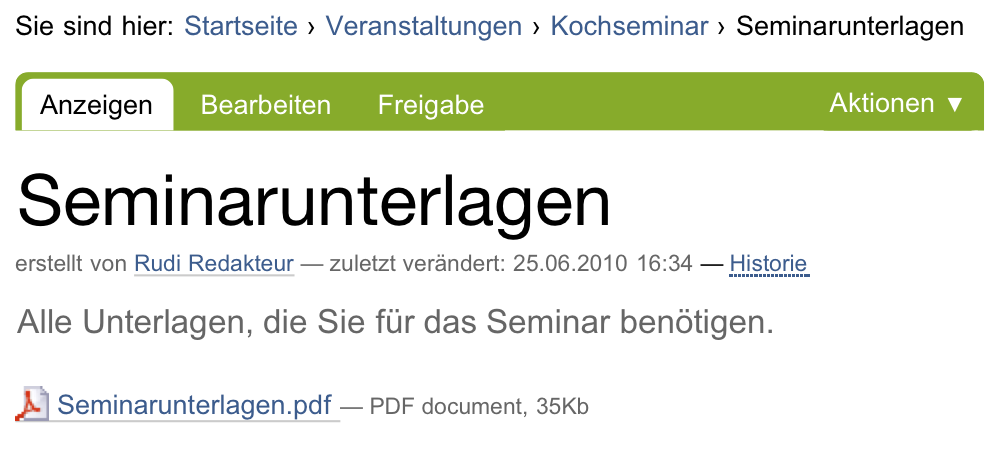

.. _sec_datei:

=======
 Datei
=======

Mit Hilfe eines Artikels vom Typ »Datei« können Sie eine beliebige Datei auf
Ihrer Website veröffentlichen und zum Herunterladen anbieten. Typ und Inhalt,
innere Struktur und Speicherformat der Datei unterliegen keinen
Einschränkungen.

Der Nachteil dabei ist, dass Plone nur wenige Dateitypen kennt und in alle
anderen Dateien mangels Wissens über Struktur und Format nicht hineinschauen
kann. Aus diesem Grund funktioniert die Volltextsuche nur für PDF-, Office- und
einfache Textdateien, aber nicht für andere Formate, die möglicherweise auch
Textpassagen enthalten können.  Um die Möglichkeiten von Plone ausschöpfen zu
können, sollten Sie daher Texte als »Seite« oder »Nachricht« und Bilder als
»Bild« ablegen, wenngleich es technisch möglich ist, sie im Artikeltyp »Datei«
zu speichern.

Die Anzeige einer Datei enthält neben Titel und Beschreibung den
Dateinamen, einen Verweis zum Herunterladen der Datei sowie Angaben zu 
Größe und Art (MIME-Typ) der Daten (siehe Abbildung :ref:`fig_datei`).

.. _fig_datei:

   Anzeige einer Datei

Eine Ausnahme bilden Textdateien, beispielsweise einfacher Text, Quellcode von
Programmen oder HTML-Text. Den Inhalt dieser Dateien kann Plone anzeigen. Es
erkennt Textdateien daran, dass ihr MIME-Typ mit ``text``
beginnt. Normalerweise sorgt Ihr Webbrowser dafür, dass beim Hochladen einer
Datei der richtige MIME-Typ mitgesendet wird.

Je nach Typ der Daten und Konfiguration Ihres Webbrowsers wird beim
Herunterladen die Datei entweder mit einem Hilfsprogramm im Webbrowser selbst
dargestellt oder auf Ihrem Rechner gespeichert. Häufig ist beides möglich;
dann fragt der Webbrowser nach, was Sie mit der Datei tun möchten.

Ähnlich wie bei Bildern laden Sie Dateien in der Bearbeitungsansicht hoch.
Wenn bereits eine hochgeladene Datei vorhanden ist, sehen Sie den Namen, die
Größe und die Art der Datei. Sie können die vorhandene Datei behalten oder
durch eine andere ersetzen. Um eine Datei erstmalig hochzuladen oder zu
ersetzen, rufen Sie mit der Schaltfläche :guilabel:`Datei auswählen` ein
Dateiauswahlfenster auf, wählen die gewünschte Datei auf Ihrem Rechner aus und
speichern Ihre Veränderungen.
