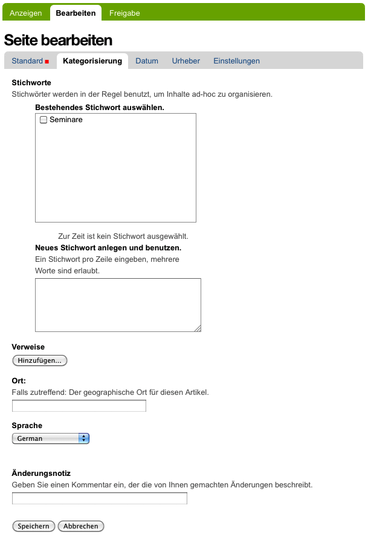
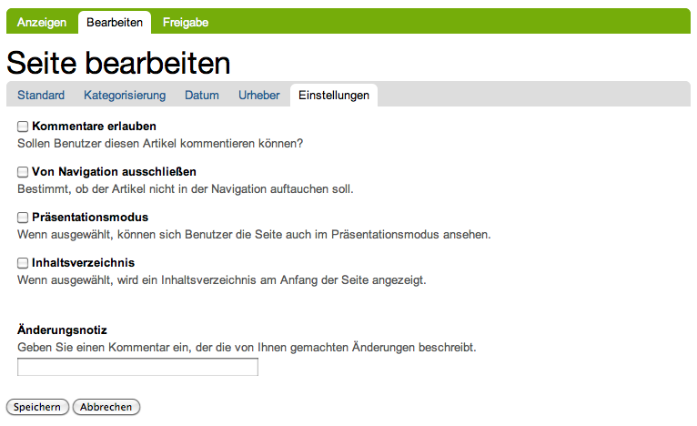

.. _sec_inhaltstypen-gemeinsamkeiten:

=================
 Gemeinsamkeiten
=================

Die unterschiedlichen Artikeltypen in Plone weisen viele Gemeinsamkeiten auf.
So besitzt jeder Artikel folgende drei Ansichten (siehe Abbildung
:ref:`fig_tabs`):

* Anzeigen
* Bearbeiten
* Freigabe

Der Zugriff auf die einzelnen Ansichten ist Ihnen nur gestattet, wenn Sie die
jeweils dafür benötigten Rechte besitzen. Sie können mit Hilfe der Reiter
zwischen den für Sie verfügbaren Ansichten eines Artikels wechseln.

.. _fig_tabs:

.. figure:: ../images/ansichten-reiter.*
   :width: 100%

   Reiter auf der linken Seite für die Ansichten eines Artikels

Anzeige und Bearbeitungsansicht sind in ihren Grundzügen für alle Artikel
gleich. Sie werden direkt im Anschluss erläutert, die Ansicht »Freigabe« in
Abschnitt :ref:`sec_ansicht-freigabe`.

.. _sec_gemeinsamkeiten-anzeige:

Anzeige
=======

Die Anzeigeansicht stellt einen Artikel so dar, wie ihn Besucher der Website
sehen sollen. Aussehen und enthaltene Informationen hängen vom
Artikeltyp ab. Beispielsweise werden für eine Seite hauptsächlich Titel,
Beschreibung und Haupttext angezeigt, während in einem Termin weitergehende
Informationen wie der Zeitpunkt und Ort des Ereignisses erscheinen. Die
einzelnen Artikeltypen und die Eigenheiten ihrer Anzeige werden in
Kapitel :ref:`sec_dokument` genauer beschrieben.

Die Anzeigeansichten aller Artikel haben jedoch einige Gemeinsamkeiten (siehe
Abbildung :ref:`Aufbau der Anzeige eines Artikels <fig_gemeinsamkeiten-anzeige>`):

#. Titel
#. Verfasserzeile
#. Zusammenfassung
#. Inhalt (je nach Artikeltyp unterschiedlich aufgebaut)
#. Stichworte
#. Vor- und Zurückblättern (je nach Einstellungen des Ordners)

.. _fig_gemeinsamkeiten-anzeige:

.. figure:: ../images/gemeinsamkeiten-anzeige.*
   :width: 100%

   Aufbau der Anzeige eines Artikels: Titel (1), Verfasserzeile (2),
   Zusammenfassung (3), Inhalt (4), Stichworte (5) und Vor- und Zurückblättern
   (6)

Die Verfasserzeile eines Artikels gibt an, wer den Artikel erstellt hat und
wann er zuletzt verändert wurde. Sie enthält außerdem einen Verweis zur
Historie des Artikels. Der Name des Erstellers ist ein Verweis zu seinem
Profil.  Beachten Sie, dass die Verfasserzeile nicht angibt, wer die letzte
Änderung gemacht hat; dies erfahren Sie in der Historie. Die Verfasserzeile
wird je nach Konfiguration der Website möglicherweise nur angemeldeten
Benutzern angezeigt. 

Stichworte dienen dazu, Artikel semantisch zu kategorisieren. Sie können in der
Bearbeitungsansicht einem Artikel zugewiesen werden (siehe Kapitel
:ref:`sec_teilf-kateg`). Die grau hinterlegten Stichworte sind Verweise, die zu
einer Seite mit Suchresultaten (siehe Abb.: :ref:`fig_suchresultate-stichwort`
) führen, auf der alle Artikel aufgelistet werden, die mit dem entsprechenden
Stichwort versehen wurden. 

.. _fig_suchresultate-stichwort:

.. figure::
   ../images/suchresultate-stichwort.*
   :width: 80%

   Suchresultate für Stichwort

   
Ganz unten in der Ansicht finden Sie Verweise, über die Sie zum nächsten oder
zum vorherigen Artikel innerhalb des gleichen Ordners wechseln können. Diese
Funktion muss jedoch im Teilformular Eigenschaften in der Bearbeitungsansicht
des Ordners aktiviert werden (siehe dazu Kapitel
:ref:`sec_bearbeitungsansicht-ordner`). 

.. _sec_anzeige-waehlen:

Darstellung auswählen
---------------------

Manche Artikel wie beispielsweise Ordner und Kollektionen können ihren Inhalt
auf mehr als eine Art und Weise darstellen. In solchen Fällen finden Sie in der
grünen Leiste ein Ausklappmenü mit der Bezeichnung :guilabel:`Darstellung`, aus
dem Sie eine der möglichen Darstellungen auswählen können (siehe Abbildung
:ref:`fig_anzeige-waehlen`).

.. _fig_anzeige-waehlen:

.. figure:: ../images/anzeige-waehlen.*

   Darstellung eines Ordners auswählen

.. _sec_bearbeiten:

Bearbeiten
==========

.. index:: Sofortbearbeitung

Wenn Sie einen Artikel verändern möchten, gibt es zwei Möglichkeiten: die
Sofortbearbeitung und die Bearbeitungsansicht.

Sofortbearbeitung
-----------------

Sofortbearbeitung bedeutet, dass Sie zum Beispiel den Titel, die Beschreibung
oder den Haupttext in der Anzeige des Artikels mit der Maus anklicken und
direkt bearbeiten können. (siehe Abbildung :ref:`fig_sofortbearbeitung`).

.. _fig_sofortbearbeitung:

.. figure:: ../images/titel-bearbeiten-ajax.*

   Die Sofortbearbeitung einer Seite

Sie erkennen Felder, die Sie sofort aus der Anzeige heraus bearbeiten können,
an einem dünnen Rahmen, der auftaucht, sobald Sie mit dem Mauszeiger über das
Feld fahren. Der Mauszeiger verwandelt sich dabei in einen Cursor. Nach einem
Mausklick auf ein solches Feld springt die Anzeige an dieser Stelle in den
Bearbeitungsmodus und unterhalb des angewählten Elements erscheinen
Schaltflächen zum Speichern und Abbrechen der Bearbeitung.  Bei der
Sofortbearbeitung des Haupttextes stehen Ihnen die Funktionen des Texteditors
zu Verfügung. 

Die Sofortbearbeitung muss nach der Installation einer Plone-Website vom
Administrator in den Bearbeitungseinstellungen eingeschaltet werden (siehe
Kapitel :ref:`sec_konfiguration-bearbeiten`). Sie steht nur zur Verfügung,
wenn Sie im Browser Javascript eingeschaltet haben.

.. index:: Bearbeitungsansicht

.. _sec_bearbeitungsansicht:

Bearbeitungsansicht
-------------------

Jeder Artikel besitzt eine Bearbeitungsansicht, in der man alle
seine Merkmale verändern kann. Ob Sie einen Artikel überhaupt modifizieren
dürfen, hängt von Ihren Rechten und vom Status des Artikels ab (siehe
Abschnitte :ref:`sec_funktionen` und :ref:`sec_workflow`).

Es handelt sich bei der Bearbeitungsansicht um ein gegliedertes
Formular, das aus folgenden Teilen besteht:

  * Standard
  * Kategorisierung
  * Datum
  * Urheber
  * Einstellungen

Sie erreichen die einzelnen Teilformulare über eine Navigationsleiste unterhalb
der Seitenüberschrift (siehe Abbildung :ref:`fig_bearbeiten-teilformulare`).
Falls Sie Javascript in Ihrem Browser ausgeschaltet haben, werden alle
Teilformulare gleichzeitig untereinander angezeigt.

.. _fig_bearbeiten-teilformulare:

.. figure:: ../images/bearbeiten-teilformulare.*
   :width: 100%

   Auswahl eines Teilformulars der Bearbeitungsansicht

Falls der Artikeltyp der Versionskontrolle unterworfen ist, finden Sie
unter jedem Teilformular entweder ein Eingabefeld für eine
Änderungsnotiz oder eine Checkbox mit der Bezeichnung
:guilabel:`Speichere als neue Version` (siehe Abbildung
:ref:`fig_manuelle-versionierung`).

.. _fig_manuelle-versionierung:

.. figure::
   ../images/manuelle-versionierung.*
   :width: 80%
   :alt: Veränderungen können manuell in einer neuen Version
   	 gespeichert werden.

   Manuelle Versionierung

Beim Wechsel in die Bearbeitungsansicht, befinden Sie sich zunächst im
Teilformular Standard. 

.. _sec_teilf-stand:

Teilformular »Standard«
~~~~~~~~~~~~~~~~~~~~~~~

Im Teilformular »Standard« (siehe Abbildung :ref:`fig_bearbeiten`) werden
diejenigen Informationen eingetragen, die im Allgemeinen für die Öffentlichkeit
bestimmt sind und den wesentlichen Inhalt des Artikels ausmachen:

  * Titel
  * Zusammenfassung
  * sonstige Inhalte (beispielsweise der Haupttext)

.. _fig_bearbeiten:

   Bearbeitungsansicht einer Seite

Ob Sie darüber hinaus ein Eingabefeld für den Kurznamen sehen, hängt von den
Einstellungen für Ihre Website und von Ihren persönlichen Einstellungen ab.
Mehr zu Kurznamen erfahren Sie in Abschnitt :ref:`sec_kurzname`.

Wählen Sie für jeden Artikel einen kurzen, aussagekräftigen Titel, der
sich direkt auf den Inhalt bezieht. Da Plone die Titel beispielsweise für die
Navigation benutzt, wird Ihre Website dadurch übersichtlicher und ihr Aufbau
besser verständlich. Außerdem tragen gut gewählte Titel dazu bei, dass Ihre
Seiten von Suchmaschinen im Internet höher bewertet und damit von
interessierten Besuchern leichter gefunden werden.

Die Zusammenfassung sollte aus einem kurzen Text bestehen, der den Inhalt
umreißt oder als Einleitung dient. Sie erscheint zum einen in der
Artikelanzeige selbst, zum anderen in Listen wie der von Plone erzeugten
Ordnerübersicht.

Bei allen Artikeltypen außer bei Ordnern und Kollektionen dient das
Teilformular »Standard« dazu, den Inhalt des Artikels zu verändern. Welche
Möglichkeiten Sie dabei haben, hängt stark vom jeweiligen Typ ab und wird
später im Einzelnen erläutert. Ordner und Kollektionen hingegen besitzen keinen
eigenen redaktionellen Inhalt.

.. _sec_teilf-kateg:

Teilformular »Kategorisierung«
~~~~~~~~~~~~~~~~~~~~~~~~~~~~~~

Im Teilformular »Kategorisierung« (siehe Abbildung
:ref:`fig_seite-bearbeiten-kategorisierung`) können Sie Artikel kategorisieren.
Dabei versehen Sie jeden Artikel mit Informationen wie der Sprache, in der er
verfasst ist, oder einer inhaltlichen Kategorie, in die er gehört. Solche
Informationen werden als Metadaten bezeichnet (siehe Abschnitt
:ref:`sec_exkurs-metadaten`). Um weitere Metadaten geht es in den
Teilformularen »Datum« und »Urheber«.

.. _fig_seite-bearbeiten-kategorisierung:

   Das Teilformular »Kategorisierung«

.. _sec_teilf-kateg-1:

Stichworte
 Stichworte dienen dazu, einen Artikel zu verschlagworten. Sie helfen beim
 Auffinden oder Gruppieren inhaltlich verwandter Artikel.

 Wenn Ihre Website schon länger aktiv ist, wird es bereits eine Reihe von
 Stichwörtern geben, die im Feld :guilabel:`Bestehendes Stichwort auswählen` zur
 Auswahl angeboten werden. Redakteure haben die Möglichkeit, weitere Stichwörter
 im Feld :guilabel:`Neues Stichwort anlegen und benutzen` hinzuzufügen.

.. _sec_teilf-kateg-2:

Verweise
 Verweise dienen dazu, den Leser eines Artikels auf bestimmte andere Artikel
 hinzuweisen, die mit dem angezeigten in Verbindung stehen. Sie werden in der
 Anzeige eines Artikels unterhalb des Inhalts angezeigt.

 Das Teilformular »Kategorisierung« enthält eine Liste der eingetragenen
 Verweise. Darunter befindet sich eine Schaltfläche, mit der man neue Verweise
 hinzufügen kann. Wenn man sie betätigt, öffnet sich ein Fenster mit der
 Artikelliste des aktuellen Ordners, einem Verzeichnispfad und einem Suchfeld
 (siehe Abbildung :ref:`fig_verweise-artikel-suchen`).

 .. _fig_verweise-artikel-suchen:

 .. figure:: ../images/verweise-artikel-suchen.png
    :width: 100%

    Artikelsuche beim Hinzufügen von Verweisen

 Sie können damit durch die Website navigieren, Artikel suchen sowie Artikel
 aus dem angezeigten Ordner oder den Suchergebnissen zu den Verweisen
 hinzufügen.

 Um einen Verweis aus der Liste zu löschen, entfernen Sie das neben
 ihm stehende Häkchen und speichern Ihre Änderungen.

Ort
 Sie können hier den Artikel in Bezug zu einem geografischen Ort setzen. Einige
 Erweiterungen für Plone können diese Information auswerten, indem
 sie Orte beispielsweise auf einer Weltkarte markieren.

Sprache
 In diesem Menü können Sie die Sprache auswählen, in der der Artikel verfasst
 ist. Die hier voreingestellte Sprache wird vom Administrator in der
 Konfiguration festgelegt.

.. _sec_teilformular-datum:

Teilformular »Datum«
~~~~~~~~~~~~~~~~~~~~

Das Teilformular »Datum« dient dazu, die Anzeigedauer des Artikels zu
beschränken beziehungsweise den Gültigkeitszeitraum der Information festzulegen
(siehe Abbildung :ref:`fig_seite-bearbeiten-datum`).

.. _fig_seite-bearbeiten-datum:

   Das Teilformular »Datum«

Freigabedatum
 Mit dem Freigabedatum bestimmen Sie, wann ein Artikel Besuchern zur Ansicht
 freigegeben wird. Selbst wenn ein Artikel die interne, redaktionelle Prüfung
 durchlaufen hat und sich im Status »veröffentlicht« befindet, wird er erst
 nach dem Freigabedatum wirklich sichtbar.

Ablaufdatum
 Ist ein Ablaufdatum eingestellt, wird der Artikel ausgeblendet, sobald es
 erreicht ist.

 Beide Einträge zusammen bilden die Angabe »Verfügbarkeitszeitraum« des
 Dublin-Core-Standards (siehe dazu Abschnitt :ref:`sec_exkurs-metadaten`).

 Sie können das Datum bei beiden Feldern mit Hilfe des aufklappbaren Kalenders
 eingeben, den Sie über das Kalendersymbol zwischen Datum und Uhrzeit
 erreichen (siehe Abbildung :ref:`fig_kalenderpopup`).

 .. _fig_kalenderpopup:

 .. figure::
    ../images/kalender-popup.* 
 
    Der aufgeklappte Kalender zur Auswahl eines Datums

    Popup-Fenster zur Datumsauswahl

 Um ein früher eingegebenes Datum zu löschen, wählen Sie für das
 Jahr ›- -‹ aus.

.. _sec_teilformular-urheber:

Teilformular »Urheber«
~~~~~~~~~~~~~~~~~~~~~~

Im Teilformular »Urheber« (siehe Abbildung :ref:`fig_seite-bearbeiten-urheber`)
können Sie die Personen aufführen, die an der Erstellung des Artikels
mitgewirkt haben, und Angaben zu den Urheberrechten machen.

.. _fig_seite-bearbeiten-urheber:

    Das Teilformular »Urheber«

Ersteller
  Tragen Sie einen oder mehrere Benutzernamen ein. Um mehrere
  Personen aufzuführen, schreiben Sie jeden Namen in eine eigene Zeile.

Beitragende
  Hier tragen Sie die realen Namen weiterer Personen ein, die
  einen Beitrag geleistet haben. Verwenden Sie wieder eine eigene Zeile für
  jeden Namen. Wie Sie Ersteller und Beitragende voneinander abgrenzen, ist
  keine technische, sondern eine redaktionelle Frage. Die Ersteller sind
  gemeinhin diejenigen Personen, die an der Erstellung des Artikels auf der
  Website beteiligt waren. Beitragende haben in der Regel Informationen
  beigesteuert, den Artikel auf der Website aber nicht selbst bearbeitet. Sie
  müssen nicht einmal auf der Website registriert sein.

Urheberrechte
  In diesem Formularfeld können Sie beispielsweise eine
  Creative-Commons-Lizenz angeben oder sich alle Rechte
  vorbehalten. Eventuell ist dieses Feld bereits von Ihrem
  Systemverwalter ausgefüllt worden. Hier ist auch der geeignete Ort,
  um auf Rechte Dritter aufmerksam zu machen.

.. _sec_teilf-einst:

Teilformular »Einstellungen«
~~~~~~~~~~~~~~~~~~~~~~~~~~~~

Welche Einstellungen Sie in diesem Teilformular vornehmen können, hängt vom
Artikeltyp ab. Die Abbildung :ref:`fig_seite-bearbeiten-einstellungen` zeigt das
Teilformular »Einstellungen« für eine Seite.

.. _fig_seite-bearbeiten-einstellungen:

   Das Teilformular »Einstellungen«

Die folgenden zwei Einstellungen sind allen Artikeltypen gemeinsam. 

Kommentare erlauben
  Ihre Website kann so konfiguriert sein, dass für
  manche Artikeltypen Kommentare im Allgemeinen erlaubt sind. Bei Artikeln
  dieser Typen ist hier das Häkchen bereits gesetzt. Sie können ungeachtet
  dieser Einstellungen das Kommentieren eines einzelnen Artikels erlauben oder
  verbieten, indem Sie hier ein Häkchen setzen oder entfernen.

Von Navigation ausschließen
  Per Voreinstellung tauchen bestimmte
  Artikeltypen im Navigationsportlet oder der Navigationsleiste auf. Hier
  können Sie einzelne Artikel von der Anzeige in der Navigation ausschließen.

Die übrigen Einstellungsmöglichkeiten der einzelnen Artikeltypen werden in den
nachfolgenden Abschnitten erläutert.

Bearbeitungsansicht gesperrt
~~~~~~~~~~~~~~~~~~~~~~~~~~~~

Sobald Sie einen Artikel bearbeiten, ist er für andere Benutzer gesperrt, sie
können ihn nicht mehr bearbeiten. Falls Sie einen Artikel aufrufen, der in
diesem Moment bereits von einem anderen Benutzer bearbeitet wird, erhalten Sie
einen entsprechenden Warnhinweis (siehe Abbildung :ref:`fig_locking`).

.. _fig_locking:

   Warnmeldung beim Zugriff auf gesperrten Artikel

Die Bearbeitungsansicht ist für Sie gesperrt, das heißt der Reiter »Bearbeiten«
fehlt. Wenn Sie sicher sind, dass der genannte Benutzer den Artikel nicht mehr
bearbeitet, können Sie die Sperrung aufheben, indem Sie die Schaltfläche
:guilabel:`Entsperren` betätigen.

.. _sec_exkurs-metadaten:

Metadaten und der Dublin-Core-Standard
--------------------------------------

Wenn Sie schon einmal in einer Bibliothek nach einem bestimmten Buch gesucht
haben, sind sie bereits mit Metadaten konfrontiert worden. So haben Sie
vielleicht im Stichwortkatalog nach Büchern gesucht, die ein bestimmtes Thema
behandeln. Plone besitzt etwas Ähnliches für den Inhalt einer Website.

Metadaten sind beschreibende Angaben zu einem Artikel.  Mit ihrer Hilfe kann
ein Leser den Artikel inhaltlich einordnen und abschätzen, ob er  von
Interesse ist, ohne ihn erst vollständig zu lesen.  Zudem können Metadaten
auch maschinell auf einfache Weise ausgewertet werden.

Die Artikel in einer Plone-Website besitzen eine Anzahl von Metadaten, von
denen einige auch öffentlich angezeigt werden. Dazu zählen beispielsweise der
Titel und die Stichworte, mit denen ein Artikel verschlagwortet wurde. So
können Suchmaschinen Ihre Inhalte besser katalogisieren und wiederfinden. 

Damit Metadaten verschiedener Artikel vergleichbar sind, wurde der
Dublin-Core-Standard entwickelt (siehe
\url{http://dublincore.org/documents/dcmi-terms/}). Dieser Standard legt eine
Anzahl von Angaben fest, die in den Metadaten für einen Artikel enthalten sein
sollten. Er wird nicht nur im Content-Management angewandt, sondern
erleichtert beispielsweise Bibliotheken den Austausch von Informationen über
ihre Datenbestände.

Metadaten nach Dublin-Core-Standard umfassen derzeit 15 Basisangaben und eine
größere Zahl zusätzlicher, feiner unterteilter Felder.  Die folgende Liste
fasst zusammen, welche davon in Plone verfügbar sind.

Von Plone verwendete Metadaten nach Dublin-Core:

*      Titel
*      Ersteller
*      Herausgeber
*      Beitragende
*      Kategorien 
*      Inhaltliche Beschreibung
*      Sprache
*      Erstellungsdatum
*      Änderungsdatum
*      Verfügbarkeitszeitraum
*      Artikeltyp
*      Format
*      Ressourcen-Identifikation
*      Urheberrecht

Die Metadaten von Artikeln kommen in Plone an vielen Stellen zum Einsatz. 

.. _sec_nutz-von-metad-1:

Erweiterte Suche
~~~~~~~~~~~~~~~~

Besonders nützlich sind Metadaten für die erweiterte Suche
(siehe Abbildung :ref:`fig_suche`).

Sie erreichen sie, indem Sie die Schnellsuche benutzen.

Einige der erweiterten Suchkriterien sind dazu da, Artikel anhand ihrer
Metadaten zu finden. So kann man beispielsweise Stichwörter angeben oder das
Beschreibungsfeld von Artikeln nach Begriffen durchsuchen. Außerdem kann man
die Suche auf Artikel beschränken, die in einer bestimmten Zeitspanne
hinzugefügt oder von einem bestimmten Autor verfasst wurden.

.. _sec_nutz-von-metad-3:

Portlets
~~~~~~~~

In vielen Portlets spielen Metadaten eine Rolle. So listet das Portlet
»Aktuelle Änderungen« die fünf Artikel auf, die zuletzt verändert
wurden (siehe Abbildung :ref:`fig_portlet-recent`).

.. _fig_portlet-recent:

   Portlet »Aktuelle Änderungen«

Hier wird der Zeitstempel »zuletzt verändert« benutzt, den Plone
automatisch immer dann aktualisiert, wenn ein Artikel verändert und
gespeichert wird.

Ähnlich funktionieren die Portlets für Nachrichten und Termine, in denen die
fünf neuesten Nachrichten und Termine aufgelistet werden. Hier verwendet Plone
einen Zeitstempel, der einmalig beim Erzeugen eines Artikels gesetzt wird: das
Erstellungsdatum.

.. _sec_nutz-von-metad-4:

Kollektionen
~~~~~~~~~~~~

Kollektionen listen Artikel aus der gesamten Website auf, die bestimmte
Kriterien erfüllen. Wie bei der erweiterten Suche gibt es dafür ganz
unterschiedliche Kriterien, die sich auch häufig auf Metadaten beziehen.
Mehr über Kollektionen erfahren Sie in Abschnitt :ref:`sec_kollektion`.

Maschinenlesbare Metadaten im HTML-Quellcode
~~~~~~~~~~~~~~~~~~~~~~~~~~~~~~~~~~~~~~~~~~~~

Metadaten nach dem Dublin-Core-Schema können auch maschinenlesbar in den
HTML-Quellcode Ihrer Webseiten eingebunden werden. Dadurch können Suchmaschinen
Ihre Seiten effizienter einordnen.  In Plone werden der Titel und die
Zusammenfassung entsprechend im HTML-Code eingebunden. Fragen Sie Ihren
Systemadministrator, wenn Sie weitere Dublin-Core-Metadaten in Ihre Webseiten
einbinden möchten.

