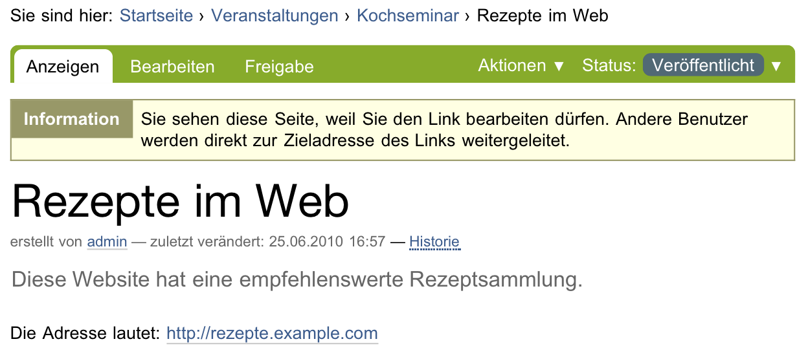

.. _sec_link:

====
Link
====

Man kann mit Plone Verweise auf Webseiten und andere Ressourcen im Internet
genauso verwalten wie alle anderen Inhalte. Es ist also möglich, Links mit
einem Titel und einer Zusammenfassung zu versehen, sie in Ordnern zu sammeln
und mit Hilfe von Metadaten zu kategorisieren. 

Der Artikeltyp, der dafür vorgesehen ist, heißt »Link«, und sein Inhalt besteht
aus einer Internetadresse. Wenn man das Recht hat, einen Link zu bearbeiten,
wird er – wie die anderen Artikeltypen – angezeigt (siehe Abbildung
:ref:`fig_link`). Hat man diese Rechte nicht, gelangt man sofort zur
referenzierten Website. Der Artikeltyp »Link« verhält sich also in der Regel
wie ein ganz normaler Link im Text einer Webseite.  

.. _fig_link:

   Anzeige eines Links

Mit einem Ordner oder einer Kollektion mit mehreren Link-Artikeln kann man
beispielsweise kommentierte Verweislisten erstellen. Werden Links in der
Navigation oder der Anzeige eines Ordners aufgeführt, so zeigt der Verweis
dort gleich auf die Zieladresse des Links und nicht auf den Link-Artikel.

Im Bearbeitungsformular ist die Adresse ein Pflichtfeld; ohne sie hätte
der Artikel keinen Inhalt. Beachten Sie, dass die Adresse einer Webseite mit
``http://`` beginnen muss. Sie können natürlich neben Webadressen auch
Adressen anderer Internetdienste angeben, beispielsweise nach dem Schema
``ftp://``.

