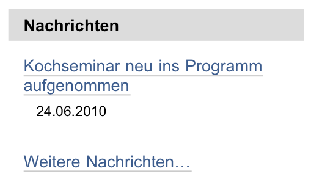

.. _sec_nachricht:

===========
 Nachricht
===========

Nachrichten sind ähnlich aufgebaut wie Seiten. Sie sollen vom Leser innerhalb
der Website als aktuelle Mitteilungen wahrgenommen werden:

* Der Eintrag »Nachrichten« in der Hauptnavigation führt zu einer
  Übersicht aller veröffentlichten Nachrichten.
* Das Nachrichtenportlet (siehe Abbildung :ref:`fig_portlet-news`)
  zeigt Ihnen die Titel der fünf neuesten Nachrichten an.

.. _fig_portlet-news:

   Nachrichtenportlet

Beide Listen enthalten nur Nachrichten im Revisionsstatus »veröffentlicht«.
Sie sind nach dem Erstellungsdatum sortiert und beginnen mit der neuesten
Nachricht. Das Portlet zeigt zu jeder Nachricht das Änderungsdatum an.

Im Unterschied zu Seiten gehört zum Inhalt einer Nachricht außer dem
Text ein Titelbild. Es erscheint sowohl in der Anzeige der Nachricht
(siehe Abbildung :ref:`fig_nachricht`) als auch in der
Nachrichtenübersicht der Website neben dem Beschreibungstext des
Artikels. Das Titelbild hat nichts mit den Bildern zu tun, die Sie
beispielsweise mit Kupu in den Nachrichtentext einbetten können.

.. _fig_nachricht:

   Anzeige einer Nachricht

In der Bearbeitungsansicht einer Nachricht können Sie das Titelbild auf Ihrem
Rechner auswählen und hochladen (siehe
Abbildung :ref:`fig_nachricht-bild-einfuegen`).

.. _fig_nachricht-bild-einfuegen:

.. figure:: ../images/nachricht-bild-einfuegen.png
   :width: 100%

   Ein Titelbild in eine Nachricht einfügen

In einem Feld darunter sollten Sie einen Bildtitel eingeben. Haben Sie für
dieselbe Nachricht bereits früher ein Bild hochgeladen, so wird es
angezeigt. Sie können es beibehalten, löschen oder durch ein anderes Bild
ersetzen. Plone verkleinert große Bilder so, dass sie sich für die Verwendung
im Web eignen.

