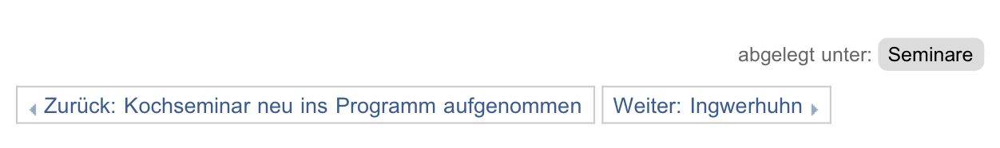
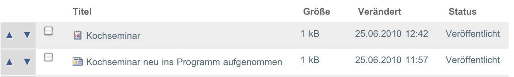

.. _sec_ordner:

========
 Ordner
========

Mit Ordnern geben Sie Ihrer Website eine inhaltliche Struktur. Sie können
verwandte und zusammengehörige Artikel in Ordnern zusammenfassen und mit
ineinander verschachtelten Ordnern komplexe Navigationsstrukturen aufbauen.

.. todo:: 
   Hier später Verweis auf Admin-Tutorial einfügen.

Die Anzeigeansicht eines Ordners listet entweder den Inhalt des Ordners auf,
also die Artikel, die sich in ihm befinden, oder sie verwendet einen
ausgewählten Artikel aus dem Ordner wie eine Art Titelblatt und zeigt diesen
Artikel an. 

Der Inhalt von Ordnern kann auf unterschiedliche Art und Weise dargestellt
werden.  Ordner haben dafür mehrere Vorlagen, aus denen Sie im Menü
:guilabel:`Darstellung` wählen können:

* Kurzfassung
* Gesamter Inhalt
* Tabelle
* Album
* Liste

.. _fig_ordner:

.. figure:: ../images/folder-order.png
   :width: 100%

   Der Inhalt eines Ordners als Kurzfassung

Kurzfassung
   Die Darstellungsform »Kurzfassung« (siehe Abbildung :ref:`fig_ordner`) zeigt
   den Titel, die Zusammenfassung und bei Nachrichten zusätzlich das Titelbild
   an. Der Titel ist ein Verweis zum jeweiligen Artikel, zu dem auch der Link
   :guilabel:`Mehr..` unterhalb der Zusammenfassung verweist.  

Tabelle
   In der Darstellungsform »Tabelle« wird der Inhalt des Ordners in einer
   vierspaltigen Tabelle aufgelistet. Die vier Spalten zeigen den Titel, den
   Autor, den Artikeltyp und das Datum der letzten Veränderung an. Der Titel
   ist ein Verweis auf den jeweiligen Artikel. Der Name des Autors ein Verweis
   auf dessen persönliche Informationen.   

Liste
   Die Darstellung als Liste enthält zu jedem Eintrag den Titel, die
   Beschreibung, einen Verweis auf das Profil des Erstellers und das Datum der
   letzten Änderung. Eine Ausnahme bilden Einträge für Termine: bei ihnen
   werden anstelle des Änderungsdatums Ort und Zeitraum des Termins angezeigt.

Album
   Die Darstellung als Album ähnelt der Listendarstellung. Von Bildern werden
   jedoch kleine Vorschaubilder angezeigt. Diese Darstellungsart eignet sich
   also zur Anzeige von Ordnern, in denen sich hauptsächlich Bilder befinden. 

Gesamter Inhalt
   Wenn Sie die Darstellungsform :guilabel:`Gesamter Inhalt` auswählen, wird
   der Inhalt aller Artikel angezeigt. Dabei wird die Reihenfolge eingehalten,
   in der sich die Artikel im Ordner befinden.

Artikel im Revisionsstatus »privat« werden in der Regel ausgeblendet. Sie
sehen nur die privaten Artikel, die Ihnen gehören oder sich in Ihrem
persönlichen Ordner befinden.

Wollen Sie für die Ordneranzeige einen Artikel aus dem Ordner benutzen, wählen
Sie im Darstellungsmenü den Punkt :guilabel:`Artikel aus dem Ordner...`. Sie
gelangen so zu einem Formular, in dem Sie einen Artikel aus dem Ordner
markieren können. In der Anzeigeansicht des Ordners erscheint nun keine
Übersicht über seinen Inhalt, sondern der ausgewählte Artikel.

Plone kann für Ordner RSS-Feeds erzeugen. Dieser Vorgang wird Syndizierung
genannt. Jeder Ordner besitzt eine weitere Ansicht, in der Sie das
Syndizierungsverhalten steuern können (siehe
Kapitel :ref:`sec_syndizierung-ansicht`).

.. _sec_bearbeitungsansicht-ordner:

Bearbeitungsansicht
===================

In der Bearbeitungsansicht eines Ordners gibt es im Teilformular
»Einstellungen« die Option »Vor- und Zurückblättern einschalten«
(siehe Abbildung :ref:`fig_ordner-bearbeiten`).

.. _fig_ordner-bearbeiten:

.. figure:: ../images/ordner-bearbeiten.png
   :width: 100%

   Das Teilformular »Einstellungen« bei Ordnern

Wenn diese Option eingeschaltet ist und sich in einem Ordner mehrere Artikel
befinden, so erscheinen in deren Anzeige Verweise zum jeweils
vorherigen und nächsten Artikel (siehe Abbildung :ref:`fig_vor-zurueck-navi`).

.. _fig_vor-zurueck-navi:

   Vor- und Zurückblättern zwischen Artikeln

Damit lässt sich beispielsweise ein langer Text in kleinere
Abschnitte gliedern, durch die der Leser bequem blättern kann.

.. _sec_inhaltsansicht-ordner:

Inhaltsansicht
==============

Wenn Sie den Inhalt eines Ordners verwalten dürfen, erhalten Sie Zugriff auf
seine Inhaltsansicht (siehe Abbildung :ref:`fig_ordnerinhalt`).

.. todo:: Neuer Screenshot, Kosmetik

.. _fig_ordnerinhalt:

.. figure:: ../images/ordnerinhalt.png
   :width: 100%

   Inhaltsansicht eines Ordners

Sie erreichen diese Ansicht über den Reiter :guilabel:`Inhalte`.

Die Inhaltsansicht eines Ordners zeigt eine Tabelle aller im Ordner
befindlichen Artikel mit ihren wichtigsten Eigenschaften. In dieser Ansicht
können Sie die Artikel unter anderem kopieren, verschieben und löschen.
Haben Sie einen Artikel aus dem Ordner als Ordneranzeige ausgewählt, so ist er
durch Fettschrift hervorgehoben.

Eine Ebene höher
    Über diese Schaltfläche gelangen Sie in die Inhaltsansicht des
    Ordners, in dem sich der angezeigte Ordner befindet.

Auswählen: Alle
    Mit dem Link :guilabel:`Alle` können Sie alle angezeigten Artikel
    auswählen, um sie anschließend gemeinsam zu kopieren oder
    umzubenennen. 

Auswahl aufheben
    Wenn alle Artikel in einem Ordner ausgewählt wurden, erscheint ein
    zusätzlicher Link in der Anzeige, über den Sie die komplette
    Auswahl wieder aufheben können.

Wähle alle n Artikel in diesem Ordner 
    Falls sich mehr als 20 Artikel in einem Ordner befinden, wird die
    Inhaltsansicht auf mehrere Seiten verteilt (siehe Abbildung
    :ref:`fig_inhaltsansicht-ordner-seitenweise`). Sie können dann mit
    Hilfe zusätzlicher Navigationselemente direkt zu einer bestimmten
    Seite springen oder jeweils die nächsten oder vorherigen 20
    Artikel anzeigen lassen. 

    Über den Link :guilabel:`Auswählen: Alle` können Sie die 20
    Artikel auswählen, die auf der aktuellen Seite angezeigt
    werden. Wenn Sie dies gemacht haben, erscheint ein zusätzlicher
    Link in der Anzeige, über den Sie alle Artikel im Ordner auswählen
    können. Die Variable 'n' wird jeweils durch die Anzahl der Artikel
    ersetzt.

Kopieren, Ausschneiden, Umbenennen, Löschen, Status ändern
    Diese Schaltflächen werden in Kapitel :ref:`sec_ordner-aktionen`
    beschrieben. Sie wirken sich auf alle ausgewählten Artikel aus. 

.. _fig_inhaltsansicht-ordner-seitenweise:

.. figure::
   ../images/inhaltsansicht-ordner-seitenweise.*
   :width: 80%
   :alt: Zusätzliche Navigationselemente, wenn die Inhaltsansicht auf
   	 mehrere Seiten verteilt wird.

   Zusätzliche Navigationselemente bei seitenweiser Darstellung

.. _fig_inhaltsansicht-waehle-alle-n-artikel:

.. figure::
   ../images/inhaltsansicht-waehle-alle-n-artikel.*
   :width: 80%
   :alt: Aktivierter Link, um alle Artikel im Ordner auszuwählen

   Aktivierter Link, um alle Artikel im Ordner auszuwählen

Sortierung der Inhaltsansicht
-----------------------------

Die Sortierung der Artikel in der tabellarischen Anzeige kann
verändert werden. Wenn Sie beispielsweise die Tabelle alphabetisch
nach Titel sortieren möchten, klicken Sie einfach das Wort
:guilabel:`Titel` in der Kopfzeile der Spalte mit den Titeln an. Die
Kopfzeilen der Spalten :guilabel:`Verändert` und :guilabel:`Status`
bewirken bei einem Doppelklick ebenfalls eine Neusortierung. Das
Änderungsdatum wird aufsteigend sortiert. In der Statusspalte erfolgt
eine Gruppierung nach Status. Der Status »Zur Redaktion eingereicht«
erscheint ganz oben, da solche Artikel im redaktionellen Arbeitsablauf
besonders schnell gefunden werden müssen.

Eine Änderung der Sortierung in der Inhaltsansicht hat keine
Auswirkung auf die Reihenfolge in der Anzeige des Ordners oder die
Sortierung der Artikel in der Navigation. Denn die Artikel liegen im
Ordner in der Reihenfolge, in der sie hinzugefügt wurden. In dieser
Reihenfolge werden sie auch in den Ordneransichten und der Navigation
angezeigt.

Veränderung der Reihenfolge
---------------------------

.. only:: html

   Sie können die Reihenfolge jedoch verändern. Am Anfang jeder Spalte
   befindet sich das Symbol :guilabel:`⣿`. Wenn Sie mit der Maus über
   diesem Symbol sind, verändert sich der Mauszeiger in einen
   Doppelpfeil. Sie können nun bei gedrückter Maustaste den
   entsprechenden Artikel nach oben oder unten verschieben.  Wenn Sie
   Javascript ausgeschaltet haben, finden Sie in der Spalte
   stattdessen Pfeilsymbole vor (siehe Abbildung :ref:`fig_umordnen`).

.. Hier die Lösung \usepackage[8dots]{braille} und
.. \braillebox{12345678} ausprobieren.

.. only:: latex

   .. |8dot| image:: ../images/8dot.png

   Sie können die Reihenfolge jedoch verändern. Am Anfang jeder Spalte
   befindet sich das Symbol |8dot|. Wenn Sie mit der Maus über diesem
   Symbol sind, verändert sich der Mauszeiger in einen
   Doppelpfeil. Sie können nun bei gedrückter Maustaste den
   entsprechenden Artikel nach oben oder unten verschieben.  Wenn Sie
   Javascript ausgeschaltet haben, finden Sie in der Spalte
   stattdessen Pfeilsymbole vor (siehe Abbildung :ref:`fig_umordnen`).

.. _fig_umordnen:

   Bedienelemente zur Umsortierung bei ausgeschaltetem Javascript
