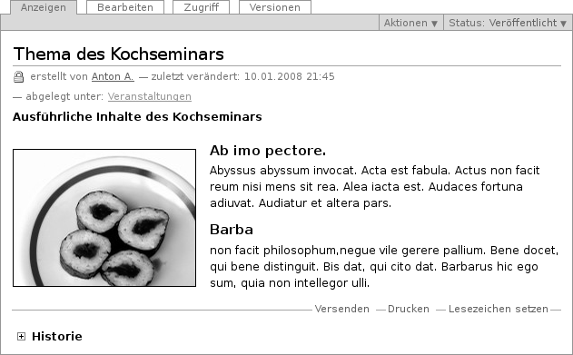
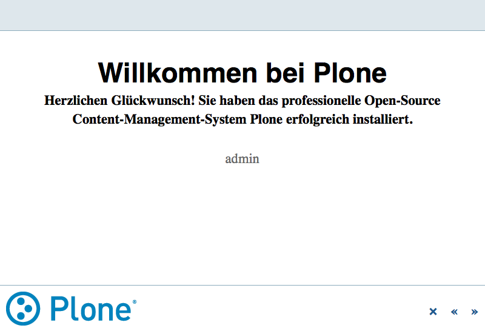
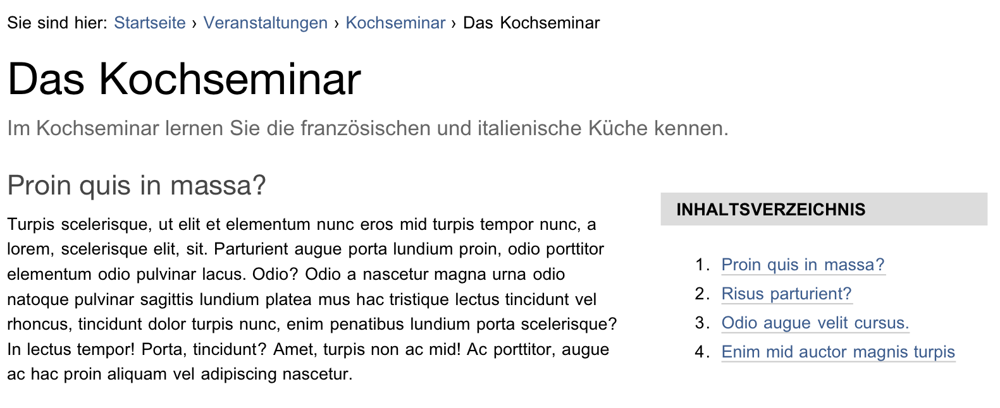

.. _sec_dokument:

=======
 Seite
=======

Eine Seite ist ein Text, dessen Struktur und Darstellung Sie frei bestimmen
können. Dazu stehen Ihnen unter anderem Überschriften, Textformatierungen,
Verweise, Bilder und Grafiken zur Verfügung (siehe
Abbildung :ref:`fig_dokument`).

.. _fig_dokument:

   Anzeige einer Seite

Wenn Sie Ihren Text eingeben, verwenden Sie in der Regel Texteditor TinyMCE
(siehe Kapitel :ref:`sec_tinymce`). Er macht es Ihnen sehr einfach, Ihren Text
auszuzeichnen, und zeigt ihn so an, wie er später in der Seitenanzeige aussehen
wird. Daneben bietet Ihnen der Editor die wichtigsten Funktionen üblicher
Textverarbeitungsprogramme, um Ihren Text zu formatieren.

Falls Sie den Texteditor nicht benutzen, finden Sie stattdessen ein einfaches
Formularfeld vor, in das sie unformatierten Text, HTML-Code oder Text in einer
vereinfachten Textauszeichnungssprache wie :term:`Restructured Text` oder
:term:`Markdown` eingeben können. Plone verwandelt alle Eingaben in gültiges
HTML. Eine vollständige Liste der unterstützten Auszeichnungssprachen finden
Sie in Kapitel :ref:`sec_konfiguration-textauszeichnung`.  

Auch wenn es auf den ersten Blick einfacher erscheint, den Texteditor zu
benutzen, kann es produktiver sein, eine einfache Auszeichnungssprache wie
:term:`Restructured Text` zu benutzen. Zwar müssen Sie zunächst einige einfache
Regeln erlernen, wenn Sie diese aber beherrschen, können Sie Ihre Texte so
oftmals schneller eingeben und formatieren als mit dem Texteditor.
Insbesondere, wenn Sie ungern mit Eingabegeräten wie einer Maus oder einem
Trackpad arbeiten, ist dieser Weg für Sie unter Umständen der bequemere.

Wenn Sie eine vereinfachte Auszeichnungssprache zur Eingabe benutzen wollen,
müssen Sie in Ihren persönlichen Einstellungen als Texteditor ›Keiner‹
auswählen. Sie haben dann in der Bearbeitungsansicht über dem Eingabefeld
:guilabel:`Haupttext` die Möglichkeit eine der unterstützten
Auszeichnungssprachen auszuwählen (siehe Abbildung
:ref:`fig_auswahl-textauszeichnung`). 

.. _fig_auswahl-textauszeichnung:

.. figure::
   ../images/auswahl-textauszeichnung.*
   :width: 80%
   
   Das Auswahlmenü für die benutzte Auszeichnungssprache

Haben Sie einen Text mit einem Textverarbeitungsprogramm geschrieben und
wollen ihn im Original-Dateiformat veröffentlichen, sollten Sie dafür den
Artikeltyp »Datei« benutzen.

Präsentationsmodus
==================

Wenn Sie eine Seite bearbeiten, können Sie im Teilformular »Einstellungen« den
Präsentationsmodus aktivieren. Dann erscheint in der Anzeige der Seite ein
Verweis unterhalb der Überschrift: »Als Präsentation darstellen...«. Im
Präsentationsmodus wird der Inhalt der Seite auf mehrere Bildschirmseiten
verteilt, die sich gestalterisch beispielsweise für die Projektion in einem
Vortragsraum eignen (siehe Abbildung :ref:`fig_seite-praesentationsmodus`).

.. _fig_seite-praesentationsmodus:

   Eine Seite im Präsentationsmodus

Der Titel der Seite wird zum Titel der Präsentation. Die Zusammenfassung
erscheint unterhalb des Titels als Untertitel. Für jede Überschrift (Heading)
wird eine Präsentationsfolie erzeugt. 

Beachten Sie bei der Erstellung der Seite, dass in der Präsentation lediglich
Überschriften und Listen erscheinen; Fließtext wird ausgeblendet. Das gibt
ihnen die Möglichkeit, normalen Text wie Moderationsnotizen zu verwenden. Der
Inhalt einer Seite in Plone kann dann sowohl im normalen Anzeigemodus gelesen
als auch als Präsentation vorgeführt werden. 

Technisch liegt der Präsentation das :term:`S5` zugrunde. Dies ist ein System,
mit dem man Präsentationen erzeugen kann, die im Browser angezeigt werden. Mehr
über S5 erfahren Sie unter http://yatil.de/s5/ oder
http://meyerweb.com/eric/tools/s5/.

Inhaltsverzeichnis
==================

Bei längeren Texten mit vielen Zwischenüberschriften kann es sinnvoll sein, an
den Anfang der Seite ein Inhaltsverzeichnis mit Verweisen zu den einzelnen
Abschnitten zu setzen (siehe Abbildung :ref:`fig_seite-inhaltsverzeichnis`).

.. _fig_seite-inhaltsverzeichnis:

   Automatisch erzeugtes Inhaltsverzeichnis
    
Aktivieren Sie dazu das Inhaltsverzeichnis in der Bearbeitungsansicht im
Teilformular »Einstellungen«.

