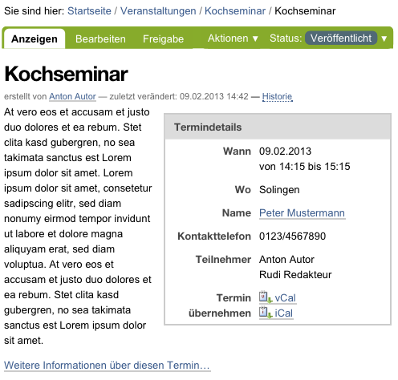
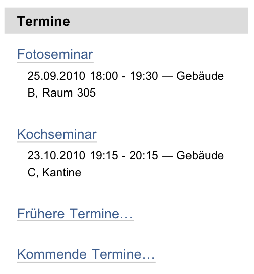
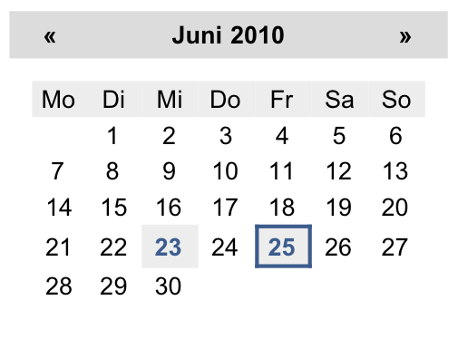

.. _sec_termin:

========
 Termin
========

Artikel vom Typ Termin kündigen zeitlich festgelegte Ereignisse an,
beispielsweise Veranstaltungen. Eine solche Ankündigung enthält für Termine
typische Informationen wie Anfang und Ende des Ereignisses, einen Ort und
einen Ansprechpartner. Diese Termininformationen haben eigene Eingabefelder im
Bearbeitungsformular und werden strukturiert gespeichert, damit Plone sie
direkt benutzen kann.

Wie die Seite verfügt auch der Termin über Felder für Titel, Beschreibung und
Haupttext. Letzterer wird im Termin jedoch als Terminankündigung bezeichnet.
Dort haben Sie die Möglichkeit, mit dem Texteditor Kupu einen formatierten Text
mit Zwischenüberschriften, Bildern, Tabellen und anderen Elementen einzugeben.

.. _fig_termin:

   Anzeige eines Termins

Zu den strukturierten Angaben eines Termins mit eigenen Eingabefeldern in der
Bearbeitungsansicht gehören:

Terminort (Wo)
  Ort des Ereignisses, Treffpunkt

Terminanfang, Terminende (Wann)
  Zeitraum, in dem das Ereignis stattfindet

Terminankündigung
  Ankündigung einer Veranstaltung, Einladung zu einem Treffen

Teilnehmer
  Liste der erwarteten Teilnehmer

Terminart (Was)
  Wählen Sie eine oder mehrere Kategorien aus, oder legen
  Sie neue an.

URL
  Internetadresse mit weiteren Informationen

Kontaktname
  Name des Ansprechpartners bei Fragen zum Ereignis

Kontaktadresse
  E-Mail-Adresse des Ansprechpartners

Kontakttelefon
  Rufnummer des Ansprechpartners

Dabei sind nur Terminanfang und Terminende Pflichtfelder.

Plone wertet die zusätzlichen Felder gezielt aus, um eine einfache
Terminverwaltung anbieten zu können:

* Strukturierte Angaben werden in der Anzeige jedes Termins in einer
  Tabelle dargestellt (siehe Abbildung :ref:`fig_termin`).

* Über den Eintrag »Termine« in der Hauptnavigation erreichen Sie eine
  Übersicht künftiger und vergangener Termine.

* Das Terminportlet (siehe Abbildung :ref:`fig_portlet-events`)
  unterrichtet Sie über die jeweils fünf nächsten Termine. Zu
  jedem Termin sehen Sie Titel, Ort und Anfangsdatum. Wenn Sie den Mauszeiger
  über den Titel halten, wird der Anfang des Beschreibungstextes angezeigt.

* Plone trägt Termine ins Kalenderportlet ein (siehe
  Abbildung :ref:`fig_portlet-calendar`).
  Der Titel des Portlets gibt an, welcher Monat gerade angezeigt wird. Er
  enthält außerdem Verweise auf den jeweils vorherigen und nächsten Monat;
  zunächst zeigt der Kalender den aktuellen Monat an. Der aktuelle Tag ist mit
  einem orangefarbenen Rahmen markiert.

  Ist für einen Tag mindestens ein Termin bekannt, so wird er im Kalender
  hervorgehoben und dient als Verweis zu einer Liste aller Termine des
  betreffenden Tages. Wenn Sie den Mauszeiger über einen solchen Tag halten,
  sehen Sie seine Termine mit Anfangszeit, Endzeit und Titel.

* In der Anzeige und bei den Artikelaktionen eines Termins können Sie
  Kalenderdateien im iCal- und vCal-Format (iCalendar/vCalendar)
  herunterladen, um den Termin in das Kalenderprogramm auf Ihrem lokalen
  Rechner zu übernehmen.

.. _fig_portlet-events:

   Terminportlet

.. _fig_portlet-calendar:

   Kalenderportlet

Die Terminübersicht und das Kalenderportlet berücksichtigen per Voreinstellung
nur Termine im Revisionsstatus »veröffentlicht«.

Vergessen Sie bei der Eingabe der Adresse für weitere Informationen zum Termin
nicht, dass eine Webadresse mit ``http://`` beginnen muss. Wenn Sie
diesen Teil der Adresse weglassen, erhalten Sie eine Fehlermeldung. Plone
speichert nur Adressen mit vollständigem URL-Schema, beispielsweise
``http``, ``https`` oder ``ftp``.

Plone achtet darauf, dass Ihre Datumsangaben für Anfang und Ende des Termins
gültig sind und der Anfangszeitpunkt nicht nach dem Ende liegt.

