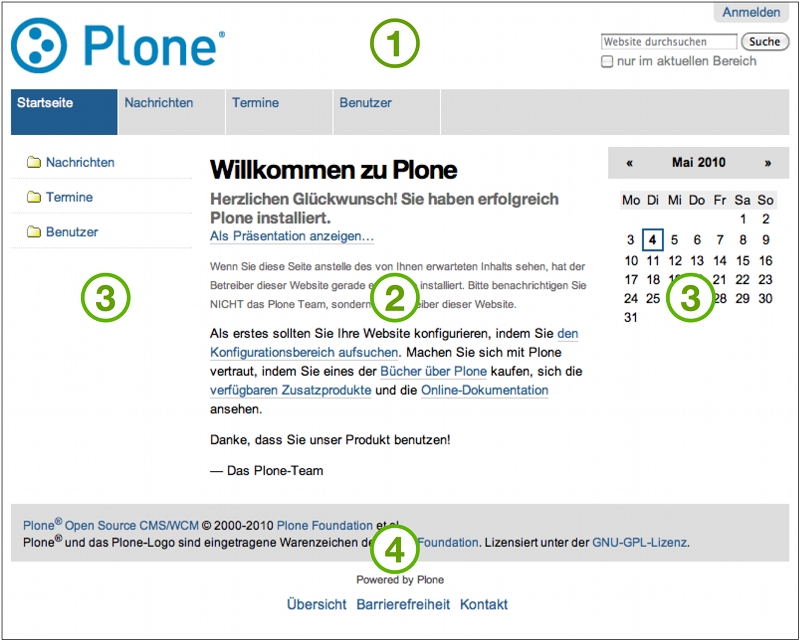
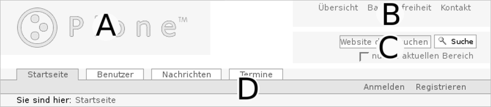

.. _aussehen:

================================
 Aussehen der Plone-Oberfläche
================================

In diesem Kapitel lernen Sie das Aussehen der Plone-Oberfläche kennen.
Danach sind Sie in der Lage, die in den folgenden Tutorien erwähnten
Elemente der Oberfläche aufzufinden und zuzuordnen.

.. TODO localhost:8080/Plone 

Starten Sie Ihren Webbrowser und rufen Sie darin Ihre Website auf. Sie
erfahren die Adresse Ihrer Website von Ihrem Administrator.

Sie sehen nun die Oberfläche Ihrer Website, wie sie sich einem nicht
angemeldeten Benutzer darstellt (siehe
Abbildung :ref:`fig-plonebase`).

.. _fig-plonebase:

   Plone-Oberfläche für nicht angemeldete Besucher. Die Hauptelemente sind der
   Kopf (1), der Inhaltsbereich (2), die Seitenspalten (3) und der Fuß (4).

Jede Seite der Website folgt dem gleichen Grundaufbau. Die Abbildung
benennt die Hauptelemente einer Plone-Seite:

* Kopf
* Inhaltsbereich
* eine oder zwei Seitenspalten
* Fuß

Diese Elemente werden in den einzelnen Abschnitten dieses Kapitels näher
beschrieben.

Kopf
====

.. _fig_ploneheader:

   Kopf einer Plone-Seite

..    Kopf einer Plone-Seite. Er enthält ein Logo (A), einige Verweise (B), das
..    Suchfeld (C) und die Navigationsleiste (D).}
  
Abbildung :ref:`fig_ploneheader` stellt die Bestandteile des Kopfes einer
jeden Seite der Website dar. Dabei handelt es sich um folgende vier Elemente:

* A Logo
* B Verweise im Seitenkopf
* C Suchfeld
* D Navigationsleiste

Das Logo in der linken oberen Ecke der Seite wird in aller Regel vom
Betreiber Ihrer Website angepasst worden sein. Anderenfalls handelt es
sich um das Plone-Logo, das in der Abbildung zu sehen ist.

Rechts oben finden Sie Verweise zu einer Übersicht über den Inhalt der
Website, Informationen zur Barrierefreiheit und einem Kontaktformular.

Darunter befindet sich das Suchfeld. Wenn Sie hier einen Suchbegriff eingeben
und die Schaltfläche »Suche« betätigen, wird eine Volltextsuche wahlweise in
der gesamten Website oder im aktuellen Bereich durchgeführt. Falls
Sie in Ihrem Webbrowser Javascript eingeschaltet haben, werden Suchtreffer
bereits während der Eingabe des Suchbegriffs angezeigt.

Die Navigationsleiste besteht aus drei Teilen:

* Hauptnavigation
* Benutzermenü
* Verzeichnispfad

In der Hauptnavigation befinden sich Verweise auf wichtige Bereiche der
Website, die von jeder einzelnen Seite aus schnell erreichbar sein sollen. In
der Regel sind das Ordner in der obersten Ebene Ihrer Website.

Das Benutzermenü rechts in der blauen Leiste enthält Informationen und
Verweise, die sich auf Sie, den Benutzer, beziehen. Wenn Sie nicht angemeldet
sind, enthält das Menü lediglich Verweise zu einem Anmelde- und gegebenenfalls
zu einem Registrierungsformular.

Am Verzeichnispfad können Sie jederzeit Ihre Position in der Website ablesen.
Sie sehen dort den Pfad durch die Ordnerhierarchie, der Sie von der Startseite
aus auf direktem Weg zum aktuell angezeigten Artikel führt.  Jeder Schritt ist
dabei ein Verweis auf einen dazwischen liegenden Ordner. 

Inhaltsbereich
==============

Plone stellt Ihnen die Artikel Ihrer Website in verschiedenen Ansichten dar.
Diese Artikelansichten nehmen den Inhaltsbereich der Seiten ein. Wenn Sie Ihre
Website unter der Adresse besuchen, die Sie von Ihrem Administrator erhalten
haben, sehen Sie eine Ansicht der Startseite, die hauptsächlich einfach den
Inhalt der Startseite anzeigt.

Seitenspalten
=============

Links und rechts des Inhaltsbereichs können Seitenspalten auftauchen. Die
Spalten nehmen zusätzliche Informationen und Bedienelemente auf.
Dazu kann jede der beiden Spalten mehrere Portlets
enthalten. Falls eine Spalte kein Portlet enthält oder wenn dieses nichts
anzeigt, wird die Spalte ausgeblendet.

Auf der Startseite finden Sie zwei Portlets vor: die Anmeldung und den
Kalender.

Das Anmeldeportlet enthält, ebenso wie das Anmeldeformular, Eingabefelder für
Ihren Benutzernamen und Ihr Passwort. Falls Sie Letzteres einmal vergessen
haben, finden Sie hier wie auch im Formular eine Möglichkeit, ein neues
Passwort anzufordern. Zudem können Sie von diesem Portlet aus über den Verweis
»Neuer Benutzer?« zum Registrierungsformular gelangen.

Das Kalenderportlet auf der rechten Seite zeigt Ihnen das aktuelle Datum und
den Wochentag an. Blättern Sie durch die vergangenen oder folgenden
Monate. Sollten Sie auf blau hinterlegte und in Fettschrift ausgeführte
Datumsfelder stoßen, dann wurde für den entsprechenden Tag ein Termin
veröffentlicht. Sobald Sie den Mauszeiger darüber halten, sehen Sie genauere
Informationen zu dem Termin.

Fuß
===

Der Fuß jeder Webseite enthält einen Vermerk zum Urheberrecht an Plone und
Verweise auf Internetstandards, die Plone erfüllt.
