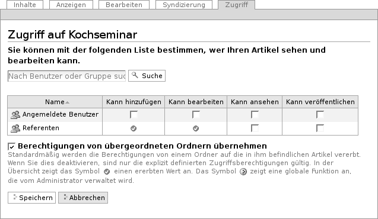

.. _sec_benutzer-funktionen:

============
 Funktionen
============

Ein CMS wie Plone ermöglicht es Ihnen, auf Ihrer Website mit anderen
Personen zusammenzuarbeiten. Dabei übernehmen die einzelnen Benutzer
häufig ganz unterschiedliche Funktionen und benötigen dafür bestimmte
Zugriffsrechte. Während einige Benutzer Artikel verfassen, sind andere
dafür verantwortlich, sie zu prüfen und zu veröffentlichen. Wiederum
andere Benutzer können beispielsweise die Struktur der Website
verändern und neue Benutzer hinzufügen.

Ein und derselbe Benutzer kann auch an unterschiedlichen Stellen der
Website verschiedene Funktionen ausüben. So ist es möglich, dass Sie
auf einige Bereiche Ihrer Website gar keinen Zugriff haben, in anderen
lediglich Artikel lesen und nur in einem bestimmten Bereich selbst
Artikel verfassen können.

All diese Fälle werden von Plone berücksichtigt und unterstützt. Plone
unterscheidet sehr genau, welche Benutzer an welchen Stellen der
Website Artikel anschauen, anlegen, bearbeiten oder veröffentlichen
dürfen.

Um Berechtigungen und Einschränkungen übersichtlich und detailliert
verwalten zu können, gibt es Funktionen. Wer beispielsweise dafür
zuständig ist, Artikel vor ihrer Veröffentlichung auf der Website zu
prüfen, muss die Funktion »Veröffentlichen« ausüben dürfen.

Wenn Sie sich als Benutzer an einer Plone-Website registrieren, erhalten Sie
bereits eine oder mehrere Funktionen. Sie können weder eigenständig weitere
Funktionen übernehmen, noch Funktionen abgeben, die Sie bereits haben. Ihr
Administrator kann Ihnen jedoch jederzeit neue Funktionen zuteilen oder
bestehende entziehen.

Funktionen können nicht nur einzelnen Benutzern, sondern auch Gruppen
zugeordnet werden. Sollen mehrere Benutzer die gleiche Funktion
ausüben, ist es oft sinnvoll, sie in einer Gruppe zusammenzufassen und
die Funktion der Gruppe zu übertragen. Die Funktion gilt dann für alle
Gruppenmitglieder.

.. _sec_standardfunktionen:

Standardfunktionen
==================

Jede Plone-Website kennt wenigstens sieben Funktionen:

Benutzer
  Wer sich auf der Website als Benutzer registriert, erhält je
  nach Voreinstellung bestimmte Rechte zugeteilt. Unter Umständen dürfen nur
  registrierte Benutzer überhaupt auf die Website zugreifen (etwa bei einem
  Intranet).

Besitzen
  Wer als Benutzer einen Artikel anlegt, »besitzt« ihn. Mit
  dieser Funktion gehen eine Reihe von Berechtigungen einher. So kann man
  Artikel, die man besitzt, bearbeiten und wieder löschen.

Hinzufügen
  Der Benutzer kann neue Artikel hinzufügen, nicht aber
  bestehende Artikel bearbeiten.

Bearbeiten
  Der Benutzer kann Artikel bearbeiten, er kann den Inhalt und
  die Metadaten eines Artikels verändern.

Ansehen
  Der Benutzer kann Artikel im Webbrowser aufrufen und anschauen.

Veröffentlichen
  Der Benutzer kann Artikel veröffentlichen, sodass sie
  von allen Benutzern und Besuchern der Website eingesehen werden können.

Verwalten
  Der Benutzer darf im CMS Verwaltungsaufgaben
  erledigen. Darunter fallen unter anderem die Benutzerverwaltung, also
  beispielsweise die Vergabe von Funktionen an Benutzer und Gruppen, sowie
  Änderungen an der Struktur und an grundlegenden Funktionen der Website.

Sie bekommen in Plone nur die Funktionen zu Gesicht, die Sie selbst ausüben
und in der Artikelansicht »Zugriff« delegieren dürfen.

.. _sec_zugriffsrechte-ansicht:

Artikelansicht »Zugriff«
=========================

Wenn Sie Besitzer oder Verwalter eines Artikels sind, steht Ihnen die
Ansicht »Zugriff« zur Verfügung. Dort können Sie Funktionen an andere
Benutzer und Gruppen übertragen, um beispielsweise Aufgaben an Mitarbeiter zu
delegieren.

.. _fig_zugriff:

   Die Artikelansicht »Zugriff«

Die Ansicht »Zugriff« (siehe Abbildung :ref:`fig_zugriff`) ist
folgendermaßen aufgebaut:

Suchfeld
  Mit dem Suchfeld können Sie nach Benutzern und Gruppen suchen,
  wenn deren Namen nicht bereits in der Tabelle darunter aufgeführt sind.

Tabelle der übertragenen Funktionen
  Die Tabelle gibt Ihnen einen
  Überblick darüber, an welche Benutzer und Gruppen welche Funktionen
  übertragen wurden. 

Berechtigungen von übergeordneten Ordnern übernehmen
  In der Regel ist diese Option eingeschaltet. In diesem Fall werden
  Funktionen von übergeordneten Ordnern an den aktuellen Artikel
  vererbt. Wer beispielsweise in einem Ordner Artikel hinzufügen darf,
  kann das dann auch in seinen Unterordnern.

  Übernommene Funktionen werden mit einem grünen Häkchen symbolisiert. Ein
  Kreis mit drei roten Punkten steht für Funktionen, die vom Administrator
  global auf der gesamten Website vergeben worden sind.

Wenn Sie einem Benutzer eine Funktion übertragen wollen, suchen Sie zunächst
im Suchfeld nach seinem Namen. Alle Benutzer, auf die Ihr Suchbegriff passt,
werden in der Tabelle aufgelistet. Sie übertragen eine Funktion, indem Sie
in der Zeile mit dem Namen des Benutzers ein Häkchen in dem entsprechenden
Kästchen setzen. Wenn der Benutzer beispielsweise den Inhalt von Artikeln
verändern soll, setzen Sie ein Häkchen bei der Funktion »Kann bearbeiten«.

Wenn Sie Funktionen an eine Gruppe übertragen wollen, verfahren Sie
genauso. Sie erkennen eine Gruppe an dem Gruppensymbol neben dem Namen.

