======================
 Angemeldete Benutzer
======================

Jeder registrierte Benutzer besitzt einen Benutzernamen, mit dem er
für die Website eindeutig identifizierbar ist. Jeder Benutzername darf
innerhalb einer Website daher nur einmal vergeben werden.

Nachdem Sie sich mit Ihrem Benutzernamen und Passwort an der Website
angemeldet haben, passt sich die Benutzungsoberfläche an Ihre
persönlichen Einstellungen an und bietet Ihnen zusätzliche
Funktionen. Dazu zählen die persönliche Seite, der persönliche Ordner
sowie die Möglichkeit, Webinhalte zu bearbeiten.

.. _sec_anmelden:

Anmelden
========

In diesem Buch gehen wir davon aus, dass Sie bereits auf Ihrer Website
registriert sind und Ihre Zugangsdaten, also Benutzernamen und
Passwort, kennen.  Falls Sie das Tutorium in Abschnitt
:ref:`sec_tutorium-rundgang` nachvollzogen haben, haben Sie Ihr
Passwort auch schon einmal geändert.

Sie können sich auf verschiedene Weise an der Website anmelden. Zum
einen gibt es das Anmeldeportlet, das Sie als anonymer Besucher auf
jeder Seite der Website sehen. Zum anderen enthält das Benutzermenü
für anonyme Besucher den Verweis »Anmelden«, der zu einem
Anmeldeformular führt.

Sowohl das Portlet als auch das Anmeldeformular enthalten Eingabefelder für
Ihren Benutzernamen und Ihr Passwort sowie eine Schaltfläche zum Anmelden
(siehe Abbildung :ref:`fig_portlet-login`).

.. _fig_portlet-login:

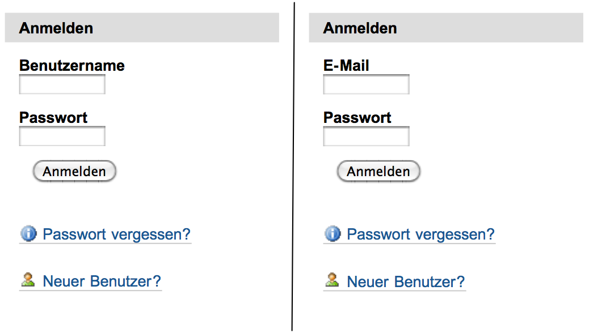

   Anmeldeportlet

.. _fig_anmeldeformular:

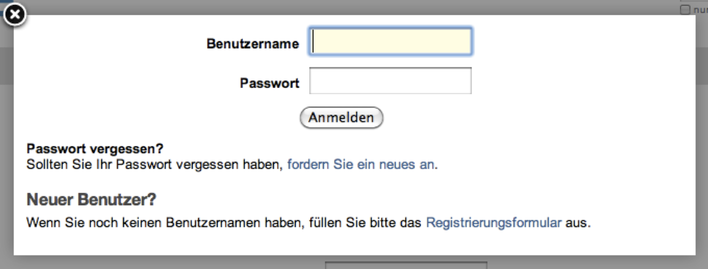

   Anmeldeportlet

Sie verweisen außerdem auf ein oder zwei Formulare:

* Unter »Passwort vergessen?« können sich registrierte Benutzer per
  E-Mail einen Link zuschicken lassen, der sie zu einer Seite führt, auf der
  sie ihr Passwort neu setzen können.
* Der Verweis »Neuer Benutzer?« erscheint nur, falls die Website so
  konfiguriert wurde, dass man sich selbst registrieren kann. Er führt
  dann zum Registrierungsformular.

.. _sec_anmelden-mit-openid:

Anmelden mit OpenID
===================

Plone unterstützt die Anmeldung mit einer OpenID. Das OpenID-System
erlaubt Ihnen, sich auf mehreren Websites anzumelden, ohne jedes Mal
ein eigenes Benutzerkonto mit Benutzernamen und Passwort erstellen zu
müssen. Stattdessen legen Sie ein Benutzerkonto bei einem
OpenID-Anbieter an und hinterlegen dort ein einziges Passwort. Der
OpenID-Anbieter übernimmt später die Passwortprüfung, wenn Sie sich
mit Ihrer OpenID an einer Website anmelden.

Wenn Sie sich an einer Website mit OpenID anmelden, verwenden Sie dazu
keinen Namen, sondern eine OpenID-URL. Das ist eine Internetadresse
wie \url{http://mustermann.myopenid.com/}, die meist aus Ihrem
OpenID-Benutzernamen und der Domäne des Anbieters gebildet
wird. Dadurch ist eine OpenID im gesamten Internet eindeutig.

Wenn Sie sich mit Hilfe von OpenID auf der Website anmelden, sind Sie
der Website nicht als regulärer Benutzer bekannt, sondern erhalten
lediglich bestimmte Rechte aufgrund der Tatsache, dass Sie eine
gültige OpenID-Identität haben. Daher steht Ihnen in diesem Fall weder
ein persönlicher Ordner noch eine persönliche Seite zur
Verfügung. Ihre OpenID-URL ersetzt den Benutzernamen bei der Anzeige
im Benutzermenü. Alle Benutzer, die sich über OpenID anmelden, werden
von Plone gleich behandelt und besitzen die gleichen
Zugriffsrechte. Welche das im Einzelnen sind, hängt von der
Konfiguration Ihrer Website ab.

Falls Ihre Website OpenID unterstützt, erscheint auf dem
Registrierungsformular ein zusätzliches Unterformular mit dem Namen
»OpenID-Anmeldung«. Außerdem finden Sie ein weiteres Anmeldeportlet für eine
OpenID-Anmeldung vor (siehe Abbildung :ref:`fig_openid-anmeldung`).

.. _fig_openid-anmeldung:

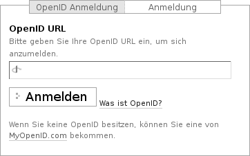

   Open-ID-Anmeldeformular

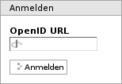

   Open-ID-Portlet

Um sich auf einer Plone-Website mit Hilfe von OpenID anzumelden, geben Sie in
das Portlet oder auf dem Registrierungsformular Ihre OpenID-URL ein. Sie
werden dann zu Ihrem OpenID-Anbieter weitergeleitet, der Sie nach
Ihrem Passwort fragt. Wenn Sie das richtige Passwort eingegeben haben, leitet
Sie der OpenID-Anbieter zu Ihrer Website zurück und schickt dabei eine
Bestätigung Ihrer Identität mit. Sie sind daraufhin auf der Website angemeldet.

.. _sec_benutzer-aktionen:

Benutzeraktionen
================

Nach Ihrer Anmeldung an der Website haben Sie im Benutzermenü Zugriff auf eine
Reihe von Aktionen (siehe Abbildung :ref:`fig_benutzermenue`):

.. _fig_benutzermenue:

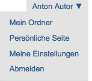

   Benutzermenü für einen angemeldeten Benutzer

Ihr Name
  Der Verweis, der mit Ihrem Namen beschriftet ist, führt Sie zu
  Ihrer persönlichen Seite (siehe Abschnitt :ref:`sec_personliche-seite-1`).

Mein Ordner
  Hier gelangen Sie gegebenenfalls zu Ihrem persönlichen
  Ordner (siehe Abschnitt :ref:`sec_mitgliedsordner`).

Abmelden
  Über diesen Verweis melden Sie sich von der Website ab. Danach
  sind Sie bis zu Ihrer nächsten Anmeldung mit Benutzernamen und Passwort ein
  der Website unbekannter Besucher und haben keinen Zugriff auf die
  erweiterten Funktionen für angemeldete Benutzer.

.. _sec_personliche-seite-1:

Persönliche Seite
=================

Ihre persönliche Seite ist als Ihre zentrale Anlaufstelle auf der
Website gedacht. Sie gelangen dorthin, wenn Sie nach der Anmeldung im
Benutzermenü dem Verweis mit Ihrem Namen folgen.

Ihre Seite soll Informationen und Funktionen zusammenfassen, die für Sie und
Ihre Arbeit von Interesse sind. Zunächst finden Sie dazu rechts oben auf Ihrer
Seite die folgenden drei Verweise.

Mein Profil
  Dieser Verweis führt Sie zu Ihrem Profil (siehe
  Abschnitt :ref:`sec_profil`).

Meine Einstellungen
  Hier können Sie die Angaben in Ihrem Profil und einige
  nicht öffentlich einsehbare persönliche Daten und Einstellungen ändern
  (siehe Abschnitt :ref:`sec_persoenliche-einstellungen`).

Passwort ändern
  Um ein neues Passwort für Ihr Benutzerkonto zu setzen,
  geben Sie es in diesem Formular zweimal ein und bestätigen Sie es mit Ihrem
  aktuellen Passwort.

Im Hauptteil Ihrer Seite können Sie Portlets
zusammenstellen, die für Sie relevante Informationen enthalten. Einen
Überblick über Plones Portlets finden Sie in Abschnitt :ref:`sec_portlets`.

Portlets hinzufügen
===================

Die Portlets auf Ihrer Seite sind in vier Spalten angeordnet. In der
Bearbeitungsansicht Ihrer Seite können Sie in jeder der Spalten beliebige
Portlets anlegen, umordnen und löschen (siehe
Abbildung :ref:`fig_persoenliche-seite-bearbeiten`).

.. _fig_persoenliche-seite-bearbeiten:

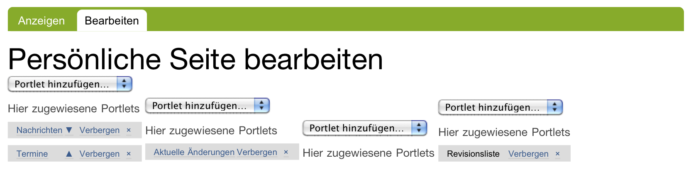

   Die Bearbeitungsansicht der persönlichen Seite

Viele Portlets müssen Sie erst konfigurieren, bevor sie angezeigt werden
können. Wenn Sie ein solches Portlet anlegen, gelangen Sie zunächst zu seinem
Bearbeitungsformular. Der Name des Portlets in der Bearbeitungsansicht Ihrer
Seite ist ebenfalls ein Verweis dorthin. Nachfolgend werden die Einstellungen
der einzelnen Portlets aufgeführt.

RSS-Feed
--------

(Abbildung :ref:`fig_rss-feed-hinzufuegen`)

.. _fig_rss-feed-hinzufuegen:

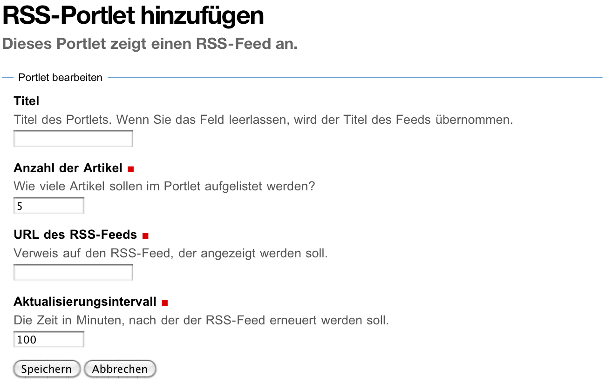

   Hinzufügen des RSS-Portlets

* Anzahl der Feed-Einträge im Portlet
* URL des RSS-Feeds
* Anzahl der Minuten, nach denen der RSS-Feed erneuert werden soll

Suche
-----

(Abbildung :ref:`fig_suchportlet-hinzufuegen`)

.. _fig_suchportlet-hinzufuegen:

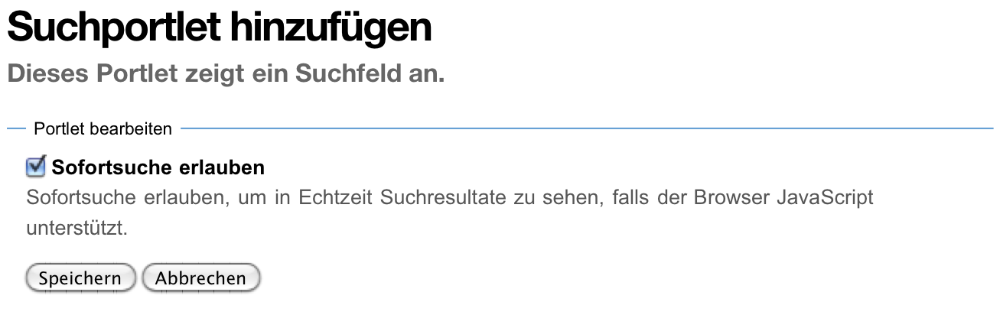

   Hinzufügen des Suchportlets

* Sofortsuche an- oder abschalten

Aktuelle Änderungen
-------------------

(Abbildung :ref:`fig_aktuelle-artikel-portlet-hinzufuegen`)

.. _fig_aktuelle-artikel-portlet-hinzufuegen:

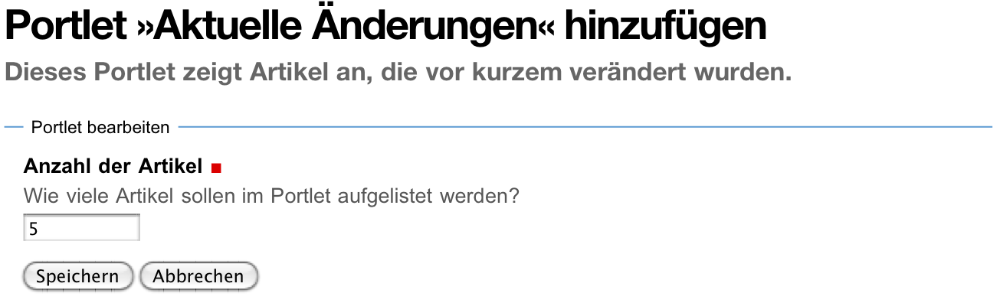

   Hinzufügen des Portlets »Aktuelle Änderungen«

* Anzahl der angezeigten neuen Artikel

Nachrichten
-----------

(Abbildung :ref:`fig_nachrichten-portlet-hinzufuegen`)

.. _fig_nachrichten-portlet-hinzufuegen:

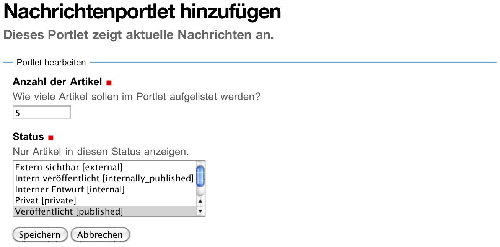

   Hinzufügen des Nachrichtenportlets

* Anzahl der angezeigten Nachrichten
* zu berücksichtigende Revisionsstatus

Welche Status Sie für die anzuzeigenden Nachrichten auswählen können, hängt
von Ihren Berechtigungen ab. Veröffentlichte Nachrichten kann jeder Benutzer
anzeigen lassen.

Termine
-------

(Abbildung :ref:`fig_terminportlet-hinzufuegen`)

.. _fig_terminportlet-hinzufuegen:

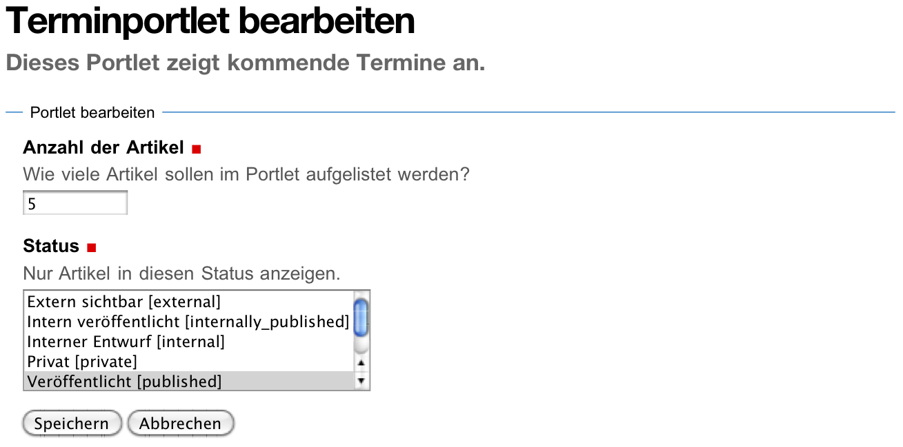

   Hinzufügen des Terminportlets

* Anzahl der angezeigten Termine
* zu berücksichtigende Status (siehe die Erläuterung zum
  Nachrichtenportlet)

.. _sec_statisches-portlet-hinzufuegen:

Statisches Portlet
------------------

(Abbildung :ref:`fig_statisches-portlet-hinzufuegen`)

.. _fig_statisches-portlet-hinzufuegen:

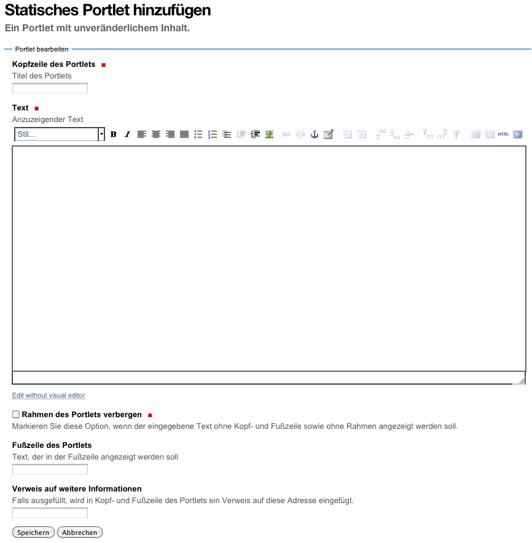

   Hinzufügen des statischen Portlets

* Kopfzeile
* anzuzeigender Text (mit allen Bearbeitungsmöglichkeiten des Texteditors
  Kupu)
* Rahmen des Portlets verbergen?
* Fußzeile
* URL, die auf weitere Informationen verweist
* Portlet vorübergehend nicht anzeigen?

Klassisches Portlet
-------------------

Unter einem klassischen Portlet versteht man ein Portlet, das für eine
frühere Version von Plone erstellt wurde. Ein solches Portlet können
Sie nicht direkt anlegen. Sie müssen im Auswahlmenü »Klassisches
Portlet« wählen und beim Bearbeiten angeben, wo Plone die Beschreibung
des Portlets finden kann.

Das einzige klassische Portlets, das Plone von Haus aus mitbringt, ist das
Portlet für Ihre Lesezeichen. Fragen Sie Ihren Administrator, ob es auf Ihrer
Website weitere klassische Portlets gibt.

.. _fig_klassisches-portlet-hinzufuegen:

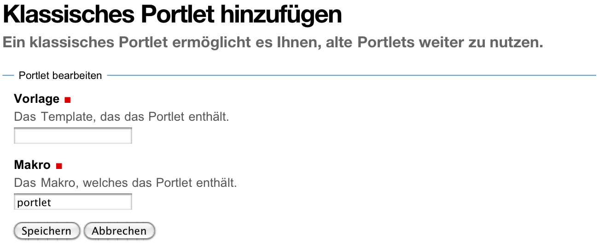

   Hinzufügen des klassischen Portlets

Abbildung :ref:`fig_klassisches-portlet-hinzufuegen`
zeigt das Bearbeitungsformular für ein klassisches Portlet. Ein solches
Portlet wird durch ein Makro in einer Vorlage beschrieben; Sie müssen die
Namen der Vorlage und des Makros angeben. Da Portletmakros in der Regel den
Namen »portlet« hatten, ist das Formularfeld bereits mit diesem Namen
vorausgefüllt. Die Vorlage für das Lesezeichenportlet heißt
``portlet_favorites``.

.. _sec_profil:

Persönliches Profil
===================

Ihr Profil gibt anderen Benutzern der Website einen Überblick über
Ihre Person und Ihre Tätigkeit (siehe Abbildung :ref:`fig_profil`).

.. _fig_profil:

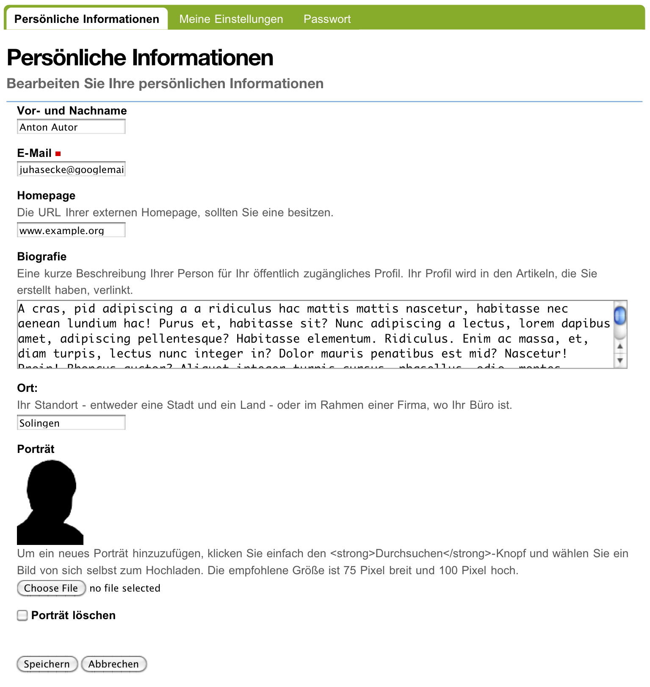

   Beispiel eines Profils

Verweise auf Ihr Profil finden sich in Ihren Artikeln und einigen
automatisch erzeugten Übersichtslisten. Sie selbst können Ihr Profil
außerdem über einen Verweis auf Ihrer persönlichen Seite erreichen.

Das Profil enthält folgende Informationen:

* Name
* Standort und Muttersprache
* Porträt und Biographie
* einen Verweis zu Ihrem persönlichen Ordner
* ein Rückmeldeformular
* Verweise zu Ihren aktuellen Artikeln

Ihre Profilangaben können Sie in Ihren Einstellungen aktuell halten.

Mit dem Rückmeldeformular können Besucher mit Ihnen Kontakt aufnehmen. Das
Formular verschickt Nachrichten an die E-Mail-Adresse, die Sie in Ihren
Einstellungen angegeben haben, sodass anonyme Besucher die Adresse nicht zu
sehen bekommen. Nachrichten bestehen aus Betreff und Text. Wenn Sie selbst
Ihre Profilseite betrachten, wird das Rückmeldeformular ausgeblendet.

Die Liste Ihrer aktuellen Artikel ist nach Artikeltypen sortiert und
enthält Titel und Änderungsdatum jedes aufgeführten Artikels. Darunter
finden Sie einen Verweis zu einer Liste aller von Ihnen verfassten
Artikel, beginnend mit dem neuesten.

.. _sec_persoenliche-einstellungen:

Persönliche Einstellungen
=========================

Wenn Sie auf Ihrer persönlichen Seite dem Verweis »Meine Einstellungen«
folgen, können Sie einige Voreinstellungen für das Verhalten von Plone
bearbeiten. Dieses Formular ist zugleich die Bearbeitungsansicht Ihres Profils
(siehe Abbildung :ref:`fig_meine-einstellungen`).

.. _fig_meine-einstellungen:

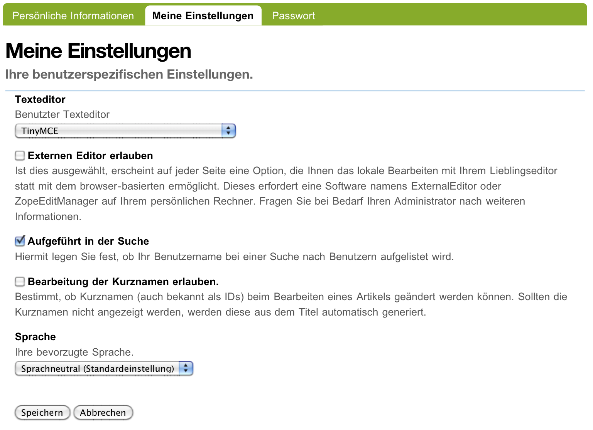

   Persönliche Einstellungen

Zu Ihren Profildaten zählen folgende Angaben:

Vor- und Nachname
  Geben Sie hier Ihren vollständigen Namen ein. Mit
  diesem Namen werden Sie beispielsweise in der Anzeige Ihrer Artikel als
  Verfasser genannt.

E-Mail

  Geben Sie eine gültige E-Mail-Adresse ein, unter der
  Sie erreichbar sind. Dieses Feld müssen Sie ausfüllen.

Ort
  Die Stadt oder das Land, wo Sie wohnen oder arbeiten.

Sprache
  Ihre Muttersprache.

Biographie
  Ein paar Sätze über Ihre Person und Ihre Arbeit. Mit diesem
  Text stellen Sie sich in Ihrem Profil vor.

Homepage
  Falls Sie eine eigene Website haben, so können Sie sie hier
  eintragen. 

Porträt
  Ein Foto von Ihnen, das in Ihrem Profil angezeigt wird. Wenn Sie ein
  zu großes Bild hochladen, wird es auf eine sinnvolle Größe skaliert.
  Um das Bild zu löschen, kreuzen Sie »Porträt löschen« an.

In den übrigen Feldern können Sie Plones Verhalten beeinflussen:

Texteditor
  Hier wählen Sie aus, mit welchem Texteditor
  Sie den Haupttext Ihrer Seiten bearbeiten wollen. Es gibt
  zwei Möglichkeiten:
 
  * Kupu ist ein komfortabler, visueller Editor. Mit ihm können Sie Ihren
    Text bei der Eingabe direkt formatieren und sehen ihn dabei so, wie er
    später von Plone angezeigt wird. Die meisten Anwender werden Kupu
    bevorzugen.
  * Der normale Formulareditor ist einfach ein mehrzeiliges Eingabefeld
    und wird von jedem Webbrowser zur Verfügung gestellt. Sie können dort
    neben einfachem Text und HTML möglicherweise auch andere
    Textauszeichnungssprachen eingeben.

Bearbeitung der Kurznamen erlauben
  Wählen Sie aus, ob Sie die Kurznamen
  Ihrer Artikel ändern wollen. Blenden Sie das Feld aus, wenn Sie eine
  aufgeräumtere Bearbeitungsansicht bevorzugen. Unabhängig davon können Sie
  die Kurznamen von Artikeln jederzeit in der Inhaltsansicht ihres jeweiligen
  Ordners bearbeiten.

  Sie sehen dieses Feld nur, falls Ihr Administrator für die Website
  erlaubt hat, Kurznamen zu bearbeiten.

.. _sec_mitgliedsordner:

Persönlicher Ordner
===================

Falls Ihre Website entsprechend konfiguriert ist, erhält jeder Benutzer einen
persönlichen Ordner. Sie erreichen Ihren Ordner nach der Anmeldung über den
Verweis »Mein Ordner« im Benutzermenü. Wenn es auf Ihrer Website keine
persönlichen Ordner gibt, fehlt dieser Verweis.

In Ihrem Ordner können Sie nach eigenem Ermessen Artikel anlegen,
bearbeiten und löschen. An anderen Stellen der Website haben Sie diese
Möglichkeiten eventuell nicht oder nur eingeschränkt. 

Die persönlichen Ordner sind ebenso öffentlich einsehbar wie alle
anderen Inhalte der Website. Sie finden die Ordner anderer Benutzer
beispielsweise durch eine Suche im Benutzerbereich (siehe
Abschnitt :ref:`sec_mitgliedersuche`).

In Ihrem eigenen Ordner können Sie außer den öffentlich sichtbaren
auch solche Artikel sehen, die den Revisionsstatus
»privat« tragen, also vor anderen Benutzern und unangemeldeten
Besuchern versteckt sind.

Wenn Sie Lesezeichen anlegen, erzeugt Plone einen Lesezeichenordner in Ihrem
persönlichen Ordner mit dem Titel »Favorites«. Für jedes Lesezeichen, das
Sie auf der Website setzen, wird in diesem Ordner ein Lesezeichen-Artikel
angelegt.

.. _sec_mitgliedersuche:

Benutzersuche
=============

Über den Eintrag »Benutzer« in der Hauptnavigation erreichen Sie die
Benutzersuche (siehe Abbildung :ref:`fig_benutzersuche`).

.. _fig_benutzersuche:

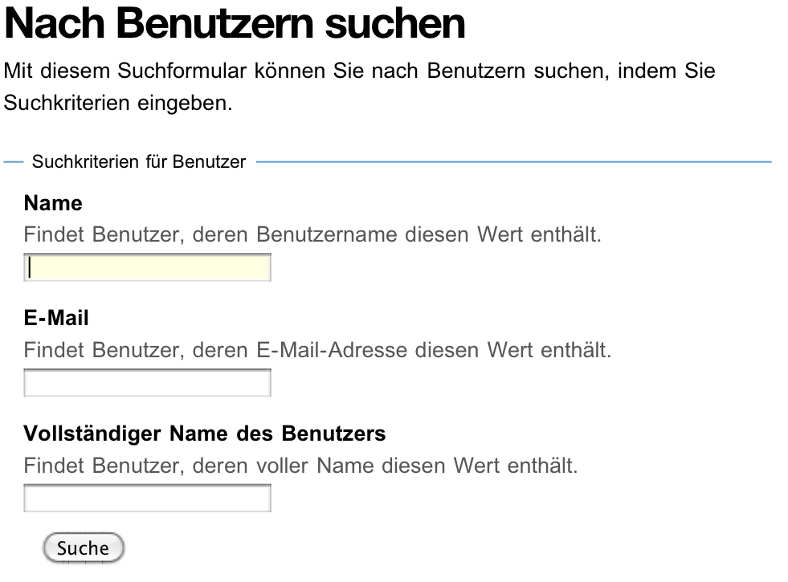

   Benutzersuche

Sie können Benutzer Ihrer Website nach folgenden Kriterien suchen:

Name
  Geben Sie hier den Benutzernamen des gesuchten Benutzers
  ein. Sie können auch nach einem Teilwort suchen.

E-Mail
  Geben Sie die E-Mail-Adresse des gesuchten Benutzers ein.
  Auch hier können Sie nach einem Teil der Adresse suchen.

Vollständiger Name des Benutzers
  Geben Sie hier den Vor- oder Nachnamen
  des Benutzers ein. Sie können auch ein Teilwort oder den gesamten Namen
  eingeben.

Alle Suchkriterien werden gleichzeitig angewendet: Es werden nur Benutzer
gefunden, die alle Kriterien erfüllen. Nicht angegebene Kriterien
werden nicht beachtet.

Die Liste der Suchergebnisse enthält die Namen und Porträts der gefundenen
Benutzer. Sie sind gegebenenfalls Verweise auf die jeweiligen persönlichen
Ordner.

