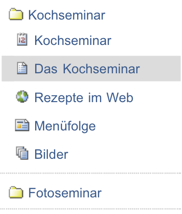
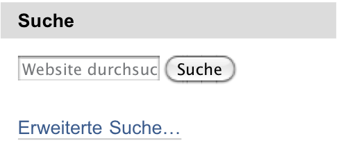

.. _sec_navigation:

============
 Navigation
============

Es gibt verschiedene Möglichkeiten, sich gezielt durch eine Plone-Website zu
bewegen:

* Orientierung an der Ordnerhierarchie: Hauptnavigation und
  Navigationsportlet, Übersicht und Verzeichnispfad
* Lesezeichen: Portlet und Lesezeichenordner
* Suche: Sofortsuche und erweiterte Suche

Ordnerhierarchie
================

Es gibt vier Elemente auf fast jeder Seite einer Plone-Website, mit deren
Hilfe Sie sich durch ihre Ordnerhierarchie bewegen können: die
Hauptnavigation, das Navigationsportlet, die Übersicht und den
Verzeichnispfad. Diese Elemente ergänzen einander. Hauptnavigation,
Navigationsportlet und Übersicht geben einen Überblick über den
Inhalt der Website, wobei der Schwerpunkt beim Portlet auf dem gerade
besuchten Teil liegt. Der Verzeichnispfad teilt Ihnen mit, an welcher Stelle
in der Ordnerhierarchie der Website Sie sich befinden.

Hauptnavigation
---------------

Die Hauptnavigation ist auf jeder Seite der Website verfügbar. Sie befindet
sich im Seitenkopf (siehe Abbildung :ref:`fig_globale-reiter`) und
enthält Verweise auf wichtige Stellen der Website.

.. _fig_globale-reiter:

   Hauptnavigation und Verzeichnispfad

Plone bringt einige dieser Verweise bereits mit (siehe
Tabelle :ref:`Einträge in Navigation <tab_globale-reiter>`).

.. _tab_globale-reiter:

+-------------+---------------------------+----------------------------+
| Titel       | Ziel                      | siehe Seite                |
+=============+===========================+============================+
| Startseite  | Anzeige des Wurzelordners |                            |
+-------------+---------------------------+----------------------------+
| Benutzer    | Benutzersuche             | :ref:`sec_mitgliedersuche` |
+-------------+---------------------------+----------------------------+
| Nachrichten | Nachrichtenüberblick      | :ref:`sec_nachricht`       |
+-------------+---------------------------+----------------------------+
| Termine     | Terminübersicht           | :ref:`sec_termin`          |
+-------------+---------------------------+----------------------------+
| Groups      | Gruppenarbeitsplätze      | :ref:`sec_gruppen`         |
+-------------+---------------------------+----------------------------+

Der Reiter für die Gruppenarbeitsplätze wird nur angezeigt, falls Ihre
Website Gruppenarbeitsplätze benutzt.

Zusätzlich zu den genannten Reitern erzeugt Plone in der
Grundeinstellung weitere Reiter für alle Ordner, die sich direkt im
Wurzelordner Ihrer Website befinden. Falls die Website entsprechend
konfiguriert ist, nimmt Plone auf diese Weise nicht nur Ordner,
sondern alle Artikel aus dem Wurzelordner, die Sie einsehen dürfen, in
die Hauptnavigation auf. Der Reiter für einen solchen Artikel ist dann
mit dem Titel des Artikels beschriftet.

.. _sec_navigation-portlet:

Navigationsportlet
------------------

Das Navigationsportlet (siehe Abbildung :ref:`fig_portlet-navigation`)
zeigt einen Teil der Website als Ordnerbaum an. Dabei werden wiederum nur
solche Ordner und Artikel aufgeführt, die Sie auch einsehen dürfen. Viele
Eigenschaften des Navigationsportlets hängen von der Konfiguration Ihrer
Website ab. Per Voreinstellung wird das Portlet auf der Startseite nicht
angezeigt, sondern erscheint erst in den einzelnen Ordnern Ihrer
Website.

.. _fig_portlet-navigation:

   Navigationsportlet

.. _fig_sitemap:

   Übersicht

Da die Ordnerhierarchie einer großen Website sehr umfangreich und
unübersichtlich werden kann, wird nie der gesamte Baum gleichzeitig
dargestellt. Das Navigationsportlet zeigt stets nur den Teil Ihrer
Website an, der sich innerhalb eines Ordners befindet und den gerade
besuchten Artikel enthält.

Per Voreinstellung beginnt die Anzeige immer mit einem Ordner, der
selbst direkt im Wurzelordner der Website liegt. Damit bildet das
Navigationsportlet gerade ein Gegenstück zur Hauptnavigation. Ob der
betreffende Ordner selbst als oberster Eintrag im Navigationsportlet
auftaucht, hängt ebenfalls von der Konfiguration ab.

Der Eintrag für den gerade besuchten Artikel wird blau
hinterlegt. Jeder Eintrag im Navigationsportlet ist ein Verweis zu
einem Ordner oder einem anderen Artikel.

Da das Navigationsportlet wie alle Portlets für jeden Ordner, ja sogar
für einzelne Artikel, individuell konfiguriert werden kann, ist es
möglich, dass es sich nicht auf jeder Seite gleichartig verhält.

.. _sec_sitemap:

Übersicht
---------

Unter den Verweisen im Kopf jeder Seite finden Sie die Übersicht.  Die
Übersicht oder »Sitemap« ist eine Baumdarstellung aller Artikel der
Website, die mit dem Wurzelordner beginnt und bis zu einer bestimmten
Tiefe der Ordnerhierarchie reicht. Per Voreinstellung werden Ordner
bis zur dritten Ebene mit allen enthaltenen Artikeln erfasst (siehe
Abbildung :ref:`fig_sitemap`). Ein weiteres Mal werden hier nur
Artikel berücksichtigt, die Sie auch betrachten dürfen. Jeder Eintrag
in der Übersicht ist ein Verweis zur Anzeige des jeweiligen Artikels.

Verzeichnispfad
---------------

Sie können den Verzeichnispfad, englisch »breadcrumb menu«, als eine
Art Brotkrumenspur verstehen, die den Wurzelordner Ihrer Website durch
die Ordnerhierarchie hindurch mit Ihrem aktuellen Standpunkt
verbindet. Das erste Element des Pfads ist der Wurzelordner der
Website (siehe Abbildung :ref:`fig_globale-reiter`). Danach folgen
alle Unterordner, in die Sie nacheinander wechseln müssen, um vom
Wurzelordner zum gerade angezeigten Artikel zu gelangen. Der aktuelle
Artikel bildet den letzten Teil des Pfads. Alle Elemente des
Verzeichnispfads sind Verweise zu den jeweiligen Orten auf der
Website.

.. _sec_navigation-lesezeichen:

Lesezeichen
===========

Neben den Navigationsfunktionen, die sich an der Ordnerstruktur der Website
orientieren, können Sie eine Reihe von Lesezeichen auf einzelne Artikel
setzen. Das ist dann sinnvoll, wenn Sie bestimmte Artikel oft benötigen und
sie nicht immer wieder aus der Ordnerhierarchie heraussuchen wollen. Die
Lesezeichenfunktion muss auf Ihrer Website eingeschaltet worden sein.

Lesezeichen sind eine spezielle Art von Link-Artikeln (siehe
Abschnitt :ref:`sec_link`). Sie werden angelegt, wenn Sie auf einer Seite
Ihrer Website die Artikelaktion »Lesezeichen setzen« benutzen (siehe
Abbildung :ref:`fig_lesezeichen-setzen`).

.. _fig_lesezeichen-setzen:

   Die Artikelaktion »Lesezeichen setzen«

Das Lesezeichenportlet zeigt eine Liste von direkten Verweisen zu den
Artikeln an, auf die Sie Lesezeichen gesetzt haben (siehe Abbildung
:ref:`fig_portlet-favorites`).

.. _fig_portlet-favorites:

   Lesezeichenportlet

Sie können das Portlet auf Ihrer persönlichen Seite anlegen. Je nach
Konfiguration kann es sich auf Ihrer Website auch in einer der
Seitenspalten befinden.

Ihre Lesezeichen werden im Unterordner »Favorites« in Ihrem persönlichen
Ordner gespeichert. Dort können Sie sie mit den gleichen Mitteln bearbeiten
und verwalten wie andere Link-Artikel. Der einzige Unterschied zwischen
Lesezeichen und anderen Links besteht darin, dass Lesezeichen nicht die
Internetadresse des Artikels, sondern seinen Pfad innerhalb der Website
speichern.

Das Lesezeichenportlet endet mit einem Verweis »Mehr...«, der Sie zu Ihrem
Lesezeichenordner führt. Sie gelangen dorthin auch über den Verweis »Meine
Lesezeichen« im Benutzermenü, falls er auf Ihrer Website eingeschaltet ist.

.. _sec_suche:

Suche
=====

Sie können den Inhalt einer Plone-Website durchsuchen. So finden Sie
beispielsweise alle Artikel, die ein bestimmtes Wort enthalten. Plone
stellt Ihnen sowohl ein einfaches Suchfeld als auch eine erweiterte
Suche zur Verfügung. Sie finden immer nur solche Artikel, die Sie auch
einsehen dürfen.

Die Liste der Suchergebnisse enthält für jeden Treffer den Titel und
die Beschreibung, eine Prozentangabe zur Relevanz, den Ersteller, das
Datum der letzten Änderung und die Kategorien.  Ein Symbol links vom
Titel zeigt Ihnen den Artikeltyp an. Der Titel ist ein Verweis zum
jeweiligen Artikel. Listen mit mehr als 30 Treffern werden auf mehrere
Seiten verteilt, wobei Sie jeweils am Ende der Seiten Verweise zu den
anderen Teillisten finden.

Suchfeld
--------

In das Suchfeld im Kopf jeder Plone-Seite können Sie einen oder mehrere
Suchbegriffe eingeben. Bereits während der Eingabe zeigt Plone in der Sofortsuche
Treffer an (siehe Abbildung :ref:`fig_sofortsuche`).

.. _fig_sofortsuche:

   Sofortsuche

Sie können sich sowohl mit den Pfeiltasten durch die Liste bewegen und
mit der Eingabetaste ein Ergebnis auswählen, als auch die Maus dafür
benutzen. Wenn Sie Javascript ausgeschaltet haben, steht Ihnen die
Sofortsuche nicht zur Verfügung.

Mit der Schaltfläche »Suche« führen Sie eine Volltextsuche in Titel,
Beschreibung und Inhalt aller Artikel der Website durch. Wenn Sie nur
in dem Ordner suchen wollen, in dem Sie sich gerade befinden,
markieren Sie direkt unterhalb des Suchfeldes die Option »nur im
aktuellen Bereich«.

Komplexe Suchen und Stoppwörter
-------------------------------

Wenn Sie bei einer Suche mehrere Suchbegriffe eingeben, findet Plone
Artikel, die jeden der Begriffe enthalten. Dabei können die Begriffe
an beliebigen Stellen im Text stehen. Um nach einer Wortgruppe zu
suchen, die als Ganzes im Artikeltext vorkommt, schreiben Sie sie in
Anführungszeichen.

Sie können auch nach Artikeln suchen, die mindestens eines von
mehreren Suchwörtern enthalten, indem Sie die Suchwörter mit ``OR``
(»oder«) verknüpfen. Dadurch werden in der Regel mehr Artikel gefunden
als bei einer Suche nach Artikeln mit allen Suchwörtern. Neben ``OR``
gibt es auch die Verknüpfungsoperation ``AND`` (»und«), die
gleichbedeutend damit ist, mehrere Wörter einfach hintereinander zu
schreiben.

Sie können beide Arten der Verknüpfung von Suchbegriffen mischen. Wenn
Sie beispielsweise nach einem Seminar oder einem Workshop für
Textverarbeitung suchen, können Sie die Suche »Textverarbeitung AND
(Seminar OR Workshop)« eingeben. In diesem Beispiel findet Plone
Artikel, in denen sowohl das Wort »Textverarbeitung« als auch
wenigstens einer der Begriffe »Seminar« und »Workshop« vorkommt.

Stoppwörter, also häufig benutzte Wörter wie »der«, »die«, »das«,
werden von Plone bei einer Suchanfrage ignoriert.

Komplexe Suchen mit Verknüpfungen oder Wortgruppen sowie die Filterung
von Stoppwörtern stehen in der Sofortsuche nicht zur Verfügung. Wenn
Sie diese Funktionen benutzen wollen, müssen Sie eine reguläre
Suchanfrage über die Schaltfläche »Suche« durchführen oder die
erweiterte Suche benutzen.

Erweiterte Suche
----------------

In der Ergebnisliste des Suchfelds finden Sie einen Verweis zum
Formular für die erweiterte Suche. Damit können Sie Ihre Suche
verfeinern, indem Sie beispielsweise die zu durchsuchenden
Artikeleigenschaften einschränken oder andere Suchkriterien als die
Volltextsuche auswählen:

* Volltextsuche in Titel, Beschreibung und Inhalt
* Volltextsuche im Titel
* Suche nach Kategorien
* Volltextsuche in der Beschreibung
* Suche nach neuen Artikeln
* Suche nach bestimmten Artikeltypen
* Suche nach Artikeln von bestimmten Autoren
* Suche nach Revisionsstatus (nur für Redakteure zugänglich)

Für eine Volltextsuche geben Sie einen oder mehrere Suchbegriffe ein,
die Sie verknüpfen oder zu Wortgruppen zusammenfassen können. Für die
anderen Suchkriterien bietet Ihnen Plone eine Reihe von Werten an, aus
denen Sie einen oder mehrere auswählen können.

Die Ergebnisse einer erweiterten Suche müssen alle angegebenen
Kriterien gleichzeitig erfüllen. Irrelevante Angaben schränken daher
die Suche unnötig ein. Mit folgenden Werten und Eingaben stellen Sie
sicher, dass die Suchergebnisse nicht eingeschränkt werden: %

* für ein Textfeld: keine Eingabe
* für die Stichwortsuche: keine Auswahl
* für Artikeltyp und Revisionsstatus: jeden Wert erlauben
* für die Altersgrenze für neue Artikel: »immer«
* für den Autor: »jeder Autor«

.. _sec_suchportlet:

Suchportlet
-----------

Ihre Website kann so konfiguriert sein, dass das Suchfeld in einem eigenen
Portlet erscheint (siehe Abbildung :ref:`fig_portlet-suche`).

.. _fig_portlet-suche:

   Suchportlet

Das Suchportlet funktioniert genauso wie das Suchfeld im
Seitenkopf. Sie können allerdings die Suchergebnisse nicht auf den
Bereich eingrenzen, in dem Sie sich gerade befinden.
