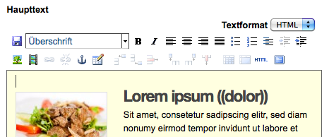

.. _sec_tinymce:

======================
Der Texteditor TinyMCE
======================

Ein Texteditor erleichtert Ihnen in Plone die Bearbeitung von Texten. Ohne
HTML-Code schreiben zu müssen, können Sie mit seiner Hilfe Texte so eingeben
und formatieren wie Sie es von Ihrer Textverarbeitung her gewohnt sind. Der
Texteditor heißt TinyMCE. Sie können mit dem Editor Textstellen als
Überschriften markieren, Auflistungen und Tabellen gestalten, Bilder einfügen
und positionieren und Verweise einfügen (siehe Abbildung
:ref:`fig_tinymce-haupttext`).
 
.. _fig_tinymce-haupttext:

.. figure:: ../images/tinymce-haupttext.*
   :width: 100%
   :alt: Der Haupttext eines Artikel im Bearbeitungsmodus mit dem
   	 Texteditor TinyMCE

   Der Texteditor TinyMCE

Um mit TinyMCE zu arbeiten, muss Javascript aktiviert sein.

.. _sec_tinymce-werkzeugleiste:

Die Werkzeugleiste
==================

Die Werkzeugleiste von TinyMCE (siehe Abbildung
:ref:`fig_tinymce-werkzeugleiste`) enthält diverse
Bedienungselemente. Welche Bedienungselemente im Einzelfall zur
Verfügung stehen, hängt von der Konfiguration der Website ab.

.. _fig_tinymce-werkzeugleiste:

.. figure:: ../images/tinymce-werkzeugleiste.*
   :width: 100%
   :alt: Die Werkzeugleiste von TinyMCE

   Die Werkzeugleiste von TinyMCE

Die Abbildung zeigt die nach der Installation von Plone zur Verfügung
stehenden Bedienungselemente an. Bedienungselemente, die im aktuellen
Kontext nicht benötigt werden, sind schattiert dargestellt und stehen
nicht zur Verfügung. 

Wenn Sie den Mauszeiger eine kurze Weile über einem Symbol ruhen
lassen, erscheint ein Hinweis auf seine Funktion und eventuell ein
Tastaturkürzel, mit dem man die Funktion alternativ zur Maus bedienen
kann.

Stilauswahl
-----------

Das Auswahlmenü :guilabel:`Stil…` enthält Stilvorgaben, die die Formatierung
von Text deutlich erleichtern. Sie können damit eine Textstelle zum Beispiel
als Überschrift markieren, und Plone kümmert sich darum, die Stelle in der
richtigen Schriftgröße und Schriftart darzustellen. Sie müssen also
Schriftgröße und Schriftart nicht bei jeder Überschrift mit der Hand
einstellen. Außerdem stellen Stilvorlagen sicher, dass überall auf der Website
Texte einheitlich formatiert sind. 

.. _fig_tinymce-stilauswahl:

.. figure:: ../images/tinymce-stilauswahl.*
   :width: 100%
   :alt: Das Auswahlmenü für die Stile

   Das Menü zur Stilauswahl

Das Menü besteht aus drei bzw. vier Teilen. 

Absätze 
   In diesem Teil stehen die Absatzstile, die sich auf den ganzen
   Absatz auswirken, in dem sich der Cursor befindet. Um einen solchen
   Stil im Text zu verwenden, setzen Sie den Cursor in den
   entsprechenden Absatz und wählen Sie einen Stil im Bereich
   :guilabel:`Absätze`. Zur Verfügung stehen folgende Absatzstile:
   
   Normaler Absatz
      Dies ist der normale Stil für längere Fließtexte in Plone.

   Überschrift
      Für Überschriften im Text.

   Zwischenüberschrift
      Für Zwischenüberschriften im Text.

   Code
      Für die Darstellung von Quellcode.

   Seitenansprache
      Für Absätze, die aus dem normalen Textfluss herausgehoben
      werden. Sie dient dazu, das Leseinteresse zu wecken,
      da sie stark hervorgehoben erscheint.

   Herausgestellt
      Der Text des Absatzes wird in einem grau hinterlegten Kasten
      dargestellt. 

   Umfluss beenden 
      Beendet den Fluss von Text um ein Bild herum, sodass der
      nachfolgende Absatz unterhalb des Bildes gesetzt wird.

Auswahl
   Die Stile im Bereich :guilabel:`Auswahl` wirken sich auf
   Textstellen aus, die zuvor mit dem Cursor ausgewählt wurden. Zur
   Verfügung stehen folgende Stile:

   (Stile entfernen)
      Hiermit entfernen Sie alle Stile einer ausgewählten
      Textpassage. 

   Dezent
      Bei diesem Stil wird der Text kleiner und in grauer Farbe
      dargestellt. 

   Markiert
      Die ausgewählte Textstelle wird durch einen gelben Hintergrund
      farblich markiert.

Tabellen
   Dieser Bereich erscheint nur dann im Auswahlmenü, wenn sich der
   Cursor in einer Tabelle befindet. Es stehen folgende Tabellenstile
   zur Verfügung:

   Einfache Zelle
      Stil für die normale Zellen, also keine Kopfzeile zur Spaltenüberschrift 

   Unsichtbarer Rahmen
      Die Zellen der Tabelle haben einen unsichtbaren Rahmen.

   Schicke Auflistung
      Die Tabelle ist ohne Rahmen, nur über der Kopfzeile ist eine
      feine Linie.

   Schicke Rasterauflistung
      Die Zellen in der Tabelle haben eine feinen Rahmen.

   Schicke vertikale Auflistung
      Die Zeilen der Tabelle sind mit feinen Linien abgetrennt. Die
      horizontalen Rahmen sind unsichtbar.

   Ungerade Reihe
      Ungerade Reihen erscheinen hellgrau hinterlegt

   Gerade Reihe
      Gerade Reihen haben keine Hintergrundfarbe

   Kopfzeile
      Stil für Zellen in der Kopfzeile

Drucken
   Stile in diesem Bereich wirken sich nur in der Druckausgabe aus. 

   Seitenumbruch
      An der Stelle, wo dieser Stil eingefügt wird, erfolgt beim
      Ausdrucken ein Seitenumbruch.

Ihr Administrator kann Ihnen an dieser Stelle weitere Stilvorlagen für Absätze
und Zeichen zur Verfügung stellen oder die Zahl der Stile eingrenzen.

Textformatierungen
------------------

Rechts neben dem Auswahlmenü für Stilvorlagen sind die
Bedienungselemente für Textformatierungen aufgereiht.

.. _fig_tinymce-textformatierungen:

.. figure:: ../images/tinymce-textformatierungen.*
   :width: 100%
   :alt: Die Bedienungselemente zur Textformatierung

   Bedienungselemente zur Textformatierung

Die Bedienungselemente haben folgende Funktion (von links nach
rechts):

* Fett (von englisch »bold«)

* Kursiv (von englisch »italic«)

* Linksbünding

* Zentriert

* Rechtsbünding

* Blocksatz

* Ungeordnete Liste

* Geordnete Liste mit Zahlen

* Definitionsliste

* Ausrücken

* Einrücken

Haben Sie einen Teil Ihres Textes markiert, so wird die jeweilige
Formatierung darauf angewendet, anderenfalls wirkt sie sich auf den Text aus,
den Sie im Anschluss eingeben.

Tabelle einfügen
----------------

Über das Tabellenwerkzeug können Sie eine Tabelle erstellen und
modifizieren.

.. image:: ../images/tinymce-tabelle.*

Wenn Sie das Icon des Tabellenwerkzeugs anklicken, öffnet sich ein
Popup-Fenster, in dem Sie die Eigenschaften der Tabelle festlegen können (siehe
Abb.: :ref:`fig_tinymce-tabelle-einfuegen`)

.. _fig_tinymce-tabelle-einfuegen:

.. figure::
   ../images/tabelle-einfuegen.*
   :width: 50%
   :alt: Popup-Fenster zum Einfügen einer Tabelle

   Tabelle einfügen/bearbeiten

Das Werkzeug besteht aus zwei Formularen, die über die Reiter
:guilabel:`Allgemein` und :guilabel:`Erweitert` erreichbar sind.

Untermenü »Allgemein«
~~~~~~~~~~~~~~~~~~~~~

Im Untermenü :guilabel:`Allgemein` können Sie eine CSS-Klasse für Ihre
Tabelle festlegen, die Spalten- und Zeilenanzahl festlegen und eine
Zusammenfassung eingeben.

Der Inhalt des Feldes :guilabel:`Zusammenfassung` wird als
:code:`summary`-Attribut in das :code:`table`-Tag eingetragen und
dient damit der Suchmaschinenoptimierung. ::

  <table class="plain" summary="Namen und E-Mail-Adressen">

Untermenü »Erweitert«
~~~~~~~~~~~~~~~~~~~~~

Im Untermenü :guilabel:`Erweitert` können Sie festlegen, ob die
Tabelle eine Beschriftung erhalten soll. Wenn Sie dies wünschen,
setzen Sie das Häkchen bei :guilabel:`Beschriftung der Tabelle` (siehe
Abb. :ref:`fig_tabelle-einfuegen-erweitert`

.. _fig_tabelle-einfuegen-erweitert:

.. figure::
   ../images/tabelle-einfuegen-erweitert.*
   :width: 50%
   :alt: Das Untermenü »Erweitert«

   Untermenü »Erweitert«

Tabellen bearbeiten
~~~~~~~~~~~~~~~~~~~

In Abb. :ref:`fig_tabelle-mit-eingaben` sieht man eine neu erstellte
Tabelle, in die bereits einige Inhalte eingetragen wurden. Über der
Tabelle ist die Beschriftung angebracht. Die Inhalte der ersten Zeile
erscheinen automatisch als Kopfzeile oder Spaltenüberschrift. Alle
anderen Zellen haben den Stil »Einfache Zelle«. Über die Stilauswahl
können andere Stile zugewiesen werden.

.. _fig_tabelle-mit-eingaben:

.. figure::
   ../images/tabelle-mit-eingaben.*
   :width: 70%
   :alt: Neu erstellte Tabelle mit einigen Inhalten

   Tabelle mit Inhalten
   

Sobald sich der Cursor in einer Tabelle befindet, stehen Ihnen weitere
Werkzeuge zur Bearbeitung in der Bedienungsleiste von TinyMCE zur
Verfügung (siehe Abb. :ref:`fig_tinymce-tabellen`). 

.. _fig_tinymce-tabellen:

.. figure::
   ../images/tinymce-tabellen.*
   :width: 50%
   :alt: Bedienungsliste für Tabellenbearbeitung

   Werkzeuge zur Tabellenbearbeitung

Die Werkzeuge haben von links nach rechts folgende Funktionen:

Eigenschaften der Zeile
  Hiermit öffnen Sie ein Popup-Fenster, in dem Sie die Eigenschaften
  der Zeile festlegen können (siehe
  Abb. :ref:`fig_tabelle-eigenschaften-zeile-allgemein`)

  .. _fig_tabelle-eigenschaften-zeile-allgemein:

  .. figure:: ../images/tabelle-eigenschaften-zeile-allgemein.*
     :width: 50%
     :alt: Popup-Fenster, um Eigenschaften einer Tabellenzeile zu
  	   verändern

     Eigenschaften der Zeile
  
  Sie können die Höhe der Zeile und die vertikale
  Ausrichtung des Inhalts bestimmen. Bei der Angabe der Höhe brauchen
  Sie keine Maßangabe zu verwenden. Es wird automatisch die Maßangabe
  ›px‹ verwendet. Bei der vertikalen Ausrichtung stehen Ihnen die
  Optionen »Oben«, »Mittig« und »Unten« zur Verfügung. 

  .. hint::
     In der Standardkonfiguration entfernt Plone diese Angaben aus dem
     HTML-Code. Die Eingabe hat also keinen Effekt.

  Im Untermenü »Erweitert«
  (Abb. :ref:`fig_tabelle-eigenschaften-zeile-erweitert`) können Sie
  Zeilen einer Tabellengruppe zuordnen. Es gibt den Tabellenkopf
  (:code:`thead`), den Tabelleninhalt (:code:`tbody`) und den
  Tabellenfuß (:code:`tfoot`). Je nach ausgewählter CSS-Klasse kann
  die Gruppierung Auswirkungen auf die Darstellung der Tabelle haben.

  .. _fig_tabelle-eigenschaften-zeile-erweitert:

  .. figure::
     ../images/tabelle-eigenschaften-zeile-erweitert.*
     :width: 50%
     :alt: Untermenü zur Gruppierung von Zeilen

     Untermenü »Erweitert« 

Eigenschaften der Zelle
  Mit diesem Werkzeug können Sie im Untermenü »Allgemein« Breite und
  Höhe der Zelle, die vertikale Ausrichtung des Inhalts (»unbestimmt«,
  »Oben«, »Mittig«, »Unten«) und den Bezug der Angaben (»unbestimmt«,
  »Spalte«, »Zeile«) einstellen. Alle Änderungen werden von Plone in
  der Standardkonfiguration aus dem HTML-Code vor dem Abspeichern
  entfernt. Sie haben also keine Auswirkung. Das gleiche gilt für das
  Untermenü »Erweitert«.

Zeile oberhalb einfügen
  Durch einen Klick auf dieses Symbol fügen Sie oberhalb der Zeile, in
  der sich der Cursor befindet, eine neue Zeile ein.

Zeile unterhalb einfügen
  Durch einen Klick auf dieses Symbol fügen Sie unterhalb der Zeile,
  in der sich der Cursor befindet, eine neue Zeile ein.

Zeile löschen
  Durch einen Klick auf dieses Symbol löschen Sie die Zeile, in der
  sich der Cursor befindet.

Spalte links einfügen
  Durch einen Klick auf dieses Symbol fügen Sie links der Spalte, in
  der sich der Cursor befindet, eine neue Spalte ein.

Spalte rechts einfügen
  Durch einen Klick auf dieses Symbol fügen Sie rechts der Spalte, in
  der sich der Cursor befindet, eine neue Spalte ein.

Spalte löschen
  Durch einen Klick auf dieses Symbol löschen Sie die Spalte, in der
  sich der Cursor befindet.

Verbundene Zellen trennen 
  Wenn sich der Cursor in einer Zelle befindet, die durch das
  Verbinden von zwei oder mehreren Zellen entstanden ist, können Sie
  die verbundenen Zellen durch einen Klick auf dieses Symbol wieder
  auftrennen.

Zellen verbinden
  Wenn Sie in der Tabelle eine oder mehrere benachbarte Zellen
  ausgewählt haben, können Sie die Zellen durch einen Klick auf dieses
  Symbol miteinander verbinden (siehe
  Abb. :ref:`fig_tabelle-zwei-zellen-ausgewaehlt`) und Abb. :ref:`fig_tabelle-zwei-zellen-vereinigt`)

.. _fig_tabelle-zwei-zellen-ausgewaehlt:

.. figure::
   ../images/tabelle-zwei-zellen-ausgewaehlt.*
   :width: 50%
   :alt: Zwei Zellen in einer Tabelle ausgewählt

   Zwei ausgewählte Zellen

.. _fig_tabelle-zwei-zellen-vereinigt:

.. figure::
   ../images/tabelle-zwei-zellen-vereinigt.*
   :width: 50%
   :alt: Zwei Zellen wurden miteinander verbunden

   Zwei miteinander verbundene Zellen

Speichern
---------

Ganz links in der Werkzeugleiste können Sie über das Disketten-Icon
den bearbeiteten Text speichern, ohne den Editor zu verlassen. Sie
können damit bei größeren Änderungen zwischendurch Ihre Arbeit
sichern.

.. image:: ../images/tinymce-speichern.* 

HTML-Ansicht
------------

Über das HTML-Icon gelangen Sie in ein neues Bearbeitungsfenster, die
HTML-Ansicht.

.. image:: ../images/tinymce-html.*

In der HTML-Ansicht enthält das Bearbeitungsfenster anstelle des formatierten
Textes den von TinyMCE erzeugte HTML-Code (siehe Abbildung
:ref:`fig_tinymce-html-quellcode`)

.. _fig_tinymce-html-quellcode:

.. figure:: ../images/tinymce-html-quellcode.*
   :width: 100%
   :alt: Fenster, um HTML-Quellcode direkt zu bearbeiten

   HTML-Code direkt bearbeiten

Wenn das Häkchen bei :guilabel:`Automatischer Zeilenumbruch` gesetzt
ist, werden die Textzeilen zur besseren Lesbarkeit innerhalb der
Anzeige automatisch umbrochen.

Sie können in dieser Ansicht direkt HTML-Code eingeben oder entfernen. Das ist
insbesondere dann praktisch, wenn Sie über die Bedienungselemente des Editors
nicht den gewünschten Effekt erzielen können oder sich der Editor fehlerhaft
verhält. Bei einem fehlerhaften Verhalten finden Sie in dieser Ansicht oftmals
die Ursache in Form eines leeren oder überflüssigen HTML-Tags, das über die
sonstigen Bedienelemente von TinyMCE nicht zu löschen ist. Nutzen Sie die
HTML-Ansicht nur, wenn Sie ausreichende HTML-Kenntnisse haben. Beachten Sie,
dass Plone einige HTML-Tags sowie die meisten HTML-Attribute und CSS-Stile vor
dem Speichern aus dem Seitencode entfernt (siehe dazu Abschnitt
:ref:`sec_konfiguration-html-filter`).

Über :guilabel:`Aktualisieren` können Sie die Änderungen
übernehmen. Sie gelangen dadurch zurück zur formatierten Ansicht des
Textes, wo Sie wieder die normalen Textbearbeitungsfunktionen von
TinyMCE nutzen können.

Über :guilabel:`Abbrechen` verlassen Sie den HTML-Editor, ohne dass
Änderungen übernommen werden. 

Beachten Sie beim Bearbeiten von HTML-Code, dass nicht alle Sprachelemente
von HTML erlaubt sind. Das ist notwendig, um zu gewährleisten, dass Ihr Text
innerhalb einer Plone-Seite angezeigt werden kann, ohne dabei den Code der
Seite insgesamt ungültig zu machen. Welche Sprachelemente unzulässig sind,
hängt von der Konfiguration Ihrer Website ab. Wenden Sie sich gegebenenfalls
an Ihren Administrator.

Vollbildanzeige
---------------

Über den Schalter ›Vollbildanzeige‹, wechseln Sie zu einer Anzeige, in
der das Textfeld den gesamten Raum im Browser in Anspruch nimmt. 

.. image:: ../images/tinymce-vollbild.*

So können Sie einen größeren Teil des zu bearbeitenden Textes
gleichzeitig sehen. Mit demselben Symbol können Sie den Vollbildmodus
wieder verlassen. Der Vollbildmodus ist vor allem bei längeren Texten
bequem.

Die übrigen Bedienungselemente werden in den folgenden Abschnitten
erklärt.

.. _sec_tinymce-kontext-menu:

Kontextmenü
===========

Zahlreiche Funktionen des Texteditors sind über ein Kontextmenü erreichbar
(siehe Abbildung :ref:`fig_tinymce-kontext-menu-1` und
:ref:`fig_tinymce-kontext-menu-2`)

.. _fig_tinymce-kontext-menu-1:

.. figure::
   ../images/tinymce-kontext-menu-1.*
   :width: 100%
   :alt: Das Kontextmenü im Fließtext

   Das Kontextmenü im Fließtext

.. _fig_tinymce-kontext-menu-2:

.. figure::
   ../images/tinymce-kontext-menu-2.*
   :width: 100%
   :alt: Das Kontextmenü bei einer Tabelle

   Das Kontextmenü in einer Tabelle

An das Kontextmenü gelangt man über einen Rechtsklick mit der Maus. Je nach
Kontext stehen in dem Menü andere Funktionen zur Verfügung. Bitte beachten Sie,
dass diese Funktion nicht in jedem Browser zur Verfügung steht.   

Bild einsetzen
==============

Mit Hilfe des Bedienungselements :guilabel:`Bild einfügen/verändern`
kann man Fotos und Grafiken in den Text einbinden.

.. _fig_tinymce-bild:

.. image:: ../images/tinymce-bild.*

Wenn man auf das Icon klickt, öffnet sich ein Auswahlfenster, mit
dessen Hilfe man die Website nach Bildern durchsuchen kann (siehe
Abbildung :ref:`fig_tinymce-bild-einfuegen`).

.. _fig_tinymce-bild-einfuegen:

.. figure::
   ../images/tinymce-bild-einfuegen.*
   :width: 100%
   :alt: Fenster zur Auswahl eines Bildes

   Fenster zur Auswahl eines Bildes

Oben im Auswahlfenster zeigt Ihnen der Dateipfad, wo Sie sich in der
Website gerade befinden.

Darunter finden Sie die Bereiche :guilabel:`Bibliothek`,
:guilabel:`Bilderliste` und :guilabel:`Details`.

Bibliothek
   Über die Verweise :guilabel:`Startseite` und :guilabel:`Aktueller
   Ordner` gelangen Sie direkt in das Wurzelverzeichnis der
   Plone-Website oder den Ordner, in dem sich der Artikel, den Sie
   bearbeiten befindet.

   Im Suchfeld darunter können Sie nach Artikeln suchen. 

Bilderliste
   In der Bilderliste werden alle Bilder im aktuell geöffneten Ordner
   angezeigt. Über den Verweis :guilabel:`Eine Ebene nach oben`
   gelangen Sie in den darüber liegenden Ordner.

Details
   In der dritten Spalte des Auswahlfensters, sehen Sie eine Vorschau
   des ausgewählten Fotos sowie im Feld Beschreibung den Titel des
   Bildes. Mit den Auswahlmenüs :guilabel:`Ausrichtung` und
   :guilabel:`Ausmaße` können Sie die Ausrichtung des Bildes festlegen
   und die Größe. 

   Ausrichtung
      Bei der Ausrichtung haben Sie die Wahl zwischen ›Inline‹, ›Links‹
      und ›Rechts‹. Bei ›Inline‹ wird das Bild in eine eigene Zeile
      gesetzt. Bei ›Links‹ auf die linke Seite, wobei es vom Text
      rechts umflossen wird. Bei ›Rechts‹ wird das Bild auf die rechte
      Seite gesetzt und links vom Text umflossen.

   Legende
      Wenn Ihre Website entsprechend konfiguriert wurde, haben Sie die
      Möglichkeit automatisch eine Bildlegende einzufügen. Setzen Sie
      dazu bei der Option :guilabel:`Legende` ein Häkchen. Wenn das
      Bild über eine Beschreibung verfügt, wird diese eingefügt,
      ansonsten der Titel des Bildes.

   .. attention:: 
     
      Die Legende wird nicht automatisch verändert, wenn sich die Beschreibung
      oder der Titel eines Bildes ändert. 

   Ausmaße
      Sie können Bilder in verschiedenen Größen in den Artikel
      einbinden. Nach der Installation von Plone stehen folgende
      Größen zur Verfügung:

      * Original
      * Listing (16x16 Pixel)
      * Icon (32x32 Pixel)
      * Tile (64x64 Pixel)
      * Thumb (128x128 Pixel)
      * Mini (200x200 Pixel)
      * Preview (400x400 Pixel)
      * Large (768x768 Pixel)

      Beim Hochladen eines Bildes skaliert Plone das Bild automatisch
      in diesen Größen. 

.. _sec_anker-setzen:

Anker setzen
============

Wenn man beispielsweise vom Anfang eines längeren Artikels zu einer
Stelle springen möchte, die weiter unten liegt, muss man die
Zielposition als Anker markieren. Dazu bewegt man den Cursor an die
gewünschte Stelle und klickt dann auf das Ankersymbol in der Werkzeugleiste.

.. image:: ../images/tinymce-anker.*

Damit öffnet man ein kleines Dialogfenster, in das man die Bezeichnung
des Ankers eingeben kann (siehe Abbildung
:ref:`fig_tinymce-anker-setzen`) 

.. _fig_tinymce-anker-setzen:

.. figure:: 
   ../images/tinymce-anker-setzen.*
   :width: 60%
   :alt: Dialogfenster zum Setzen eines Ankers

   Anker einfügen

Verweise auf Anker, also auf spezielle Textstellen haben folgendes
Format: ::

   http://localhost:8080/Plone/veranstaltungen/kochseminar/das-kochseminar#liste-der-zutaten

Der Name des Ankers erscheint hinter dem Symbol ›#‹. 

Die Stilvorlagen »Überschrift« und »Zwischenüberschrift« bewirken,
dass an diesen Stellen automatisch Anker gesetzt werden.

Wie Sie auf einen Anker verweisen, wird weiter unten in Abschnitt
:ref:`sec_tinymce-link-auf-anker` erklärt. 

Verweise einfügen
=================

Sobald man mit der Maus eine Textstelle markiert hat, wird der Button
zum Setzen bzw. Entfernen eines Verweises in der Werkzeugleiste
aktiviert. 

.. image:: ../images/tinymce-link-setzen.*

Wenn Sie auf das Kettensymbol klicken, wird das Dialogfenster für
Links geöffnet (siehe Abbildung
:ref:`fig_tinymce-link-einfuegen-intern`).

.. _fig_tinymce-link-einfuegen-intern:

.. figure::
   ../images/tinymce-link-einfuegen-intern.*
   :width: 100%
   :alt: Das Dialogfenster zum Setzen eines Links

   Verweis einfügen

Das Dialogfenster ist ähnlich aufgebaut wie das Fenster zum Einfügen
eines Bildes. Es besteht aus zwei Teilen, dem Registerblatt
:guilabel:`Allgemein` und :guilabel:`Erweitert`.

Nach dem Öffnen des Dialogfensters befinden Sie sich auf dem
Registerblatt :guilabel:`Allgemein`. 

Dort finden Sie ganz oben den Dateipfad, der anzeigt, in welchem
Ordner Sie sich befinden. Darunter ist das Dialogfenster in drei Teile
geteilt. Der linke Teil, die :guilabel:`Bibliothek` bleibt stets
gleich. Der mittlere und der rechte Teil verändern sich je nach Anforderung.

Bibliothek
   Im linken Teil des Dialogfensters, der Bibliothek können Sie durch
   die Website navigieren, nach Artikeln auf der Website suchen oder
   festlegen, dass Sie einen externen Link, eine E-Mail-Adresse oder
   einen Verweis auf einen Anker im aktuellen Artikel eingeben
   möchten. 

   Startseite
      Über diesen Link gelangen Sie zur Startseite, dem
      Wurzelverzeichnis der Website.

   Aktueller Ordner
      Über diesen Verweis springen Sie in den Ordner, in dem sich der
      Artikel befindet, den Sie gerade bearbeiten.

   Extern
      Über diesen Verweis öffnen Sie das Dialogfenster, um einen
      Verweis auf einen andere Website einzufügen (siehe Kapitel
      :ref:`sec_tinymce-externen-link-einfuegen`).

   E-Mail
      Über diesen Link öffnen Sie das Dialogfenster, mit dem Sie eine
      E-Mail-Adresse als Link einfügen können (siehe Kapitel
      :ref:`sec_tinymce-e-mail-einfuegen`)

   Anker
      Über diesen Verweis öffnen Sie das Dialogfenster, mit dem Sie
      einen Link zu einem Anker im aktuell bearbeiteten Artikel
      einfügen können.

   Suchen
      Mit Hilfe des Suchformulars können Sie nach Artikeln auf der
      Website suchen.

Verweis auf Artikel in der Website einfügen
-------------------------------------------

Abbildung :ref:`fig_tinymce-link-einfuegen-intern` zeigt das
Dialogfenster zum Einfügen eines Verweises auf einen Artikel in der
Website. Über die Verweise :guilabel:`Startseite` und
:guilabel:`Aktueller Ordner` können Sie sich durch die Website
bewegen, um den gewünschten Artikel zu finden. Sie können dazu auch
das Suchfenster in der Spalte :guilabel:`Bibliothek` benutzen.

In der mittleren Spalte werden die Artikel aus dem Ordner angezeigt,
in dem Sie sich gerade befinden. Sie können hier durch die
Ordnerhierarchie navigieren, indem Sie einen Ordner anklicken. Der
Ordner wird daraufhin geöffnet und sein Inhalt angezeigt. Mit dem
Verweis :guilabel:`Eine Ebene nach oben` gelangen Sie jeweils zurück
in den darüber liegenden Ordner.

Sie können einen Artikel als Verweisziel auswählen, indem Sie ihn
links neben dem angezeigten Titel markieren. In unserem Beispiel wurde
die Nachricht »Kochseminar neu ins Programm aufgenommen« ausgewählt.

In der rechten Spalte mit dem Namen :guilabel:`Details` werden der
Titel des Artikels sowie die Beschreibung oder – bei Bildern – eine
Vorschau angezeigt. 

Betätigen Sie die Schaltfläche :guilabel:`Einfügen`, wenn Sie den
ausgewählten Artikel als Verweis einfügen möchten. Das Dialogfenster
wird daraufhin geschlossen und Sie kehren in den Artikel zurück, den
Sie bearbeiten.

Datei hochladen
   Falls Sie auf einen Artikel verweisen möchten, den Sie noch
   hochladen müssen, können Sie dies über die Schaltfläche
   :guilabel:`Datei hochladen` tun. 

.. _sec_tinymce-externen-link-einfuegen:

Verweis auf andere Website einfügen
-----------------------------------

Wenn Sie einen Verweis zu einer fremden Website einfügen möchten,
klicken Sie in der Spalte :guilabel:`Bibliothek` auf den Link
:guilabel:`Extern`. In der mittleren Spalte erscheint daraufhin das
Formular, mit dem Sie externe Links setzen können (siehe Abbildung
:ref:`fig_tinymce-link-einfuegen-extern`) 

.. _fig_tinymce-link-einfuegen-extern:

.. figure::
   ../images/tinymce-link-einfuegen-extern.*
   :width: 100%
   :alt: Das Formular zum Einfügen externer Links

   Verweis auf fremde Website einfügen

Adresse
   In das Textfeld geben Sie die Adresse der Website ein, auf die sie
   verweisen möchten. Davor befindet sich ein Auswahlmenü, mit dem Sie
   das Protokoll auswählen können.

   http
      Das Protokoll :term:`HTTP` wird normalerweise für Websites benutzt.

   https
      Das Protokoll :term:`HTTPS` erweitert das HTTP-Protokoll um
      Verschlüsselung und Zertifizierung. Es wird vor allem dann
      benutzt, wenn persönliche, sicherheitsrelevante Daten übertragen
      werden.

   ftp
      Das File-Transfer-Protocal (:term:`FTP`) wird zur Übertragung
      von Dateien benutzt. 

   In der Adresszeile Ihres Browsers können Sie in der Regel sehen,
   welches Protokoll die Website benutzt, auf die Sie verweisen
   möchten.

Vorschau
   Wenn Sie die Schaltfläche :guilabel:`Vorschau` neben der Adresse
   betätigen, wird die angegebene Website unten im Fenster
   :guilabel:`Vorschau` angezeigt.

.. _sec_tinymce-e-mail-einfuegen:

E-Mail-Adresse als Link einfügen
--------------------------------

Über den Link :guilabel:`E-Mail` öffnen Sie das Dialogfenster, mit dem
Sie eine E-Mail-Adresse als Verweisziel in den Artikel einfügen
können (siehe Abbildung :ref:`fig_tinymce-link-einfuegen-mail`).

.. _fig_tinymce-link-einfuegen-mail:

.. figure::
   ../images/tinymce-link-einfuegen-mail.*
   :width: 70%
   :alt: Das Dialogfenster, um eine E-Mail-Adresse als Link einzufügen

   Einfügen einer E-Mail-Adresse als Link

E-Mail
   Geben Sie in dieses Textfeld die E-Mail-Adresse des Empfängers der
   E-Mail an.

Betreff
   In dieses Textfeld können Sie ein Betreff eingeben. 

Sobald der Benutzer auf den Link klickt, öffnet sich in der Regel sein
Standard-E-Mail-Programm und eine neue E-Mail wird erzeugt. Empfänger
und Betreff sind bereits eingetragen. 

.. _sec_tinymce-link-auf-anker:

Link auf Anker einfügen
-----------------------

Über den Link :guilabel:`Anker`	in der Spalte :guilabel:`Bibliothek`
gelangen Sie zu dem Formular mit dem Sie einen Link in den Artikel
einsetzen können, der auf einen Anker im gleichen Artikel verweist
(siehe Abbildung :ref:`fig_tinymce-link-einfuegen-anker`)

.. _fig_tinymce-link-einfuegen-anker:

.. figure::
   ../images/tinymce-link-einfuegen-anker.*
   :width: 100%
   :alt: Das Dialogfenster, mit dem Sie einen Link, der auf einen
   	 Anker verweis einfügen können.

   Link auf Anker einfügen

Anker
   Im Bereich :guilabel:`Mit Anker verknüpfen` werden alle Anker
   aufgelistet, die sich in dem Artikel befinden, den Sie gerade
   bearbeiten. Überschriften werden automatisch mit einem Anker
   versehen, sodass Sie diese auswählen können. Es werden aber auch
   diejenigen Anker aufgelistet, die Sie mit der Hand eingegeben haben
   (siehe dazu Abschnitt :ref:`sec_anker-setzen`). Wählen Sie einen
   Anker aus, indem Sie ihn markieren und betätigen Sie die
   Schaltfläche :guilabel:`Aktualisieren`. 

Registerblatt »Erweitert«
-------------------------

Auf dem Registerblatt :guilabel:`Erweitert` (siehe Abbildung
:ref:`fig_tinymce-link-einfuegen-erweitert`) können Sie festlegen, wie
sich der Verweis verhalten soll.

.. _fig_tinymce-link-einfuegen-erweitert:

.. figure::
   ../images/tinymce-link-einfuegen-erweitert.*
   :width: 100%
   :alt: Das Registerblatt »Erweitert«

   Das Registerblatt »Erweitert«

Fenster
   In diesem Auswahlmenü können Sie festlegen, ob die Webseite, auf
   die verwiesen wird 
   
   * im selben Fenster/Frame
   * in einem neuen Fenster
   * im übergeordneten Fenster/Frame
   * im obersten Fenster/Frame

   geöffnet werden soll. Die beiden letzten Einstellungen bewirken in
   einer normalen Plone-Website das Gleiche wie der oberste Eintrag.

Titel
   Sie können dem Verweis einen Titel geben, der als :term:`Tooltip`
   angezeigt wird, wenn der Mauszeiger sich über dem Link befindet. 

Speichern Sie Ihre Vorgaben, indem Sie die Schaltfläche
:guilabel:`Aktualisieren` betätigen. 

.. _sec_wiki-verweise:

Wiki-Verweis hinzufügen
-----------------------

Wenn Ihre Website entsprechend konfiguriert ist, können Sie im Haupttext einer
Seite, einer Nachricht und eines Termins neue Verweise wie in einem Wiki
erzeugen. Setzen Sie dazu ein Wort oder eine Wortgruppe in doppelte runde oder
eckige Klammern (siehe Abbildung :ref:`fig_bearbeiten-wiki`).

.. todo:: Neuer Screenshot

.. _fig_bearbeiten-wiki:

   Verweise einfügen wie in einem Wiki

Sollte im gleichen Ordner bereits ein Artikel vorhanden sein, dessen Kurzname
mit der eingeklammerten Wortgruppe übereinstimmt, wird der geklammerte Text
nach dem Speichern zu einem gewöhnlichen Verweis auf diesen Artikel.
Anderenfalls legt Plone einen Verweis an, über den ein neuer Artikel
hinzugefügt werden kann (siehe Abschnitt :ref:`sec_hinzufugen-mit-wiki`).

.. Bilder, Verweise, Anker und Tabellen
.. ------------------------------------
.. 
.. Die Funktionen zum Einfügen von Bildern, Verweisen und Tabellen öffnen ein
.. Fenster unterhalb von TinyMCEs Werkzeugleiste. Dort können Sie Bilder und
.. Verweisziele auswählen oder eine Tabelle einrichten. Solange dieses Fenster
.. sichtbar ist, sind die anderen Funktionen von TinyMCE nicht verfügbar. Es
.. schließt sich, wenn Sie Ihre Eingaben mit »OK« in den Text übernehmen oder mit
.. »Abbrechen« verwerfen.
.. 
.. Wenn Sie ein Bild ausgewählt haben oder sich der Cursor in einer Textstelle
.. befindet, die als Verweis markiert ist, erscheint in der Werkzeugleiste ein
.. zusätzliches Werkzeug: die Schaltfläche zum Löschen des ausgewählten
.. Elements. Wenn Sie es betätigen, wird das Bild gelöscht oder der Verweis
.. entfernt.
.. 
.. Bilder
.. ~~~~~~
.. 
.. .. Screenshot enthält noch falsche Übersetzung
.. 
.. .. _fig_kupu-bild:
.. 
.. .. figure:: ../images/kupu-bild.png
..    :width: 100%
.. 
..    Mit TinyMCE ein Bild einfügen
.. 
.. .. Bug 7919 fehlende Übersetzung}%
.. 
.. Das Fenster zum Einfügen eines Bildes (siehe Abbildung :ref:`fig_kupu-bild`)
.. besteht aus drei Spalten. Links wählen Sie, wo Sie das Bild suchen wollen:
.. 
.. * Home: auf der gesamten Website
.. * Current folder: im aktuellen Ordner
.. * My recent items: unter den von Ihnen zuletzt geänderten Artikeln
.. * Recent items: unter allen zuletzt geänderten Artikeln der Website
.. 
.. 
.. Die mittlere Spalte listet die gefundenen Bilder auf. Sie können hier
.. gegebenenfalls Unterordner durchsuchen, wobei der Verzeichnispfad oberhalb der
.. Auswahl bei der Orientierung hilft. Zusätzlich steht Ihnen rechts oben im
.. Fenster ein Suchfeld zur Verfügung.
.. 
.. Wenn Sie eines der gefundenen Bilder auswählen, zeigt TinyMCE in der rechten
.. Spalte eine Vorschau mit Größenangabe an. Sie können dort außerdem
.. 
.. 
.. * die Ausrichtung des Bildes bestimmen,
.. * eine Legende oder einen Alternativtext einfügen und
.. * die Größe auswählen, in der das Bild im Text erscheinen soll.
.. 
.. Die Ausrichtung des Bildes bestimmt, ob das Bild genau an der Schreibposition
.. eingefügt wird, so dass es im Allgemeinen mitten im Text erscheint, oder ob es
.. an den linken oder rechten Rand gesetzt wird.
.. 
.. Als Legende des Bildes können Sie die Beschreibung aus seinen Metadaten
.. übernehmen, falls Ihre Website entsprechend konfiguriert ist.
.. In diesem Fall sehen Sie dafür eine Option, die
.. zunächst ausgewählt ist. Gibt es keine solche Option oder entfernen Sie das
.. Häkchen, erscheint ein Eingabefeld für einen Alternativtext. Der
.. Alternativtext für ein Bild ist unformatierter Text und sollte das Bild
.. inhaltlich ersetzen können. Das ist unter dem Gesichtspunkt der
.. Barrierefreiheit wünschenswert, da Lesegeräte für Sehbehinderte diesen Text
.. erkennen und als Bildbeschreibung gesondert vorlesen oder anzeigen.
.. 
.. Die Bildgröße können Sie nicht frei eingeben, sondern aus einer Reihe von
.. Standardgrößen wählen. Möglicherweise ist ein Eintrag für die Originalgröße
.. dabei. In keinem Fall wird das Bild vergrößert oder verzerrt, gegebenenfalls
.. aber passend verkleinert.
.. 
.. .. _sec_kupu-bild-hochladen:
.. 
.. Bild hochladen
.. ~~~~~~~~~~~~~~
.. 
.. In der mittleren Spalte des Fensters befindet sich außerdem die Schaltfläche
.. »Hier Bild hochladen...«. Sie öffnet in der rechten Spalte ein Formular,
.. über das Sie ein Bild in den angewählten Ordner hochladen können (siehe
.. Abbildung :ref:`fig_kupu-bild-hochladen`).
.. 
.. .. _fig_kupu-bild-hochladen:
.. 
.. .. figure:: ../images/hier-bild-hochladen.png
..    :width: 100%
.. 
..    In TinyMCE ein Bild hochladen
.. 
.. Dabei wird ein Artikel vom Typ »Bild« angelegt, den Sie später mit Metadaten
.. versehen können.
.. 
.. Über die Schaltfläche »Durchsuchen« in der rechten Spalte öffnen Sie das
.. Dateiauswahlfenster Ihres Webbrowsers, um ein Bild auf Ihrem Rechner
.. auszuwählen. In den Formularfeldern darunter geben Sie den Titel des Bildes
.. und eine Beschreibung ein. Wählen Sie im unteren Teil des Formulars dann, wie
.. oben beschrieben, die gewünschten Werte für Ausrichtung und Größe und geben
.. Sie einen alternativen Text ein. Um diese Felder zu erreichen, müssen Sie
.. möglicherweise das Bildauswahlfenster ganz nach unten rollen. Nachdem Sie »OK«
.. betätigt haben, wird das Bild hochgeladen und in der gewünschten Größe und
.. Ausrichtung in den Text eingefügt.
.. 
.. 
.. Verweise auf Artikel der Website
.. ~~~~~~~~~~~~~~~~~~~~~~~~~~~~~~~~
.. 
.. Um auf einen Artikel Ihrer Website zu verweisen, benutzen Sie das Symbol
.. »Verweis auf Artikel der Website«. Daraufhin öffnet sich ein Fenster, wo Sie
.. den Artikel auswählen können, auf den Sie verweisen möchten
.. (siehe Abbildung :ref:`fig_kupu-int`).
.. 
.. .. Screenshot enthält noch falsche Übersetzung
.. 
.. .. _fig_kupu-int:
.. 
.. .. figure:: ../images/kupu-int.png
..    :width: 100%
.. 
..    Mit TinyMCE auf einen Artikel der Website verweisen
.. 
.. Um einen Artikel Ihrer Website auszuwählen, gehen sie ähnlich vor, wie es für
.. die Auswahl eines Bildes weiter oben in diesem Abschnitt beschrieben ist.
.. Jetzt zeigt die mittlere Spalte des Fensters allerdings Artikel aller Typen
.. an, und die Vorschau rechts besteht nun aus Titel und Beschreibung des
.. gewählten Artikels. Sie können bestimmen, ob der Verweis zum Anfang oder zu
.. einem bestimmten Anker im Artikel führen soll. Auf Anker wird weiter unten
.. näher eingegangen.
.. 
.. Falls Sie vor der Auswahl des Verweises ein Stück Ihres Textes markiert haben,
.. wird diese Textstelle zum Verweis. Anderenfalls fügt TinyMCE den Titel des
.. Zielartikels an der aktuellen Schreibposition als Verweis ein.
.. 
.. .. _sec_wiki-verweise:
.. 
.. Wenn Ihre Website entsprechend konfiguriert ist, können Sie im Haupttext einer
.. Seite, einer Nachricht und eines Termins neue Verweise wie in einem Wiki
.. erzeugen. Setzen Sie dazu ein Wort oder eine Wortgruppe in doppelte runde oder
.. eckige Klammern (siehe Abbildung :ref:`fig_bearbeiten-wiki`).
.. 
.. .. _fig_bearbeiten-wiki:
.. 
.. .. figure:: ../images/bearbeiten-wiki.png
..    :width: 100%
.. 
..    Verweise einfügen wie in einem Wiki
.. 
.. Sollte im gleichen Ordner bereits ein Artikel vorhanden sein, dessen Kurzname
.. mit der eingeklammerten Wortgruppe übereinstimmt, wird der geklammerte Text
.. nach dem Speichern zu einem gewöhnlichen Verweis auf diesen Artikel.
.. Anderenfalls legt Plone einen Verweis an, über den ein neuer Artikel
.. hinzugefügt werden kann (siehe Abschnitt :ref:`sec_hinzufugen-mit-wiki`).
.. 
.. Internetverweise
.. ~~~~~~~~~~~~~~~~
.. 
.. Für Verweise auf Webseiten und andere Ressourcen außerhalb Ihrer Website kann
.. TinyMCE Ihnen natürlich keine Auswahllisten anbieten. Stattdessen geben Sie die
.. gewünschte Adresse direkt ein. TinyMCE erstellt dann eine Vorschau des
.. Verweisziels (siehe Abbildung :ref:`fig_kupu-ext`).
.. 
.. .. _fig_kupu-ext:
.. 
.. .. figure:: ../images/kupu-ext.png
..    :width: 100%
.. 
..    Mit TinyMCE einen Internetverweis einfügen
.. 
.. Sie müssen für einen Internetverweis eine vollständige Adresse angeben;
.. Adressen von Webseiten beginnen in der Regel mit ``http://``. Das
.. Eingabefeld ist bereits damit vorausgefüllt, wenn TinyMCE das Fenster öffnet.
.. Natürlich können Sie aber auch auf andere Adressarten wie ``ftp://`` oder
.. ``https://`` verweisen.
.. 
.. Vorher markierter Text wird zu einem Verweis, wenn Sie die eingegebene
.. Adresse bestätigen. Haben Sie keinen Text markiert, fügt TinyMCE die
.. Internetadresse als Text für den Verweis ein.
.. 
.. Anker
.. ~~~~~
.. 
.. Anker sind unsichtbare Markierungen im Text einer Website, die als
.. Verweisziele dienen. So kann der Leser beispielsweise direkt zu einer
.. bestimmten Zwischenüberschrift in einem längeren Text geleitet werden. Sie
.. können auf Anker innerhalb eines Textes verweisen, aber auch auf Textstellen
.. in anderen Artikeln, wenn dort Anker gesetzt wurden.
.. 
.. Das Symbol »Anker einfügen« öffnet ein zweispaltiges Fenster, in dem Sie
.. sowohl Verweise auf Anker in Ihren Text einfügen als auch Anker in Ihrem
.. Artikel setzen und verwalten können (siehe
.. Abbildung :ref:`fig_kupu-auf-anker-verweisen`).
.. 
.. .. _fig_kupu-auf-anker-verweisen:
.. 
.. .. figure:: ../images/kupu-auf-anker-verweisen.png
..    :width: 100%
.. 
..    In TinyMCE auf Anker verweisen
.. 
.. Wenn Sie innerhalb desselben Textes auf
.. einen Anker verweisen, der noch nicht existiert, wird er angelegt.
.. 
.. TinyMCE kann Anker für Textstellen setzen, die mit einer Stilvorlage formatiert
.. wurden. Um auf einen solchen Anker im gerade bearbeiteten Text zu verweisen,
.. wählen Sie in der linken Spalte des Fensters einen Stil aus. Daraufhin
.. erscheint rechts eine Liste aller Textstellen, die mit diesem Stil
.. ausgezeichnet wurden. Wählen Sie eine aus, und bestätigen Sie mit »OK«.
.. 
.. TinyMCE setzt nun einen Anker auf die ausgewählte Textstelle und erzeugt an der
.. Cursorposition einen Verweis auf den Anker. Wenn Sie zuvor ein Stück Text
.. markiert hatten, wird dieser zum Verweis, anderenfalls fügt TinyMCE die als Anker
.. ausgewählte Textstelle ein. Für den Stil »Heading« wäre das beispielsweise der
.. Wortlaut der ausgewählten Überschrift.
.. 
.. Der zweite Reiter »Anker verwalten« erlaubt Ihnen, Anker zu setzen und zu
.. löschen, auf die von anderswo verwiesen werden kann (siehe
.. Abbildung :ref:`fig_kupu-anker-verwalten`).
.. 
.. .. _fig_kupu-anker-verwalten:
.. 
.. .. figure:: ../images/kupu-anker-verwalten.png
..    :width: 100%
.. 
..    In TinyMCE Anker verwalten
.. 
.. Die linke Spalte zeigt wieder die Stilauswahl, die rechte alle Textstellen mit
.. dem gerade ausgewählten Stil. Falls neben dem Namen einer Textstelle eine
.. Ankermarkierung in der Form ``#name-der-stelle`` auftaucht, wurde dort
.. bereits ein Anker gesetzt. Sie setzen einen neuen Anker, wenn Sie neben einer
.. Textstelle einen Haken setzen, und Sie löschen einen Anker, indem Sie den Haken
.. entfernen. Mit dem Schalter »Alle umschalten« können Sie an allen Textstellen
.. mit dem ausgewählten Stil Anker hinzufügen oder löschen.
.. 
.. TinyMCE erkennt, ob auf einen Anker von innerhalb des Artikels verwiesen wird.
.. Einen solchen Anker können Sie nicht löschen. TinyMCE kann jedoch nicht
.. herausfinden, ob andere Artikeln auf Anker im aktuellen Artikel verweisen.
.. Löschen Sie einen Anker daher nur, wenn Sie sicher sind, dass er
.. nirgends auf Ihrer oder anderen Websites mehr benutzt wird. Ein Verweis auf
.. einen gelöschten Anker würde den Benutzer nicht mehr zur beabsichtigten
.. Textstelle führen, sondern zum Anfang des betreffenden Artikels.
.. 
.. Tabellen
.. ~~~~~~~~
.. 
.. .. _fig_kupu-tabelle:
.. 
.. .. figure:: ../images/kupu-tabelle.png
..    :width: 100%
.. 
..    Mit TinyMCE eine Tabelle anlegen
.. 
.. Wollen Sie in Ihren Text eine neue Tabelle einfügen, benutzen Sie das Symbol
.. »Tabelle«. Daraufhin öffnet sich TinyMCEs Tabellenfenster (siehe
.. Abbildung :ref:`fig_kupu-tabelle`), in dem Sie folgende Merkmale der Tabelle bestimmen:
.. 
.. 
.. * den Tabellenstil
.. * die Anzahl der Spalten und Zeilen der Tabelle
.. * ob die Spalten Überschriften haben
.. 
.. 
.. Mit der Schaltfläche »Tabelle einfügen« legen Sie eine leere Tabelle an der
.. aktuellen Schreibposition im Text an. Sie können sie ausfüllen und
.. gegebenenfalls die Überschriften der Spalten anpassen. Mit der Schaltfläche
.. »Alle Tabellen optimieren« veranlassen Sie TinyMCE, die Größe aller Tabellen im
.. Text zu optimieren.
.. 
.. .. Screenshot enthält noch falsche Übersetzung
.. 
.. .. _fig_kupu-tabelle-bearbeiten:
.. 
.. .. figure:: ../images/kupu-tabelle-bearbeiten.png
..    :width: 100%
.. 
..    Mit TinyMCE eine Tabelle bearbeiten
.. 
.. 
.. Um eine bestehende Tabelle zu ändern, öffnen Sie TinyMCEs Tabellenfenster,
.. während sich der Cursor in der Tabelle befindet. Das Tabellenfenster enthält
.. dann Schaltflächen für folgende Tätigkeiten (siehe
.. Abbildung :ref:`fig_kupu-tabelle-bearbeiten`):
.. 
.. * Tabellenstil verändern
.. * die Ausrichtung von Text in Tabellenzellen bestimmen
.. * Zeilen und Spalten hinzufügen und entfernen
.. * die Tabelle hinsichtlich ihrer Größe optimieren
.. * die Tabelle löschen
