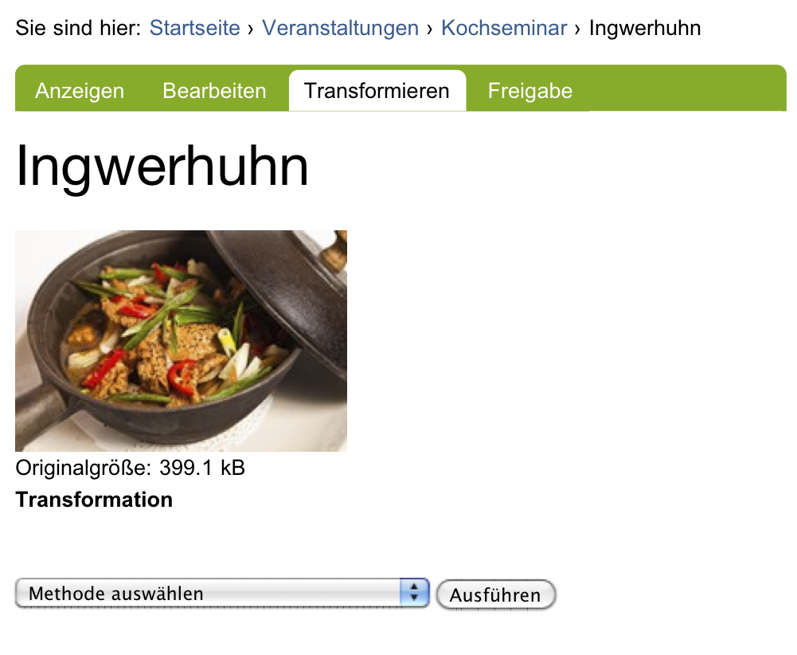

.. index:: Bild (Artikeltyp) 

.. _sec_bild:

======
 Bild
======

Der Artikeltyp »Bild« dient dazu, einzelne Bilder in einer Website zu
verwalten. Sie können in Ordner einsortiert werden und besitzen Eigenschaften
und Metadaten.  Will man in einer Seite eine Illustration verwenden, so muss
sie als Artikel vom Typ »Bild« in der Website liegen. Als einzige Ausnahme
werden die Titelbilder von Nachrichten in der Bearbeitungsansicht der Nachricht
direkt hochgeladen. Sie können nicht in anderen Artikeln verwendet werden.

Die Anzeige eines Bildes besteht aus dem Bild zusammen mit dem
Titel, der Beschreibung und einer Größenangabe (siehe
Abbildung :ref:`fig_bild`).

.. _fig_bild:

   Anzeige eines Bildes

.. index:: Vollbilddarstellung

Das Bild selbst ist dabei ein Verweis auf seine Vollbilddarstellung, die nur
das Bild und einen Verweis zurück zur Anzeigeansicht enthält. Sie können also
zwischen der Anzeige und der Vollbilddarstellung hin- und herspringen.

Die Bearbeitungsansicht eines Bildes enthält neben den allgemeinen
Feldern wie Titel und Beschreibung ein Formularfeld, mit dem Sie eine
Bilddatei von Ihrem Rechner hochladen können. 

.. index:: Bild bearbeiten 

Um ein Bild zu verändern, öffnen Sie es im Allgemeinen in einem
Bildbearbeitungsprogramm an Ihrem Arbeitsplatz. Anschließend laden Sie das
bearbeitete Bild auf die Website hoch und ersetzen damit die vorhandene
Fassung. Einige einfache Änderungen an einem Bild können Sie auch direkt auf
der Website machen: Bilder besitzen die Ansicht »Transformieren«, in der Sie
ein hochgeladenes Bild direkt spiegeln und drehen können. Wählen Sie dazu die
gewünschte Transformation aus und betätigen Sie die Schaltfläche
»Ausführen« (siehe Abbildung :ref:`fig_bild-transformieren`).

.. _fig_bild-transformieren:

   Transformationsansicht eines Bildes

Folgende Änderungen kann Plone an Ihrem Bild durchführen:

* horizontal und vertikal spiegeln
* im und gegen den Uhrzeigersinn um 90° drehen
* um 180° drehen

