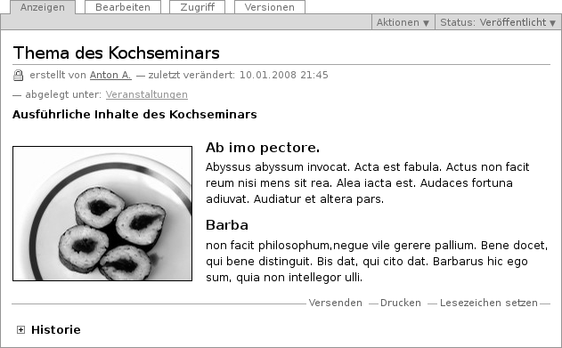
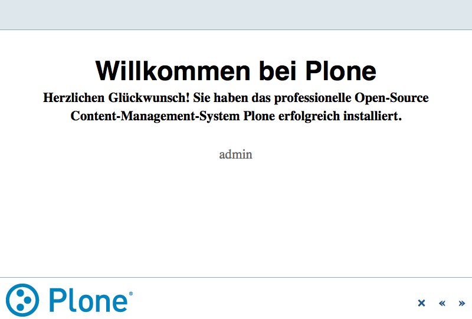

.. _sec_dokument:

=======
 Seite
=======

Eine Seite ist ein Text, dessen Struktur und Darstellung Sie frei bestimmen
können. Dazu stehen Ihnen unter anderem Überschriften, Textformatierungen,
Verweise, Bilder und Grafiken zur Verfügung (siehe
Abbildung :ref:`fig_dokument`).

.. _fig_dokument:

   Anzeige einer Seite

Wenn Sie Ihren Text eingeben, verwenden Sie in der Regel den visuellen Editor
Kupu (siehe Abschnitt :ref:`sec_kupu`). Er macht es Ihnen sehr einfach, die
Struktur Ihres Textes auszuzeichnen, und zeigt den Text bereits so an, wie er
später in der Seitenanzeige aussehen wird. Daneben bietet Ihnen Kupu die
wichtigsten Funktionen üblicher Textverarbeitungsprogramme, um Ihren Text zu
formatieren.

Falls Sie Kupu nicht benutzen, finden Sie stattdessen ein
einfaches Formularfeld vor, in das sie unformatierten Text, HTML-Code oder
Text in einer vereinfachten Textauszeichnungssprache wie Restructured Text,
Markdown oder Textile eingeben können. Plone verwandelt alle Eingaben in
gültiges HTML.  

.. Wie wähle ich das Format aus?

Haben Sie einen Text mit einem Textverarbeitungsprogramm geschrieben und
wollen ihn in dessen Dateiformat veröffentlichen, sollten Sie dafür den
Artikeltyp »Datei« benutzen.

Präsentationsmodus
==================

Wenn Sie eine Seite bearbeiten, können Sie im Teilformular »Einstellungen«
den Präsentationsmodus aktivieren. Dann erscheint in der Anzeige der Seite
ein Verweis unterhalb der Überschrift: »Als Präsentation darstellen...«. Im
Präsentationsmodus wird der Inhalt der Seite auf mehrere nacheinander
anzuzeigende Bildschirmseiten verteilt, die sich gestalterisch
beispielsweise für die Projektion in einem Vortragsraum eignen (siehe
Abbildung :ref:`fig_seite-praesentationsmodus`).

.. _fig_seite-praesentationsmodus:

Eine Seite im Präsentationsmodus

Beachten Sie, dass auf den Präsentationsseiten lediglich Überschriften und
Listen erscheinen; Fließtext wird ausgeblendet.

Technisch ist die Präsentation nichts anderes als die Anzeigeansicht mit
Darstellungsanweisungen, denen das S5-System zugrunde liegt. Mehr über S5
erfahren Sie unter \url{http://yatil.de/s5/} oder
\url{http://meyerweb.com/eric/tools/s5/}.

Inhaltsverzeichnis
==================

Bei längeren Texten mit vielen Zwischenüberschriften kann Plone an den
Anfang der Seite ein Inhaltsverzeichnis mit Verweisen zu den einzelnen
Abschnitten setzen (siehe Abbildung :ref:`fig_seite-inhaltsverzeichnis`).

.. _fig_seite-inhaltsverzeichnis:

.. figure:: ../images/seite-inhaltsverzeichnis.png
   :width: 100%

   Automatisch erzeugtes Inhaltsverzeichnis
    
Sie müssen das Inhaltsverzeichnis in den Einstellungen der Seite aktivieren.

