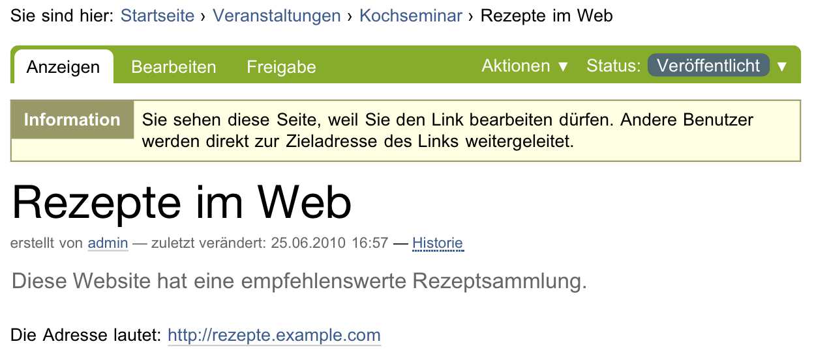

.. _sec_link:

======================
 Link und Lesezeichen
======================

Man kann auf einer Plone-Website Verweise auf Webseiten und andere Ressourcen
im Internet genauso verwalten wie alle anderen Inhalte. Dafür gibt es
den Artikeltyp »Link«, dessen Inhalt eine Internetadresse ist. In der
Anzeige eines Links erscheinen Titel und Beschreibung der Ressource sowie ein
Verweis zu der Adresse (siehe Abbildung :ref:`fig_link`).

.. _fig_link:

   Anzeige eines Links

Mit einem Ordner oder einer Kollektion mit mehreren Link-Artikeln kann man
beispielsweise kommentierte Verweislisten erstellen. Werden Links in der
Navigation oder der Anzeige eines Ordners aufgeführt, so zeigt der Verweis
dort gleich auf die Zieladresse des Links und nicht auf den Link-Artikel.

Im Bearbeitungsformular ist die Adresse ein Pflichtfeld; ohne sie hätte
der Artikel keinen Inhalt. Beachten Sie, dass die Adresse einer Webseite mit
``http://`` beginnen muss. Sie können natürlich neben Webadressen auch
Adressen anderer Internetdienste angeben, beispielsweise nach dem Schema
``ftp://``.

Lesezeichen sind spezielle Links, die auf Artikel Ihrer Website verweisen. Mit
der Artikelaktion »Lesezeichen setzen« auf einer Seite Ihrer Website legen Sie
selbst ein Lesezeichen an. Mehr über Lesezeichen erfahren Sie in
Abschnitt :ref:`sec_navigation-lesezeichen}`.
