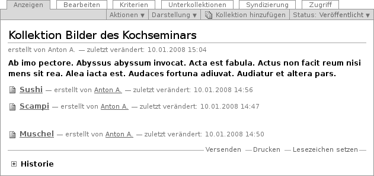
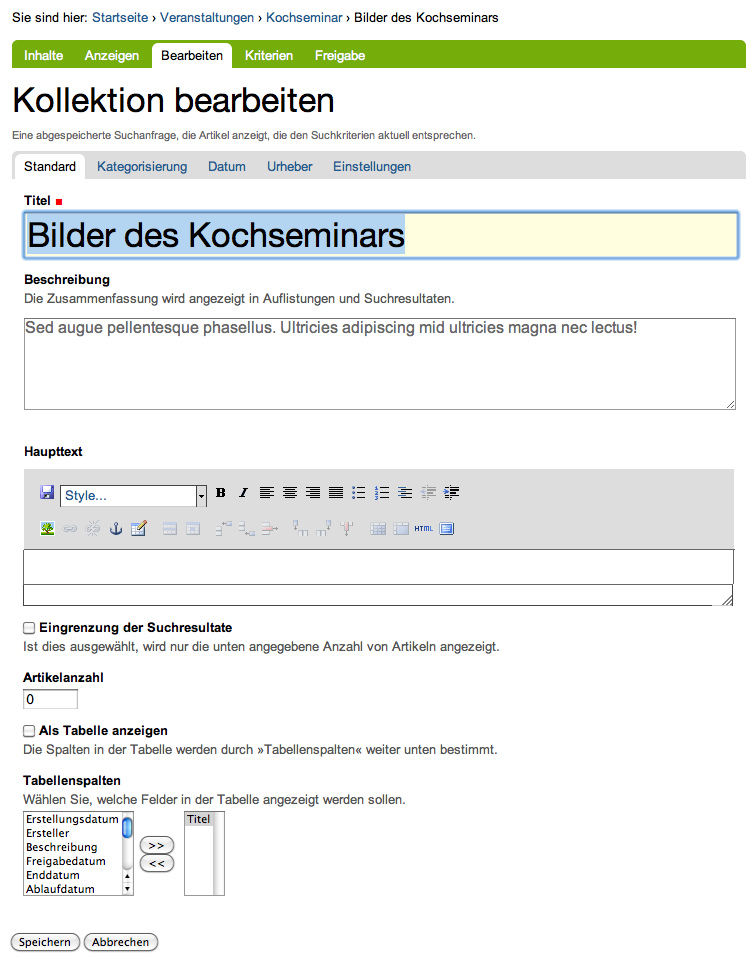
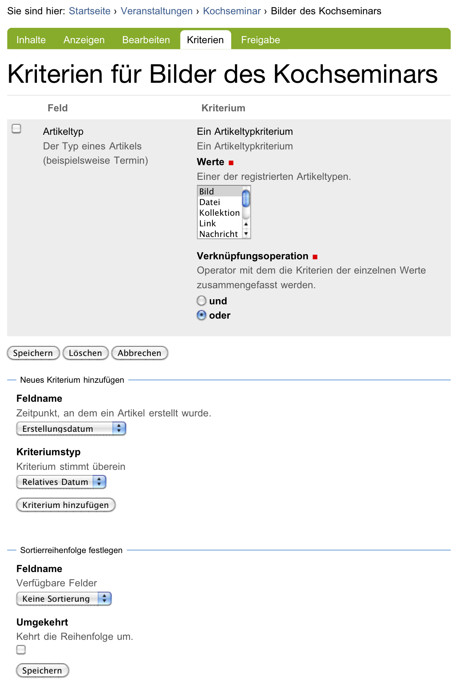
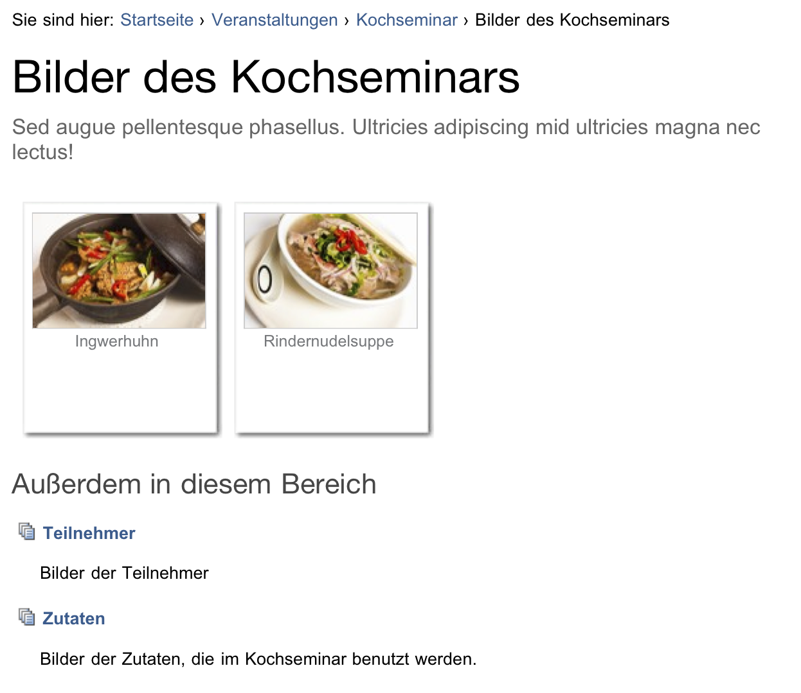
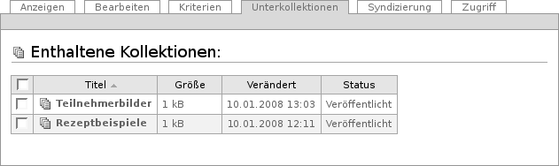

.. _sec_thema:

============
 Kollektion
============

Oft möchte man verwandte Artikel einer Website zusammenfassen, beispielsweise
in einer Nachrichtenübersicht oder einer Liste aller Artikel zu einem
Thema. Ein Artikel kann dabei für verschiedene solcher Übersichten
relevant sein. Da jeder Artikel aber nur einen einzigen Platz in der
Ordnerhierarchie der Website hat, sind Ordner nicht geeignet, um Artikel unter
verschiedenen Gesichtspunkten zu gruppieren.

Stattdessen verwendet man Kollektionen, um beliebig viele verschiedene
Übersichten zu erstellen. Diese Übersichten sind unabhängig von der
Ordnerstruktur der Website. Sie können eine Kollektion als das Ergebnis einer
vorgefertigten Suche verstehen; Plone hält die Artikelauswahl anhand von
Suchkriterien stets aktuell.

Kollektionen kennen ähnlich wie Ordner verschiedene Darstellungen für die
Anzeigeansicht, aus denen Sie im Darstellungsmenü wählen können:

* Liste
* Kurzfassung
* Tabelle
* Album
* Kollektion

Als Beispiel zeigt Abbildung :ref:`fig_thema` die Darstellung als Liste.

.. _fig_thema:

   Darstellung einer Kollektion als Liste

Wie Ordner besitzen Kollektionen auch keinen eigenen
redaktionellen Inhalt. Wenn Sie eine Kollektion bearbeiten, bestimmen Sie,
nach welchen Kriterien sie Artikel zusammenstellt und wie sie sie anzeigt.

.. _fig_kollektion-bearbeiten:

   Bearbeitungsansicht einer Kollektion

In der Bearbeitungsansicht einer Kollektion (siehe Abbildung
:ref:`fig_kollektion-bearbeiten`) können Sie einstellen, wie viele
Artikel auf einer Seite angezeigt werden sollen. Kreuzen Sie dazu
»Eingrenzung der Suchresultate« an und geben Sie im Feld darunter die
gewünschte Artikelanzahl ein. Findet die Kollektion anhand der
gewählten Suchkriterien mehr Artikel, so wird die Liste auf mehrere
Seiten verteilt. Unterhalb der angezeigten Liste finden Sie dann
Verweise auf die weiteren Seiten.  Grenzen Sie die Suchresultate nicht
ein oder geben Sie als Artikelanzahl 0 an, so werden alle passenden
Artikel auf einer Seite aufgeführt.

Wenn Sie die Kollektion als Tabelle darstellen wollen, haben Sie zwei
Möglichkeiten. Sie können zum einen im Darstellungsmenü den Eintrag »Tabelle«
auswählen, sodass der Inhalt der Kollektion in einer fest vorgegebenen Tabelle
mit vier Spalten (Titel, Autor, Artikeltyp und Änderungsdatum) angezeigt wird.

Die andere Möglichkeit besteht darin, im Darstellungsmenü den Eintrag
»Kollektion« auszuwählen und in der Bearbeitungsansicht zu markieren, dass die
Kollektion als Tabelle angezeigt werden soll. Dann können Sie für diese
Kollektion festlegen, wie viele Spalten die Tabelle enthält und welche
Informationen angezeigt werden. Eine Spalte kann eine Metadatenangabe, die
Größe des Artikels oder seinen Revisionsstatus wiedergeben. Per Voreinstellung
wird nur der Titel angezeigt; er dient als Verweis zum Artikel.

Wenn Sie die Darstellung »Kollektion« wählen und das Feld »Als Tabelle
anzeigen« nicht ankreuzen, werden die Artikel in einer Liste aufgeführt. Eine
solche Liste zeigt für jeden Eintrag den Titel, die Beschreibung, einen
Verweis auf das Profil des Erstellers und das Datum der letzten Änderung. Der
Titel dient dabei als Verweis auf den Artikel selbst.

Plone erstellt von jeder Kollektion einen RSS-Feed. Sie finden einen Verweis
darauf in den Artikelaktionen der Kollektion (siehe
Abschnitt :ref:`sec_syndizierung`).

Suchkriterien
=============

Eine Kollektion besitzt eine Reihe von Suchkriterien, von denen sich jedes auf
eine Eigenschaft der durchsuchten Artikel bezieht. Damit ein Artikel zur
Kollektion passt, muss er alle Kriterien gleichzeitig erfüllen. (Die Kriterien
werden bei der Suche mit »und« verknüpft.) Für jede Artikeleigenschaft kann es
in einer Kollektion höchstens ein Suchkriterium geben.

Die durchsuchbaren Artikeleigenschaften werden Felder genannt und
unterscheiden sich grundlegend: im Titel kann man beispielsweise nach einem
Wort suchen, und bei einem Datum will man feststellen, ob es vor oder nach
einem bestimmten Zeitpunkt liegt. Andererseits kann ein Suchtext frei
eingegeben oder aus vorgegebenen Begriffen ausgewählt werden.
Tabelle :ref:`tab_thema-feldnamen` fasst zusammen, welche
Kriteriumstypen für jedes der Felder in Frage kommen.

.. TODO items in Tabellen geht nicht in Latex

.. _tab_thema-feldnamen: Suchkriterien für Kollektionen

+----------------------------+--------------------------+
|Feldnamen                   | Kriteriumstypen          |
+============================+==========================+
| * Beschreibung             | * Text                   |
| * Durchsuchbarer Text      | * Werteliste             |
| * Kurzname                 |                          |
| * Titel                    |                          |
+----------------------------+--------------------------+
| * Ersteller                | * Text                   |
| * Status (Revisionsstatus) | * Werteliste             |
| * Kategorien               | * Werte auswählen        |
+----------------------------+--------------------------+
| * Änderungsdatum           | * Relatives Datum        |
| * Erstellungsdatum         | * Zeitspanne             |
| * Anfangsdatum             |                          |
| * Enddatum                 |                          |
| * Freigabedatum            |                          |
| * Ablaufdatum              |                          |
+----------------------------+--------------------------+
| * Artikeltyp               | * Artikeltypen auswählen |
+----------------------------+--------------------------+
| * Verweise                 | * Artikel auswählen      |
+----------------------------+--------------------------+
| * Pfad                     | * Ort in der Website     |
+----------------------------+--------------------------+

.. _fig_kriterien:

Kriterienansicht einer Kollektion

In der Ansicht »Kriterien« (siehe Abbildung :ref:`fig_kriterien`)
können Sie die Suchkriterien für eine Kollektion bearbeiten. Die Ansicht
enthält:

* eine Tabelle der bereits vorhandenen Kriterien,
* ein Feld zum Anlegen eines neuen Kriteriums und
* ein Auswahlfeld für die Sortierreihenfolge.

Die Tabelle der vorhandenen Kriterien nennt in der Spalte »Feld« das Feld,
auf das sich das jeweilige Kriterium bezieht. Die Spalte »Kriterium« zeigt
die Art des Suchkriteriums an und enthält das Eingabefeld für seinen Wert,
beispielsweise den zu suchenden Text.

Die Eingabefelder sind den Kriteriumstypen angepasst:

Text
  Geben Sie ein oder mehrere Wörter ein, die im durchsuchten Feld
  enthalten sein müssen. Die Reihenfolge mehrerer Wörter wird nur
  berücksichtigt, wenn Sie die Wortfolge in Anführungszeichen setzen. Sie
  können auch nach
  Wortbestandteilen suchen, indem Sie ähnlich wie bei der Website-Suche
  Platzhalter benutzen (siehe Abschnitt :ref:`sec_suche`).

Werteliste
  Sie können eine beliebige Anzahl von Werten eingeben. Das
  kann zum Beispiel eine Liste von Benutzernamen für das Feld »Ersteller«
  sein.

  Unterhalb der Werteliste befindet sich das Eingabefeld
  »Verknüpfungsoperation«. Falls Sie mehrere Werte eintragen, können Sie damit
  bestimmen, ob die gesuchten Artikel mit einem der eingegebenen Werte
  (»oder«) oder mit allen Werten (»und«) übereinstimmen müssen. Wenn Sie
  beispielsweise alle Artikel mit dem Ersteller »Adam« und alle mit dem
  Ersteller »Berta« zusammenfassen wollen, müssen Sie diese beiden Werte mit
  »oder« verknüpfen.

Werte auswählen
  Hier wählen Sie Werte aus einer vorgegebenen Liste aus,
  beispielweise aus den bestehenden Kategorien. Auch hier gibt es die
  Verknüpfungen »und« und »oder«.

Relatives Datum
  Sie können verlangen, dass der Wert des Feldes vor,
  nach oder genau auf einen Stichtag fällt. Der Stichtag ist jedoch kein
  festes Datum, sondern bezieht sich auf den Zeitpunkt, zu dem
  die Kollektion angezeigt wird. Beispielsweise können Sie so eine ständig
  aktuelle Liste aller Artikel erzeugen, die jünger als eine Woche sind.

  Zur Konfiguration dieses Kriteriums gehören drei Angaben. Die ersten beiden
  bestimmen den Stichtag, der mit dem jeweils aktuellen Datum zusammenfallen
  (»Heute«) oder um eine auszuwählende Zeitspanne in der Vergangenheit oder
  Zukunft liegen kann. Im Eingabefeld »Mehr oder weniger« bestimmen Sie, ob
  das Datum im betreffenden Feld der durchsuchten Artikel auf den Stichtag
  fallen, näher als dieser am jeweils aktuellen Datum oder weiter davon
  entfernt liegen soll.

Zeitspanne
  Wählen Sie zwei Zeitpunkte (Anfang und Ende) aus, zwischen
  denen der Wert des Feldes liegen muss. Sie haben zwei Gruppen von
  Eingabefeldern, um für den Anfang und das Ende der Zeitspanne jeweils einen
  Kalendertag und eine Uhrzeit zu bestimmen. Das Kalendersymbol öffnet ein
  zusätzliches Fenster mit einem Kalender, in dem Sie bequem ein beliebiges
  Datum auswählen können.

Artikeltypen auswählen
  Wählen Sie beliebig viele Artikeltypen aus einer
  Liste aus. Es werden nur Artikel des gewählten Typs in der Kollektion
  angezeigt.

Artikel auswählen 
  Wählen Sie aus der Liste der veröffentlichten Artikel
  beliebig viele aus.  Die Kollektion enthält nur
  Artikel, die auf alle ausgewählten Artikel verweisen.

Ort in der Website
  Schränken Sie die Suchergebnisse auf Artikel ein,
  die sich an bestimmten Stellen in der Ordnerhierarchie der Website befinden.
  Dabei können Sie sowohl einzelne Artikel zulassen als auch Ordner angeben,
  deren Inhalt einschließlich der Unterordner durchsucht werden soll.

  Um zu durchsuchende Artikel zusammenzustellen, betätigen Sie die
  Schaltfläche »Hinzufügen« unterhalb der Artikelliste. Daraufhin
  öffnet Ihr Webbrowser ein zweites Fenster, in dem Sie durch die Website
  navigieren und Artikel auswählen können. Sie können Artikel wieder aus der
  Liste löschen, indem Sie im Hauptfenster das Häkchen vor den betreffenden
  Artikeln entfernen und das Formular speichern.

Um ein Kriterium zu löschen, kreuzen Sie es an und betätigen Sie die
Schaltfläche »Löschen« unterhalb der Tabelle.

Der Abschnitt »Neues Kriterium hinzufügen« bietet Ihnen im Eingabefeld
»Feldname« die durchsuchbaren Felder an, für die noch kein Kriterium angelegt
wurde. Das Eingabefeld »Kriteriumstyp« enthält nur Einträge, die zum gerade
ausgewählten Feld passen. Sie können nur ein neues Kriterium auf einmal
hinzufügen.

Im letzten Abschnitt des Formulars bestimmen Sie die Reihenfolge, in der die
zur Kollektion passenden Artikel angezeigt werden. Wählen Sie eine
Artikeleigenschaft, nach der sortiert werden soll, und entscheiden Sie, ob
auf- oder absteigend sortiert wird.

Unterkollektionen
-----------------

Eine Kollektion kann Unterkollektionen besitzen, um die Suche mit weiteren
Kriterien zu verfeinern oder verwandte Kollektionen zu gruppieren. Die Anzeige
der Kollektion enthält dann eine Liste ihrer Unterkollektionen (siehe
Abbildung :ref:`fig_kollektion-mit-unterkollektionen`).

.. _fig_kollektion-mit-unterkollektionen

   Anzeige einer Kollektion mit Unterkollektionen

In der Bearbeitungsansicht von Unterkollektionen können Sie entscheiden, ob
Kriterien von übergeordneten Kollektionen geerbt werden sollen. Kreuzen Sie
dazu in der Bearbeitungsansicht der Unterkollektion das Eingabefeld
»Kriterien erben« an.

Erbt eine Unterkollektion Kriterien, so stellt sie keine eigenständige Suche
mehr dar, sondern eine Verfeinerung der übergeordneten Kollektion. Sie enthält
dann nur die Artikel der übergeordneten Kollektion, die beide Sätze von
Kriterien erfüllen.

Besitzen sowohl die Unterkollektion als auch die übergeordnete Kollektion
Suchkriterien zu einem bestimmten Feld, so wird das geerbte Kriterium in der
Unterkollektion nicht beachtet.

Sie können Unterkollektionen wie andere Artikel löschen, kopieren und
verschieben. Versuchen Sie jedoch, andere Artikel als Kollektionen in eine
Kollektion einzufügen, erhalten Sie eine Fehlermeldung.

Die Ansicht »Unterkollektionen« einer Kollektion (siehe Abbildung
:ref:`fig_unterthemen`) ist ähnlich der Inhaltsansicht eines Ordners
aufgebaut (siehe Abschnitt :ref:`sec_ordner-aktionen`). In ihr können
Sie mehrere Unterkollektionen auf einmal umbenennen, löschen oder
veröffentlichen.

.. _fig_unterthemen:

   Ansicht »Unterkollektionen«

Wenn Sie eine Unterkollektion an einen anderen Ort auf der Website verschieben
oder kopieren, gehen ihr dabei geerbte Suchkriterien der ehemals
übergeordneten Kollektionen verloren. Falls Sie sie in
eine andere Kollektion verschieben, erbt sie deren Kriterien.

.. sec_kollektionsportlet
.. Kollektionsportlet
