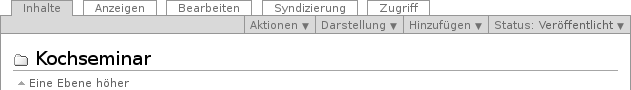
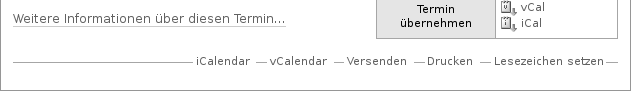
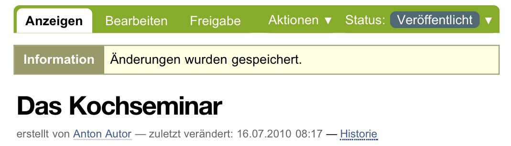

==================
 Artikelansichten
==================

Der Hauptbestandteil fast jeder Seite der Website ist die Ansicht eines
Artikels. Durch Artikelansichten werden die Inhalte Ihrer Website dargestellt
und bearbeitet. Welche Ansichten ein Artikel besitzt, hängt von seinem Typ
ab. Sie finden einen Überblick über Artikelansichten und ihre Funktionen in
Kapitel :ref:`sec_inhaltstypen`.

.. _sec_ui-rahmen:

Reiter und Menüs
================

Sind Sie an der Website angemeldet, dürfen Sie für bestimmte Artikel mehrere
Ansichten sehen. Verschiedene Ansichten eines Artikels werden wie Karteikarten
dargestellt, zwischen denen man mit Reitern wechselt. Dazu fasst Plone die
Ansichten in einen grünen Rahmen, der die Reiter trägt und möglicherweise
ein oder mehrere Ausklappmenüs enthält (siehe
Abbildung :ref:`fig_ui-rahmen`).

.. _fig_ui-rahmen:

   Reiter und Menüs am Beispiel eines Ordners

Jeder Reiter ist mit dem Namen der Ansicht beschriftet; der Reiter der
angezeigten Ansicht ist grün ausgefüllt.

Je nach Ihren Berechtigungen sehen Sie folgende Ausklappmenüs:

Aktionen
  Hier können Sie den Artikel kopieren, verschieben, löschen, in der
  Zwischenablage gespeicherte Artikel in den aktuellen Ordner einfügen
  und eine Arbeitskopie des Artikels erstellen (siehe Abschnitt
  :ref:`sec-arbeitskopie-erstellen`).

Darstellung
  Falls es für den Artikel mehrere Darstellungsmöglichkeiten gibt,
  können Sie hier eine auswählen. Bei Ordnern haben Sie die
  Möglichkeit, einen Artikel aus dem Ordner als Anzeige zu setzen
  (siehe Abschnitt :ref:`sec_anzeige-waehlen`).

Hinzufügen
  Sie erstellen einen neuen Artikel im aktuellen Ordner, indem
  Sie hier den gewünschten Artikeltyp auswählen (siehe
  Abschnitt :ref:`sec_artikel-erstellen`).

Status
  Der Titel dieses Menüs zeigt den aktuellen Status des Artikels
  an. Die Menüeinträge sind die möglichen Statuswechsel (siehe
  Abschnitt :ref:`sec_workflow`).

Artikelaktionen
===============

Die Artikelaktionen finden Sie unterhalb der Anzeige des Artikels
(siehe Abbildung :ref:`fig_doc-actions`).

.. _fig_doc-actions:

   Artikelaktionen am Beispiel eines Termins

Tabelle :ref:`tab_dokumentaktionen` fasst alle Artikelaktionen
zusammen. Welche davon Sie angezeigt bekommen, hängt vom Typ des
Artikels sowie von Ihren persönlichen Einstellungen und Berechtigungen
ab.

.. _tab_dokumentaktionen:

Artikelaktionen

==================	=================================
Titel			siehe Seite
==================	=================================
RSS-Feed		:ref:`sec_syndizierung`
Versenden		:ref:`sec_seite-versenden`
Drucken 		:ref:`sec_seite-drucken`
Lesezeichen setzen 	:ref:`sec_navigation-lesezeichen`
iCalendar   		:ref:`sec_termin`
vCalendar		:ref:`sec_termin`
==================	=================================

.. _sec_seite-versenden:

Mit der Aktion »Versenden« können Sie eine E-Mail mit der Internetadresse der
aktuellen Webseite als Inhalt versenden. Der Verweis führt Sie zu einem
Formular, in dem Sie die E-Mail-Adressen des Empfängers und Absenders sowie
einen Nachrichtentext eingeben können. Sind Sie an der Website angemeldet, so
ist Ihre Absenderadresse dort bereits eingetragen.

.. _sec_seite-drucken:

Die Aktion »Drucken« löst die Druckfunktion Ihres Webbrowsers aus, sodass
Sie die aktuelle Webseite ausdrucken können.

Statusmeldung
=============

Wenn Sie an einem Artikel Veränderungen vornehmen, informiert Plone Sie über
den Erfolg oder Misserfolg Ihrer Aktion. Dazu erscheint unmittelbar nach der
Aktion auf der im Anschluss angezeigten Seite eine
Statusmeldung. Sie befindet sich oberhalb der Artikelansicht und ist farblich
hervorgehoben (siehe Abbildung :ref:`fig_statusmeldung`).

.. _fig_statusmeldung:

   Eine Statusmeldung

Es gibt mehrere Klassen von Statusmeldungen, die unterschiedliche Wichtigkeit
besitzen und durch jeweils eigene Farben gekennzeichnet werden:

Information (gelblich)
  beispielsweise die Anmeldebestätigung

Warnung (orange)
  beispielsweise die Warnung vor defekten Verweisen beim Löschen
  referenzierter Artikel

Fehler (rot)
  beispielsweise beim Speichern unvollständig ausgefüllter Formulare

