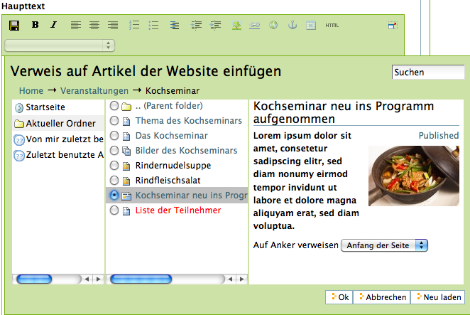
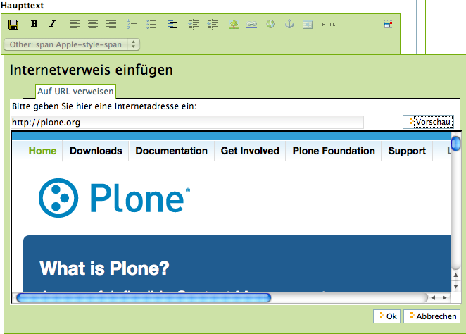
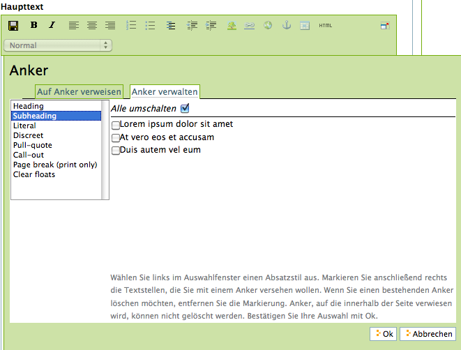
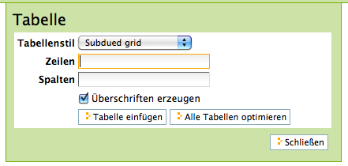
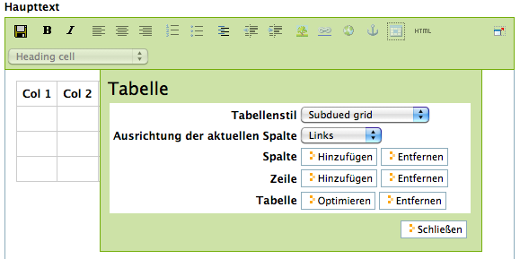

.. _sec_kupu:

=================
 Der Editor Kupu
=================

Wenn Sie eine Seite, eine Nachricht oder einen Termin bearbeiten, wollen Sie
in der Regel formatierten Text mit Strukturelementen wie Überschriften, Listen
und Tabellen eingeben. Kupu ist ein visueller Editor, der diese Arbeit
leicht macht. Er besitzt eine Leiste mit Funktionen, mit denen Sie Ihren Text
wie in einem Textverarbeitungsprogramm formatieren können (siehe
Abbildung :ref:`fig_kupu`).

.. _fig_kupu:

   Der visuelle Texteditor Kupu

So können Sie die Möglichkeiten von HTML nutzen, ohne selbst HTML-Code
schreiben zu müssen. 

Um mit Kupu zu arbeiten, muss Javascript aktiviert sein.

.. _sec_kupus-symbolleiste:

Kupus Werkzeugleiste
====================

Die in Abbildung :ref:`fig_kupu` gezeigte Werkzeugleiste von
Kupu enthält achtzehn Symbole und ein Auswahlmenü. Der genaue Satz von
sichtbaren Symbolen hängt von der Konfiguration Ihrer Website ab;
Tabelle :ref:`tab_kupu-funktionen` beschreibt die Voreinstellung.

+------------------------------+------------------------------+
| .. image::                   | Speichern                    |
|../images/plonekupuimages/sav\|                              |
|e.png                         |                              |
+------------------------------+------------------------------+
| .. image::                   | Fett                         |
|../images/plonekupuimages/bol\|                              |
|d.png                         |                              |
+------------------------------+------------------------------+
| .. image::                   | Kursiv                       |
|../images/plonekupuimages/ita\|                              |
|lic.png                       |                              |
+------------------------------+------------------------------+
| .. image::                   | Linksbündig                  |
|../images/plonekupuimages/lef\|                              |
|t_just.png                    |                              |
+------------------------------+------------------------------+
| .. image::                   | Zentriert                    |
|../images/plonekupuimages/cen\|                              |
|ter.png                       |                              |
+------------------------------+------------------------------+
| .. image::                   | Rechtsbündig                 |
|../images/plonekupuimages/rig\|                              |
|ht_just.png                   |                              |
+------------------------------+------------------------------+
| .. image::                   | Nummerierte Liste            |
|../images/plonekupuimages/num\|                              |
|bered_list.png                |                              |
+------------------------------+------------------------------+
| .. image::                   | Einfache Liste               |
|../images/plonekupuimages/lis\|                              |
|t.png                         |                              |
+------------------------------+------------------------------+
| .. image::                   | Definitionsliste             |
|../images/plonekupuimages/def\|                              |
|initionlist.png               |                              |
+------------------------------+------------------------------+
| .. image::                   | Ausrücken                    |
|../images/plonekupuimages/out\|                              |
|dent.png                      |                              |
+------------------------------+------------------------------+
| .. image::                   | Einrücken                    |
|../images/plonekupuimages/ind\|                              |
|ent.png                       |                              |
+------------------------------+------------------------------+
| .. image::                   | Bild einfügen                |
|../images/plonekupuimages/ima\|                              |
|ge.png                        |                              |
+------------------------------+------------------------------+
| .. image::                   | Verweis auf Artikel der      |
|../images/plonekupuimages/hyp\|Website                       |
|erlink.png                    |                              |
+------------------------------+------------------------------+
| .. image::                   | Internetverweis              |
|../images/plonekupuimages/lin\|                              |
|k_icon.png                    |                              |
+------------------------------+------------------------------+
| .. image::                   | Anker einfügen               |
|../images/plonekupuimages/anc\|                              |
|hor.png                       |                              |
+------------------------------+------------------------------+
| .. image::                   | Tabelle                      |
|../images/plonekupuimages/tab\|                              |
|le.png                        |                              |
+------------------------------+------------------------------+
| .. image::                   | HTML-Code                    |
|../images/plonekupuimages/vie\|                              |
|w-source.png                  |                              |
+------------------------------+------------------------------+
| .. image::                   | Vollbildanzeige              |
|../images/plonekupuimages/ful\|                              |
|lscreenexpand_icon.png        |                              |
+------------------------------+------------------------------+
| .. image::                   | Element löschen              |
|../images/plonekupuimages/del\|                              |
|ete_icon.png                  |                              |
+------------------------------+------------------------------+

Ganz links in der Werkzeugleiste können Sie den bearbeiteten Text speichern,
ohne den Editor zu verlassen. Sie können damit bei größeren Änderungen
zwischendurch Ihre Arbeit sichern.

Es folgen verschiedene Funktionen zur Textformatierung wie fette Schrift,
kursive Schrift, Textausrichtung, Listen sowie die Ein- und Ausrückung von
Absätzen. Haben Sie einen Teil Ihres Textes markiert, so wird die jeweilige
Formatierung darauf angewendet, anderenfalls wirkt sie sich auf den Text aus,
den Sie im Anschluss eingeben.

Desweiteren umfasst die Leiste Werkzeuge, um Bilder, Verweise in Ihre Website
oder ins Internet, Anker und Tabellen in Ihren Text einzufügen. Mehr dazu
erfahren Sie weiter unten in diesem Abschnitt.

In der HTML-Ansicht enthält das Bearbeitungsfenster anstelle des formatierten
Textes den von Kupu erzeugte HTML-Code. Sie können ihn
in direkt bearbeiten; die übrigen Werkzeuge auf der Leiste
werden dabei ausgeblendet. Das Symbol für die HTML-Ansicht bringt Sie zur
formatierten Ansicht Ihres Textes zurück, wo Sie wieder Kupus
Textbearbeitungsfunktionen nutzen können.

Beachten Sie beim Bearbeiten von HTML-Code, dass nicht alle Sprachelemente
von HTML erlaubt sind. Das ist notwendig, um zu gewährleisten, dass Ihr Text
innerhalb einer Plone-Seite angezeigt werden kann, ohne dabei den Code der
Seite insgesamt ungültig zu machen. Welche Sprachelemente unzulässig sind,
hängt von der Konfiguration Ihrer Website ab. Wenden Sie sich gegebenenfalls
an Ihren Administrator.

Ganz rechts finden Sie einen Schalter, mit dem Sie zu einer Vollbildanzeige
wechseln können. In diesem Zustand nimmt Kupu den gesamten Platz in Ihrem
Webbrowser ein, so dass Sie einen größeren Teil des zu bearbeitenden Textes
gleichzeitig sehen. Mit demselben Symbol können Sie den Vollbildmodus wieder
verlassen. Der Vollbildmodus ist vor allem bei längeren Texten bequem.

Wenn Sie den Mauszeiger eine kurze Weile über einem Symbol ruhen lassen,
erscheint ein Hinweis auf seine Funktion und das entsprechende Tastaturkürzel,
mit dem man die Funktion alternativ zur Maus bedienen kann.

Stilvorlagen
============

In Kupu und Plone gibt es für Textelemente wie Absätze und Überschriften
bestimmte Stilvorlagen, die Sie mit Kupu einzelnen Passagen Ihres Textes
zuordnen können. Stile sollen die Funktion von Textpassagen beschreiben; Plone
kümmert sich darum, die ausgezeichneten Textstellen passend zur jeweiligen
Funktion und zum Design der Website darzustellen.

Wählen Sie die Stile mit Hilfe des Auswahlmenüs aus Kupus Werkzeugleiste
(siehe Abbildung :ref:`fig_kupu`). Die folgenden Stile stehen Ihnen zur
Verfügung:

Normal
 für einfachen Fließtext
Heading
 für Überschriften
Subheading
 für Zwischenüberschriften
Literal
 für Programmcode in einer Schrift mit fester Laufweite vor
 einem hellblauen Hintergrund
Discreet
 für »Kleingedrucktes« in kleiner grauer Schrift
Pull-quote
 für hervorgehobene Textpassagen in Form von Randnotizen
Call-out
 für farblich hervorgehobene Textpassagen
Page break (print only)
  Ein Seitenumbruch beim Ausdruck. In der
  Bearbeitungsansicht ist dies eine feine Linie, in der Anzeige unsichtbar.
Clear floats
  für eine Leerzeile zwischen zwei Absätzen, an der der
  Textfluss um ein Bild abgeschnitten und unterhalb des Bildes fortgesetzt
  wird
Highlight
 ein Zeichenstil für einzelne farblich hervorgehobene Wörter

Absatzstile werden auf den Absatz angewendet, in dem sich bei der Auswahl des
Stils der Cursor befindet oder die ganz oder teilweise markiert sind,
Zeichenstile dagegen nur auf markierte Zeichen. Mit dem Eintrag »(remove
style)« können Sie den Zeichen- oder Absatzstil an der Cursorposition oder für
die markierten Zeichen und Absätze entfernen.

Besitzt der Text am Cursor oder in der Markierung weder einen Zeichen- noch
einen Absatzstil, so zeigt das Menü den Eintrag »<no style>« an. Ist dagegen
eine Textpassage markiert, in der verschiedene Stile verwendet werden, kommt
dafür der Eintrag »Mixed styles« hinzu. Die beiden letztgenannten Menüeinträge
sind nicht immer vorhanden und können nicht als Stile zugewiesen werden.

Ihr Administrator kann Ihnen an dieser Stelle weitere Stilvorlagen für Absätze
und Zeichen zur Verfügung stellen oder die Zahl der Stile eingrenzen.

Bilder, Verweise, Anker und Tabellen
------------------------------------

Die Funktionen zum Einfügen von Bildern, Verweisen und Tabellen öffnen ein
Fenster unterhalb von Kupus Werkzeugleiste. Dort können Sie Bilder und
Verweisziele auswählen oder eine Tabelle einrichten. Solange dieses Fenster
sichtbar ist, sind die anderen Funktionen von Kupu nicht verfügbar. Es
schließt sich, wenn Sie Ihre Eingaben mit »OK« in den Text übernehmen oder mit
»Abbrechen« verwerfen.

Wenn Sie ein Bild ausgewählt haben oder sich der Cursor in einer Textstelle
befindet, die als Verweis markiert ist, erscheint in der Werkzeugleiste ein
zusätzliches Werkzeug: die Schaltfläche zum Löschen des ausgewählten
Elements. Wenn Sie es betätigen, wird das Bild gelöscht oder der Verweis
entfernt.

Bilder
~~~~~~

.. Screenshot enthält noch falsche Übersetzung

.. _fig_kupu-bild:

  Mit Kupu ein Bild einfügen

.. Bug 7919 fehlende Übersetzung}%

Das Fenster zum Einfügen eines Bildes (siehe Abbildung :ref:`fig_kupu-bild`)
besteht aus drei Spalten. Links wählen Sie, wo Sie das Bild suchen wollen:

* Home: auf der gesamten Website
* Current folder: im aktuellen Ordner
* My recent items: unter den von Ihnen zuletzt geänderten Artikeln
* Recent items: unter allen zuletzt geänderten Artikeln der Website

Die mittlere Spalte listet die gefundenen Bilder auf. Sie können hier
gegebenenfalls Unterordner durchsuchen, wobei der Verzeichnispfad oberhalb der
Auswahl bei der Orientierung hilft. Zusätzlich steht Ihnen rechts oben im Fenster ein
Suchfeld zur Verfügung.

Wenn Sie eines der gefundenen Bilder auswählen, zeigt Kupu in der rechten
Spalte eine Vorschau mit Größenangabe an. Sie können dort außerdem

* die Ausrichtung des Bildes bestimmen,
* eine Legende oder einen Alternativtext einfügen und
* die Größe auswählen, in der das Bild im Text erscheinen soll.

Die Ausrichtung des Bildes bestimmt, ob das Bild genau an der Schreibposition
eingefügt wird, so dass es im Allgemeinen mitten im Text erscheint, oder ob es
an den linken oder rechten Rand gesetzt wird.

Als Legende des Bildes können Sie die Beschreibung aus seinen Metadaten
übernehmen, falls Ihre Website entsprechend konfiguriert ist.
In diesem Fall sehen Sie dafür eine Option, die
zunächst ausgewählt ist. Gibt es keine solche Option oder entfernen Sie das
Häkchen, erscheint ein Eingabefeld für einen Alternativtext. Der
Alternativtext für ein Bild ist unformatierter Text und sollte das Bild
inhaltlich ersetzen können. Das ist unter dem Gesichtspunkt der
Barrierefreiheit wünschenswert, da Lesegeräte für Sehbehinderte diesen Text
erkennen und als Bildbeschreibung gesondert vorlesen oder anzeigen.

Die Bildgröße können Sie nicht frei eingeben, sondern aus einer Reihe von
Standardgrößen wählen. Möglicherweise ist ein Eintrag für die Originalgröße
dabei. In keinem Fall wird das Bild vergrößert oder verzerrt, gegebenenfalls
aber passend verkleinert.

.. _sec_kupu-bild-hochladen:

Bild hochladen
~~~~~~~~~~~~~~

In der mittleren Spalte des Fensters befindet sich außerdem die Schaltfläche
»Hier Bild hochladen\dots{}«. Sie öffnet in der rechten Spalte ein Formular,
über das Sie ein Bild in den angewählten Ordner hochladen können (siehe
Abbildung :ref:`fig_kupu-bild-hochladen`).

.. fig_kupu-bild-hochladen:

.. figure:: ../images/hier-bild-hochladen.png

In Kupu ein Bild hochladen

Dabei wird ein Artikel vom Typ »Bild« angelegt, den Sie später mit Metadaten
versehen können.

Über die Schaltfläche »Durchsuchen« in der rechten Spalte öffnen Sie das
Dateiauswahlfenster Ihres Webbrowsers, um ein Bild auf Ihrem Rechner
auszuwählen. In den Formularfeldern darunter geben Sie den Titel des Bildes
und eine Beschreibung ein. Wählen Sie im unteren Teil des Formulars dann, wie
oben beschrieben, die gewünschten Werte für Ausrichtung und Größe und geben
Sie einen alternativen Text ein. Um diese Felder zu erreichen, müssen Sie
möglicherweise das Bildauswahlfenster ganz nach unten rollen. Nachdem Sie »OK«
betätigt haben, wird das Bild hochgeladen und in der gewünschten Größe und
Ausrichtung in den Text eingefügt.

Verweise auf Artikel der Website
~~~~~~~~~~~~~~~~~~~~~~~~~~~~~~~~

Um auf einen Artikel Ihrer Website zu verweisen, benutzen Sie das Symbol
»Verweis auf Artikel der Website«. Daraufhin öffnet sich ein Fenster, wo Sie
den Artikel auswählen können, auf den Sie verweisen möchten
(siehe Abbildung :ref:`fig_kupu-int`).

.. Screenshot enthält noch falsche Übersetzung

.. _fig_kupu-int:

Mit Kupu auf einen Artikel der Website verweisen

Um einen Artikel Ihrer Website auszuwählen, gehen sie ähnlich vor, wie es für
die Auswahl eines Bildes weiter oben in diesem Abschnitt beschrieben ist.
Jetzt zeigt die mittlere Spalte des Fensters allerdings Artikel aller Typen
an, und die Vorschau rechts besteht nun aus Titel und Beschreibung des
gewählten Artikels. Sie können bestimmen, ob der Verweis zum Anfang oder zu
einem bestimmten Anker im Artikel führen soll. Auf Anker wird weiter unten
näher eingegangen.

Falls Sie vor der Auswahl des Verweises ein Stück Ihres Textes markiert haben,
wird diese Textstelle zum Verweis. Anderenfalls fügt Kupu den Titel des
Zielartikels an der aktuellen Schreibposition als Verweis ein.

.. _sec_wiki-verweise:

Wenn Ihre Website entsprechend konfiguriert ist, können Sie im Haupttext einer
Seite, einer Nachricht und eines Termins neue Verweise wie in einem Wiki
erzeugen. Setzen Sie dazu ein Wort oder eine Wortgruppe in doppelte runde oder
eckige Klammern (siehe Abbildung :ref:`fig_bearbeiten-wiki`).

.. _fig_bearbeiten-wiki:

.. figure:: ../images/bearbeiten-wiki.png

   Verweise einfügen wie in einem Wiki

Sollte im gleichen Ordner bereits ein Artikel vorhanden sein, dessen Kurzname
mit der eingeklammerten Wortgruppe übereinstimmt, wird der geklammerte Text
nach dem Speichern zu einem gewöhnlichen Verweis auf diesen Artikel.
Anderenfalls legt Plone einen Verweis an, über den ein neuer Artikel
hinzugefügt werden kann (siehe Abschnitt :ref:`sec_hinzufugen-mit-wiki`).

Internetverweise
~~~~~~~~~~~~~~~~

Für Verweise auf Webseiten und andere Ressourcen außerhalb Ihrer Website kann
Kupu Ihnen natürlich keine Auswahllisten anbieten. Stattdessen geben Sie die
gewünschte Adresse direkt ein. Kupu erstellt dann eine Vorschau des
Verweisziels (siehe Abbildung :ref:`fig_kupu-ext`).

.. _fig_kupu-ext:

   Mit Kupu einen Internetverweis einfügen

Sie müssen für einen Internetverweis eine vollständige Adresse angeben;
Adressen von Webseiten beginnen in der Regel mit ``http://``. Das
Eingabefeld ist bereits damit vorausgefüllt, wenn Kupu das Fenster öffnet.
Natürlich können Sie aber auch auf andere Adressarten wie ``ftp://`` oder
``https://`` verweisen.

Vorher markierter Text wird zu einem Verweis, wenn Sie die eingegebene
Adresse bestätigen. Haben Sie keinen Text markiert, fügt Kupu die
Internetadresse als Text für den Verweis ein.

Anker
~~~~~

Anker sind unsichtbare Markierungen im Text einer Website, die als
Verweisziele dienen. So kann der Leser beispielsweise direkt zu einer
bestimmten Zwischenüberschrift in einem längeren Text geleitet werden. Sie
können auf Anker innerhalb eines Textes verweisen, aber auch auf Textstellen
in anderen Artikeln, wenn dort Anker gesetzt wurden.

Das Symbol »Anker einfügen« öffnet ein zweispaltiges Fenster, in dem Sie
sowohl Verweise auf Anker in Ihren Text einfügen als auch Anker in Ihrem
Artikel setzen und verwalten können (siehe
Abbildung :ref:`fig_kupu-auf-anker-verweisen`).

.. _fig_kupu-auf-anker-verweisen:

   In Kupu auf Anker verweisen

Wenn Sie innerhalb desselben Textes auf
einen Anker verweisen, der noch nicht existiert, wird er angelegt.

Kupu kann Anker für Textstellen setzen, die mit einer Stilvorlage formatiert
wurden. Um auf einen solchen Anker im gerade bearbeiteten Text zu verweisen,
wählen Sie in der linken Spalte des Fensters einen Stil aus. Daraufhin
erscheint rechts eine Liste aller Textstellen, die mit diesem Stil
ausgezeichnet wurden. Wählen Sie eine aus, und bestätigen Sie mit »OK«.

Kupu setzt nun einen Anker auf die ausgewählte Textstelle und erzeugt an der
Cursorposition einen Verweis auf den Anker. Wenn Sie zuvor ein Stück Text
markiert hatten, wird dieser zum Verweis, anderenfalls fügt Kupu die als Anker
ausgewählte Textstelle ein. Für den Stil »Heading« wäre das beispielsweise der
Wortlaut der ausgewählten Überschrift.

Der zweite Reiter »Anker verwalten« erlaubt Ihnen, Anker zu setzen und zu
löschen, auf die von anderswo verwiesen werden kann (siehe
Abbildung :ref:`fig_kupu-anker-verwalten`).

.. _fig_kupu-anker-verwalten:

   In Kupu Anker verwalten

Die linke Spalte zeigt wieder die Stilauswahl, die rechte alle Textstellen mit
dem gerade ausgewählten Stil. Falls neben dem Namen einer Textstelle eine
Ankermarkierung in der Form ``#name-der-stelle`` auftaucht, wurde dort
bereits ein Anker gesetzt. Sie setzen einen neuen Anker, wenn Sie neben einer
Textstelle einen Haken setzen, und Sie löschen einen Anker, indem Sie den Haken
entfernen. Mit dem Schalter »Alle umschalten« können Sie an allen Textstellen
mit dem ausgewählten Stil Anker hinzufügen oder löschen.

Kupu erkennt, ob auf einen Anker von innerhalb des Artikels verwiesen wird.
Einen solchen Anker können Sie nicht löschen. Kupu kann jedoch nicht
herausfinden, ob andere Artikeln auf Anker im aktuellen Artikel verweisen.
Löschen Sie einen Anker daher nur, wenn Sie sicher sind, dass er
nirgends auf Ihrer oder anderen Websites mehr benutzt wird. Ein Verweis auf
einen gelöschten Anker würde den Benutzer nicht mehr zur beabsichtigten
Textstelle führen, sondern zum Anfang des betreffenden Artikels.

Tabellen
~~~~~~~~

.. _fig_kupu-tabelle:

   Mit Kupu eine Tabelle anlegen

Wollen Sie in Ihren Text eine neue Tabelle einfügen, benutzen Sie das Symbol
»Tabelle«. Daraufhin öffnet sich Kupus Tabellenfenster (siehe
Abbildung :ref:`fig_kupu-tabelle`), in dem Sie folgende Merkmale der Tabelle bestimmen:

* den Tabellenstil
* die Anzahl der Spalten und Zeilen der Tabelle
* ob die Spalten Überschriften haben

Mit der Schaltfläche »Tabelle einfügen« legen Sie eine leere Tabelle an der
aktuellen Schreibposition im Text an. Sie können sie ausfüllen und
gegebenenfalls die Überschriften der Spalten anpassen. Mit der Schaltfläche
»Alle Tabellen optimieren« veranlassen Sie Kupu, die Größe aller Tabellen im
Text zu optimieren.

.. Screenshot enthält noch falsche Übersetzung

.. _fig_kupu-tabelle-bearbeiten:

   Mit Kupu eine Tabelle bearbeiten

Um eine bestehende Tabelle zu ändern, öffnen Sie Kupus Tabellenfenster,
während sich der Cursor in der Tabelle befindet. Das Tabellenfenster enthält
dann Schaltflächen für folgende Tätigkeiten (siehe
Abbildung :ref:`fig_kupu-tabelle-bearbeiten`):

* Tabellenstil verändern
* die Ausrichtung von Text in Tabellenzellen bestimmen
* Zeilen und Spalten hinzufügen und entfernen
* die Tabelle hinsichtlich ihrer Größe optimieren
* die Tabelle löschen
