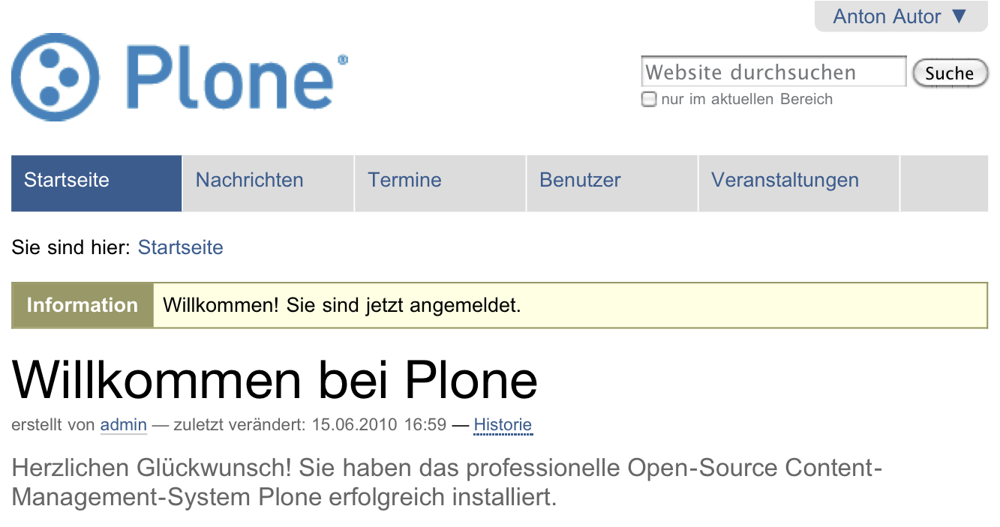

.. _sec_tutorium-rundgang:

==========
 Rundgang
==========

Im ersten Tutorium machen Sie sich mit grundlegenden Tätigkeiten wie dem
Anmelden, dem Abmelden und dem Navigieren durch eine Plone-Website vertraut.

Besuchen Sie Ihre Website unter der Adresse http://localhost:8080/Plone.  Eine
gegebenenfalls abweichende Internetadresse Ihrer Website erfahren Sie von Ihrem
Administrator. Sie sehen nun in Ihrem Webbrowser die Startseite, deren Aufbau
in Kapitel :ref:`sec_aussehen` erläutert wurde.

Die Website vor der Anmeldung
=============================

Solange Sie sich nicht an der Website angemeldet haben, stellt sie sich Ihnen
dar wie allen anderen Besuchern. Erst nach der Anmeldung mit
Benutzernamen und Passwort können Sie als Autor oder Redakteur tätig
werden und die dafür notwendigen Informationen und Bedienelemente sehen.

Machen Sie sich zunächst mit Ihrer Website aus der Sicht eines nicht
angemeldeten Besuchers vertraut.

.. topic:: Aufgabe

   * Folgen Sie den Verweisen in der Hauptnavigation zur Nachrichten- und
     Terminübersicht.

   * Schauen Sie das Anmeldeformular an, das Sie über das Benutzermenü
     erreichen.
   
   * Benutzen Sie die Verweise im Fuß der Seite, um zur Übersicht, den
     Anmerkungen zur Barrierefreiheit oder dem Kontaktformular zu gelangen.

.. _sec_benutz-registr-und:

Benutzerzugang registrieren und aktivieren
==========================================

Möglicherweise hat Ihr Administrator Sie bereits als Benutzer Ihrer Website
registriert. In diesem Fall haben Sie eine E-Mail erhalten, in der
Sie gebeten werden, Ihren Benutzerzugang zu aktivieren. Dazu müssen Sie dem
Link in der E-Mail folgen und dann auf der Website Ihr Passwort setzen
(siehe Abbildung :ref:`fig_passwortsetzen`).

.. _fig_passwortsetzen:

   Das Formular zum Auswählen eines Passworts

Das Passwort muss aus mindestens fünf Zeichen bestehen. Wählen Sie ein
Passwort, das Sie sich gut merken können, das aber nicht zu einfach ist. Da
es auf dem Bildschirm nicht dargestellt wird, müssen Sie es zweimal eingeben,
um ein versehentliches Vertippen auszuschließen.

Wenn die Aktivierung gelungen ist, können Sie den folgenden Abschnitt über das
Registrierungsformular überspringen und sich anmelden.
Anderenfalls registrieren Sie sich selbst als Benutzer der Website. Je nach
Konfiguration der Website können Verweise zum Registrierungsformular im
Benutzermenü, im Anmeldeportlet und im Anmeldeformular erscheinen.

.. _sec_benutz-registr-und-1:

Das Registrierungsformular
==========================

.. _fig_registrieren:

   Das Registrierungsformular für neue Benutzer

Auf dem Registrierungsformular (siehe Abbildung :ref:`fig_registrieren`)
erfragt Plone die notwendigen Informationen, um Sie als Benutzer registrieren
zu können. Folgende Angaben werden immer abgefragt:

* Vor- und Nachname
* Benutzername
* E-Mail-Adresse

Ihr Vor- und Nachname wird beispielsweise verwendet, um Sie in Ihren Artikeln
als Autor anzugeben. Je nach Konfiguration der Website benötigen Sie einen
Benutzernamen, mit dem Sie sich an der Website anmelden können. Wählen Sie
einen kurzen, prägnanten Namen, den Sie sich gut merken können. Vermeiden Sie
in Ihrem Benutzernamen Zeichen, die Sie vielleicht nicht auf jeder Tastatur
finden, beispielsweise solche mit Akzenten.

An die angegebene E-Mail-Adresse wird die Aktivierungs-E-Mail geschickt. Falls
Sie Ihr Passwort vergessen, können Sie sich ebenfalls an diese Adresse eine
neue Aktivierungs-E-Mail senden lassen. Achten Sie daher darauf, eine gültige
Adresse anzugeben. Plone kann so konfiguriert werden, dass man sich nicht mit
einem Benutzernamen, sondern mit seiner E-Mail-Adresse anmeldet. 

Je nach Konfiguration Ihrer Website kann das Registrierungsformular bereits
die Eingabefelder für Ihr Passwort enthalten. Ist das der Fall, können Sie
sich sofort nach der Registrierung anmelden, ohne erst eine
Aktivierungs-E-Mail zu bekommen. Außerdem kann ein weiteres Formularfeld
vorhanden sein, wo Sie angeben können, ob Sie Ihr Passwort per E-Mail
zugeschickt haben möchten.

Felder, deren Bezeichnung mit einem kleinen roten Quadrat gekennzeichnet sind,
müssen ausgefüllt werden. Die übrigen Felder können Sie leer lassen. Wenn Sie
alle Angaben gemacht haben, betätigen Sie die Schaltfläche »Registrieren«,
um das Formular abzusenden.

.. _sec_tut-anmelden:

Anmelden
========

Sobald Ihr Benutzerzugang eingerichtet und aktiviert wurde, können Sie sich
entweder über das Anmeldeformular aus dem Benutzermenü oder über das
Anmeldeportlet an der Website anmelden.

.. _fig_anmeldeformular-tutorium:

.. figure::
   ../images/anmeldeformular.*
   :width: 100%

   Das Anmeldeformular

.. topic:: Aufgabe

   * Geben Sie Ihren Benutzernamen und Ihr Passwort in die Eingabefelder ein.
   * Betätigen Sie die Schaltfläche »Anmelden«.

Ist die Anmeldung erfolgreich, gelangen Sie in beiden Fällen wieder auf die
Seite, die Sie vorher besucht hatten.

Fehler beim Anmelden
====================

Haben Sie sich bei der Eingabe des Benutzernamens oder des Passworts vertan,
teilt Ihnen Plone mit, dass die Anmeldung fehlgeschlagen ist (siehe Abbildung
:ref:`fig_anmeldung-fehlgeschlagen`). 

.. _fig_anmeldung-fehlgeschlagen:

.. figure::
   ../images/anmeldung-fehlgeschlagen.*
   :width: 100%

   Fehlermeldung bei Eingabe falscher Benutzerdaten.

Wiederholen Sie den Anmeldeversuch mit richtigen Anmeldedaten. Haben Sie Ihr
Passwort vergessen, so können Sie per E-Mail ein neues anfordern.

.. topic:: Aufgabe

   * Folgen Sie auf dem Anmeldeformular dem Verweis neben den Eingabefeldern
     für Namen und Passwort.  Sie gelangen zu einem Formular mit dem Titel
     »Passwort vergessen?«.
   * Geben Sie Ihren Benutzernamen in das Formularfeld ein.
   * Betätigen Sie die Schaltfläche »E-Mail anfordern«.
   * Sie erhalten nun eine E-Mail mit einem Verweis zu einem Formular, in dem
     Sie für sich ein neues Passwort festlegen können.
   * Der Verweis ist aus Sicherheitsgründen nur eine begrenzte Zeit lang
     gültig. Falls diese Zeit bereits verstrichen ist, wiederholen Sie einfach
     den gesamten Vorgang.

   Falls Sie keine E-Mail erhalten, setzen Sie sich mit Ihrem Administrator in
   Verbindung.

Die Website nach der Anmeldung
==============================

Sie befinden sich nach der Anmeldung zwar wieder auf derselben Seite wie
vorher, aber einige Dinge haben sich geändert (siehe
Abbildung :ref:`fig_plonebase-logged-in`).

.. _fig_plonebase-logged-in:

   Plone-Oberfläche nach der Anmeldung

Statusmeldung
=============

Oberhalb des Inhaltsbereichs sehen Sie eine gelblich hinterlegte
Statusmeldung. Sie informiert Sie darüber, dass Sie nun angemeldet
sind. Verlassen Sie die Seite, so verschwindet die Meldung. Im Laufe Ihrer
Arbeit wird es häufig vorkommen, dass Sie von Plone eine solche Statusmeldung
erhalten. Sie werden damit über den Erfolg oder Misserfolg der jeweils
unmittelbar zuvor ausgeführten Aktion unterrichtet.

Benutzermenü
============

Das Benutzermenü hat sich verändert, es heißt nicht mehr :guilabel:`Anmelden`,
sondern enthält nun Ihren Namen.  Wenn Sie das Menü anklicken, klappt es auf. Es enthält folgende Einträge:

* :guilabel:`Mein Ordner`: Der oberste Eintrag führt Sie in Ihren persönlichen
  Ordner. Direkt nach der Installation ist Plone so konfiguriert, dass keine
  Benutzerordner erzeugt werden. Dann fehlt auch der entsprechende Eintrag im
  Benutzermenü. 

* :guilabel:`Persönliche Seite`: Dieser Eintrag verweist auf eine Seite,
  die Sie personalisieren können. 
  
* :guilabel:`Meine Einstellungen`: Über diesen Link gelangen Sie in das Menü,
  in dem Sie das Verhalten von Plone konfigurieren und Ihre persönlichen
  Benutzerinformationen einsehen und verändern können.

* :guilabel:`Abmelden`: Über diesen Eintrag können Sie sich wieder abmelden.

.. _sec_persoenliche-seite:

Persönliche Seite
=================

.. topic:: Aufgabe
   
   Folgen Sie im Benutzermenü dem Verweis mit Ihrem Namen zu Ihrer persönlichen
   Seite. Sie sehen eine zunächst weitgehend leere Seite sowie zwei Reiter mit
   der Bezeichnung :guilabel:`Anzeigen` und :guilabel:`Bearbeiten`. (siehe
   Abbildung :ref:`fig_persoenliche-seite`).

.. _fig_persoenliche-seite:

   Die persönliche Seite

Auf Ihrer persönlichen Seite wird mindestens das Portlet :guilabel:`Aktuelle
Änderungen` angezeigt. Es zeigt die Artikel an, die zuletzt verändert wurden.
Bei einer neu erzeugten Plone-Site sind dies unter anderem der Nachrichten- und
Terminordner.  Wenn bereits Nachrichten oder Termine veröffentlicht wurden,
werden zusätzlich das Nachrichten- beziehungsweise das Terminportlet anzeigt.
Darüber hinaus befindet sich noch ein Portlet mit der so genannten
Revisionsliste auf Ihrer persönlichen Seite. Es werden jedoch immer nur die
Portlets sichtbar, die etwas anzuzeigen haben.    

Über den Reiter :guilabel:`Bearbeiten` gelangen Sie in die
Bearbeitungsansicht Ihrer persönlichen Seite, in der Sie den Inhalt der Seite
verändern können. 

Persönliche Seite bearbeiten
----------------------------

Wenn Sie die Bearbeitungsansicht aufrufen, haben Sie die Möglichkeit, auf Ihrer
persönlichen Seite weitere Portlets hinzuzufügen, zu verbergen oder zu
entfernen. Dazu ist Ihre Seite in vier Spalten unterteilt. In jeder von ihnen
befindet sich ein Auswahlmenü mit der Bezeichnung :guilabel:`Portlet
hinzufügen` (siehe Abbildung :ref:`fig_persoenliche-seite-bearbeiten-tutorium`).

.. _fig_persoenliche-seite-bearbeiten-tutorium:

.. figure::
   ../images/persoenliche-seite-bearbeiten.*
   :width: 100%

   Die Bearbeitungsansicht der persönlichen Seite 
   

.. topic:: Aufgabe

   * Suchen Sie auf der Seite das Portlet mit der Bezeichnung
     :guilabel:`Aktuelle Änderungen`. Es werden drei Verweise anzeigt.
   
      * :guilabel:`Aktuelle Änderungen`: Über diesen Verweis gelangen Sie zum
        Bearbeitungsformular des Portlets.
   
      * :guilabel:`Verbergen`: Wenn Sie diesen Verweis anklicken, wird das Portlet
        verborgen. 
   
      * :guilabel:`x`: Mit einem Klick auf diesen Verweis, können Sie das Portlet
        komplett entfernen. 
   
     Wechseln Sie in das Bearbeitungsformular. 
   
   * Im Bearbeitungsformular des Portlets können Sie die Anzahl der Artikel
     einstellen, die im Portlet aufgelistet werden sollen. Voreingestellt sind
     fünf Artikel. Verändern Sie die Anzahl auf ›1‹ und speichern Sie Ihre Angaben.
   * Sie gelangen zurück in die Bearbeitungsansicht Ihrer persönlichen Seite.
   * Rufen Sie die Ansicht »Anzeigen« auf, um sich das Ergebnis anzuschauen.
   * Das Portlet :guilabel:`Aktuelle Änderungen` zeigt nun nur noch die letzte
     Änderung an.  
   
   Eine detaillierte Beschreibung der Portlets, die Sie auf Ihrer persönlichen
   Seite hinzufügen können, finden Sie in Abschnitt
   :ref:`sec_personliche-seite-1`.

.. _sec_tut-profil:

Meine Einstellungen
===================

Folgen Sie im Benutzermenü dem Verweis :guilabel:`Meine Einstellungen`, um zu
sehen, welche Möglichkeiten Ihnen zur Verfügung stehen, die Bedienung von Plone Ihren Wünschen anzupassen.

Schauen Sie sich an, welche persönlichen Angaben auf der Website hinterlegt
sind. Wechseln Sie dazu in das Formular :guilabel:`Persönliche Informationen`.
Die Informationen, die Sie in diesem Formular sehen und bearbeiten können, sind
auch für andere Benutzer der Website sichtbar. 

.. topic:: Aufgabe

        Füllen Sie das Formular aus und speichern Sie die Eingaben. 

Abmelden
========

An dieser Stelle beenden wir unseren ersten Rundgang durch die Website. Melden
Sie sich am Ende jeder Arbeitssitzung von der Website ab.

.. topic:: Aufgabe

   * Betätigen Sie die Schaltfläche :guilabel:`Abmelden` im Benutzermenü.

Sie erhalten daraufhin von Plone eine Bestätigung, dass Sie sich abgemeldet
haben. Das Benutzermenü sieht nun wieder genauso aus wie vor der Anmeldung,
und die Website stellt sich Ihnen so dar, wie sie für alle Besucher aussieht.
