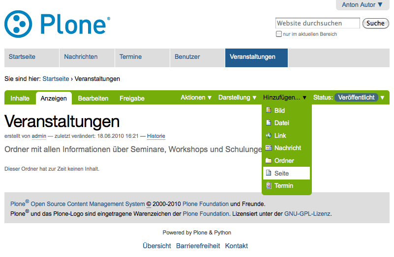
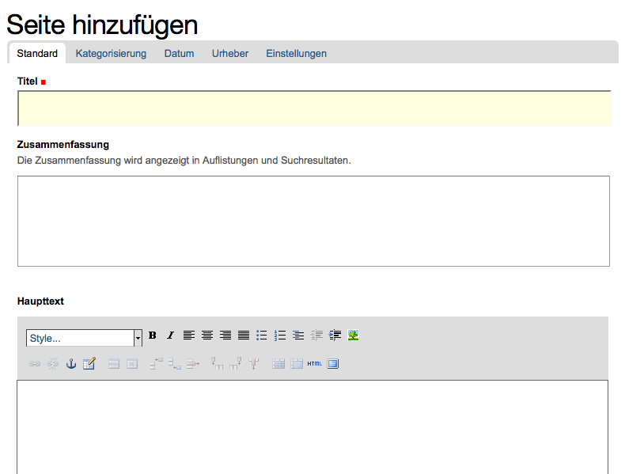
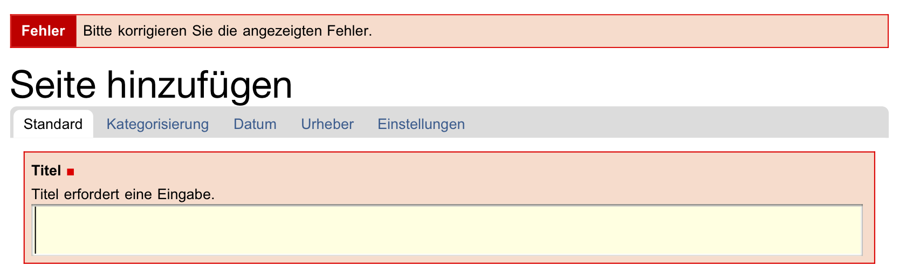
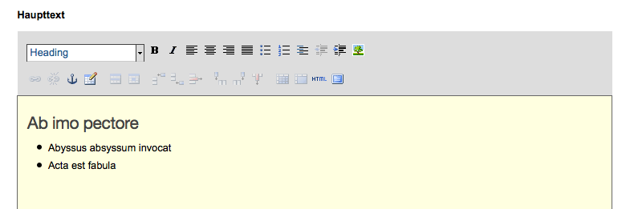
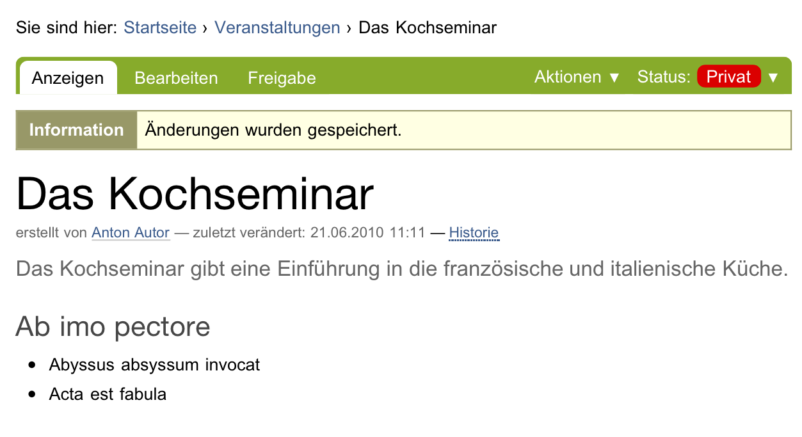
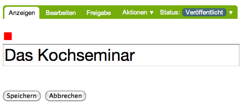
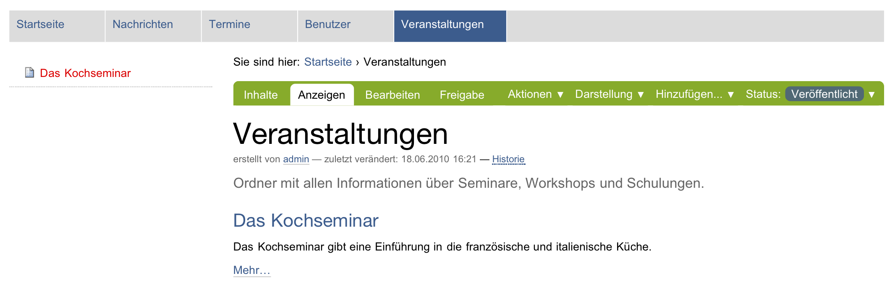
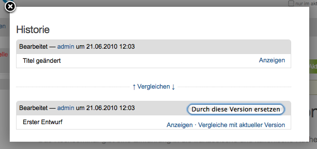
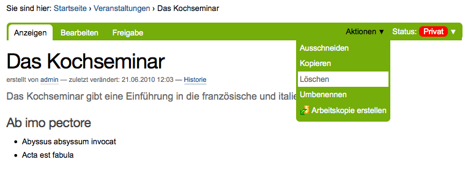

.. _sec_tutorium-dokumente:

===================
 Umgang mit Seiten
===================

In diesem Tutorium lernen Sie, wie Sie eine Seite auf der Website anlegen,
bearbeiten und löschen.

Seite anlegen
=============

Wir gehen im folgenden davon aus, dass Ihr Administrator in der Website einen
Ordner mit dem Namen »Veranstaltungen« eingerichtet hat. Diesen Ordner sollten
Sie nutzen, wenn Sie die nachfolgenden Tutorien durcharbeiten. Sie erreichen
ihn über einen Eintrag in der Hauptnavigation.

* Begeben Sie sich in den Ordner »Veranstaltungen«, indem Sie dem Verweis
  »Veranstaltungen« in der Hauptnavigation folgen.

Sie werden bemerken, dass die Anzeigeansicht des Ordners mit einem grünen
Rahmen versehen ist, auf dem sich Reiter und Ausklappmenüs befinden. Über
die Reiter gelangen Sie zum Beispiel zur Bearbeitungsansicht des
Ordners. Unterhalb der Reiter für die Artikelansichten befindet sich das Menü
»Hinzufügen« (siehe Abbildung :ref:`fig_add-menu-seite`).

.. _fig_add-menu-seite:
   

   Menü zum Anlegen von Artikeln

* Klappen Sie das Menü »Hinzufügen« auf und wählen Sie »Seite« aus.

Sie sehen nun ein Bearbeitungsformular für eine neue Seite (siehe
Abbildung :ref:`fig_homepage-edit-1`).

.. _fig_homepage-edit-1:

   Bearbeitungsformular einer Seite

Falls Sie Javascript ausgeschaltet haben, gelangen Sie zunächst zu einer
Seite, auf der Sie auswählen können, welchen Artikeltyp Sie hinzufügen
möchten (siehe Abbildung :ref:`fig_hinzufuegen-form`). Markieren Sie den Typ
»Seite« und betätigen Sie die Schaltfläche »Hinzufügen«. 

Seite bearbeiten
================

Das Bearbeitungsformular ist in fünf Teile untergliedert:

* Standard
* Kategorisierung
* Datum
* Urheber
* Einstellungen

Zunächst ist das Teilformular »Standard« geöffnet. Die übrigen Teilformulare
erreichen Sie über die Navigation direkt unterhalb der Überschrift »Seite
hinzufügen«.

Falls Sie in Ihrem Webbrowser Javascript ausgeschaltet haben, zeigt Ihnen die
Bearbeitungsansicht alle fünf Teilformulare untereinander an. Der vollständige
Funktionsumfang aller Teilformulare wird in Abschnitt :ref:`sec_bearbeiten`
erklärt.

In diesem Tutorium beschränken wir uns auf den Teil »Standard« des
Bearbeitungsformulars. Er enthält vier Felder (siehe
Abbildung :ref:`fig_homepage-edit-1`):

* Titel
* Beschreibung
* Haupttext
* Änderungsnotiz

Titel und Beschreibung
----------------------

Zunächst müssen Sie im ersten Feld den Titel der Seite angeben. Dies ist
zwingend erforderlich. Sie erkennen Formularfelder, die unbedingt ausgefüllt
werden müssen, an dem roten Quadrat rechts neben der Feldbezeichnung. Wenn Sie
versuchen, ein Formular mit einem unausgefüllten Pflichtfeld zu speichern,
erhalten Sie eine Fehlermeldung.

Beobachten Sie, wie Plone auf unausgefüllte Pflichtfelder reagiert, bevor Sie
Ihrer Seite einen neuen Titel geben:

* Wechseln Sie mit dem Cursor in das Feld »Beschreibung«, ohne einen
  Titel eingetragen zu haben.

Das Formularfeld »Titel« wird rot hinterlegt und Sie werden daran
erinnert, einen Titel einzugeben.

* Betätigen Sie die Schaltfläche »Speichern« am Ende des Formulars, ohne
  einen Titel einzugeben.

Plone hat die Seite nicht gespeichert, sondern zeigt das Bearbeitungsformular
erneut an. Das Titelfeld ist hervorgehoben und mit dem Hinweis versehen, dass
es ausgefüllt werden muss (siehe
Abbildung :ref:`fig_homepage-edit-no-title`).

.. _fig_homepage-edit-no-title:

   Fehlermeldung wegen unausgefüllten Pflichtfelds

* Tragen Sie nun einen Titel für Ihre Seite in das Titelfeld ein, etwa
  »Das Kochseminar«.

Das zweite Feld erlaubt die Eingabe einer kurzen Beschreibung, beispielsweise
einer Inhaltsangabe, einer Zusammenfassung oder eines Textauszugs.  Diese
Beschreibung wird in automatisch erzeugten Übersichtslisten und als Einleitung
des Textes verwendet.  Sie soll dem Leser die Entscheidung erleichtern, ob die
Seite für ihn interessant ist oder nicht. Die Eingabe einer Beschreibung
empfiehlt sich daher immer.

* Geben Sie in das Formularfeld »Beschreibung« einen kurzen
  beschreibenden Text ein.

Haupttext
---------

Das Feld »Haupttext« sieht etwas anders aus. Oberhalb des Textfelds finden
Sie eine Leiste mit Bearbeitungselementen des Texteditors Kupu vor (siehe
Abbildung :ref:`fig_homepage-edit-2`).

.. _fig_homepage-edit-2:

   Kupu im Bearbeitungsformular einer Seite

Falls die Bearbeitungsleiste fehlt, haben Sie den Texteditor Kupu in Ihren
persönlichen Einstellungen möglicherweise nicht ausgewählt. Siehe dazu das
erste Tutorium auf Seite :ref:`sec_tut-profil`.

.. pageref auflösen

Kupu lässt Sie den eingegebenen Text formatieren. Sie können unter anderem
Überschriften auszeichnen, Textstellen fett oder kursiv setzen und Absätze
links- oder rechtsbündig ausrichten. Eine ausführliche Beschreibung von Kupu
finden Sie in Abschnitt :ref:`sec_kupu`.

* Geben Sie etwas Text in das Formularfeld »Haupttext« ein.
* Gehen Sie mit dem Cursor in eine Zeile, die zu einer Überschrift werden
  soll und wählen Sie aus dem Auswahlmenü den Stil »Heading« aus.
* Geben Sie etwas Text in einer neuen Zeile ein und markieren Sie mit Hilfe
  des Listensymbols diese Zeile als Liste.
* Beobachten Sie, wie neue Zeilen zu weiteren Listenpunkten werden, bis
  Sie die Listenfunktion wieder ausschalten.
* Probieren Sie die anderen Formatierungen aus Kupus Werkzeugleiste aus
  und beobachten Sie, wie sich das Ein- und Ausschalten jeweils auf den Text
  auswirkt.

Bereits während Sie Ihren Text eingeben, wird er im Stil der Website
dargestellt. So erhalten Sie sofort einen Eindruck vom Ergebnis.

Änderungsnotiz
--------------

Kommentieren Sie in der Änderungsnotiz, was Sie auf der Seite geändert haben.
Da Plone auch die älteren Versionen eines Artikels speichert, kann man später
anhand dieser Notizen herausfinden, warum bestimmte Änderungen gemacht wurden.

Eingaben sichern
----------------

Sichern Sie Ihre Eingaben, wenn Sie mit ihnen zufrieden sind.

* Betätigen Sie die Schaltfläche »Speichern« am Ende des
  Formulars.

Akzeptiert Plone Ihre Änderungen, so zeigt es Ihnen die bearbeitete
Seite an (siehe Abbildung :ref:`fig_homepage-edited`).

.. _fig_homepage-edited:

   Die Seite nach der Bearbeitung

Sie werden dann durch eine Statusmeldung darüber informiert, dass die Seite
gespeichert wurde.

Ihre Eingaben werden nun in der Anzeige der Seite dargestellt. Die
Seitenüberschrift ist der von Ihnen eingegebene Titel. Gleich darauf folgt
visuell hervorgehoben Ihre Beschreibung und dann der Haupttext der Seite.

Wenn es beim Speichern ein Problem gab, verbleiben Sie in der
Bearbeitungsansicht.  Lesen Sie in diesem Fall die angezeigte Fehlermeldung
und korrigieren Sie Ihre Eingaben entsprechend.

Sofortbearbeitung einzelner Elemente
------------------------------------

Sie können einzelne Elemente der Seite direkt in der Anzeige bearbeiten. Dazu
müssen Sie in Ihrem Webbrowser Javascript eingeschaltet haben.

* Klicken Sie in der Anzeige der Seite mit der Maus auf den Titel.
* Der Seitentitel wechselt daraufhin in den Bearbeitungsmodus (siehe
  Abbildung :ref:`fig_titel-bearbeiten-ajax`).

.. _fig_titel-bearbeiten-ajax:

   Einzelne Elemente der Seite direkt bearbeiten

  Ändern Sie den Titel und speichern Sie die Änderung mit der Schaltfläche
  »Speichern« unterhalb des Eingabefeldes.

In gleicher Weise können Sie die Beschreibung und den Haupttext einer Seite
ändern. Diese Funktion ist nützlich, um schnell und bequem kleinere Änderungen
an Artikeln durchzuführen. Falls Sie umfangreichere Änderungen vornehmen
wollen, wählen Sie den Weg über das Bearbeitungsformular, das Sie über den
Reiter »Bearbeiten« erreichen. Nur dort stehen Ihnen alle
Bearbeitungsmöglichkeiten zur Verfügung.

Die Seite als Teil der Website
------------------------------

* Rufen Sie nun erneut den Ordner »Veranstaltungen« in der Hauptnavigation
  auf. Schauen Sie sich sowohl seine Anzeige an als auch die Ansicht
  »Inhalte«.

Die Inhaltsliste des Ordners enthält nun einen neuen Eintrag für die Seite,
die Sie gerade angelegt haben (siehe Abbildung :ref:`fig_homefolder+page`).

.. _fig_homefolder+page:

   Die Seite in Ihrem Ordner und im Navigationsportlet

Ältere Versionen anzeigen
=========================

Plone sichert alte Versionen von Artikeln. Sie können auf diese älteren
Versionen zugreifen. 

Um diese Funktion ausprobieren zu können, müssen Sie zunächst die von Ihnen
angelegte Seite verändern. Rufen Sie dazu erneut die Bearbeitungsansicht auf
und ändern Sie den Titel beispielsweise in »Das Kochseminar -- aktuelle
Informationen«. Vermerken Sie als Änderungsnotiz, dass Sie den Titel geändert
haben, und speichern Sie die Änderung.

Rufen Sie nun die Ansicht »Versionen« auf (siehe
Abbildung :ref:`fig_historie-tutorium`).

.. _fig_historie-tutorium:

   Liste der Versionen eines Artikels

Sie enthält eine Liste aller bisherigen Versionen der Seite. Als
Arbeitskopie wird die aktuelle, zuletzt gespeicherte Version
bezeichnet. Version 0 ist der Zustand der Seite unmittelbar nach dem
Anlegen. Sie können alte Versionen in einer Vorschau unterhalb der
Liste anzeigen lassen.

In der Spalte »Aktionen« finden Sie folgende Verweise:

Vergleiche mit vorheriger Version
  Es wird ein Vergleich zwischen der
  ausgewählten Version und der Version davor angezeigt. Version 0 besitzt
  diesen Verweis nicht, da sie keinen Vorgänger hat.

Vergleiche mit aktueller Version
  Es wird ein Vergleich der ausgewählten
  Version mit der aktuellen Version (der Arbeitskopie) angezeigt. Die
  Arbeitskopie selbst besitzt diesen Verweis nicht.

Gehe zu dieser Version zurück
  Die aktuelle Version wird durch die
  Version in der ausgewählten Zeile ersetzt. Auch diesen Verweis gibt es bei
  der aktuellen Version selbst nicht.

Machen Sie sich nun mit der Arbeitsweise dieser Aktionen vertraut.

* Ersetzen Sie die neue Version durch die ältere und schauen Sie sich
  das Ergebnis in der Ansicht »Anzeigen« an.
* Wechseln Sie erneut in die Ansicht »Versionen«. Es ist eine neue
  Arbeitskopie hinzugekommen. In der Spalte »Kommentar« finden Sie einen
  Hinweis, dass zur Version 0 zurückgewechselt wurde.
  Die alte Arbeitskopie wird nun als Version 1 bezeichnet.
* Nehmen Sie weitere Änderungen an der Seite vor und vollziehen Sie nach,
  wie diese Änderungen als verschiedene Versionen gespeichert werden.

Seite löschen
=============

Nicht mehr benötigte Artikel können Sie von der Website entfernen. Löschen Sie
nun die Seite, die Sie gerade angelegt haben.

* Rufen Sie die Anzeigeansicht der Seite auf. 
* Öffnen Sie das Menü »Aktionen« und wählen Sie den Eintrag »Löschen«
aus (siehe Abbildung :ref:`fig_aktionen-loeschen`).

.. _fig_aktionen-loeschen:

   Aktionsmenü

Plone fragt vorsichtshalber nach, ob Sie die Seite wirklich löschen wollen,
bevor die Aktion ausgeführt wird, um ein versehentliches Löschen von Artikeln
zu vermeiden. Sie können die Löschaktion an diesem Punkt abbrechen oder
mittels der Schaltfläche »Löschen« bestätigen. Nach dem Löschen wird der
Ordner aufgerufen, in dem sich die Seite befand. Eine Statusmeldung quittiert
die Löschaktion.

Andere Artikeltypen
===================

Sie haben in diesem Tutorium den Artikeltyp »Seite« kennengelernt. Probieren
Sie nun andere Artikeltypen aus. Legen Sie beispielsweise einen Termin oder
eine Nachricht an, bearbeiten und löschen Sie diese Artikel, und verfolgen Sie
die Änderungen in der Versionshistorie.
