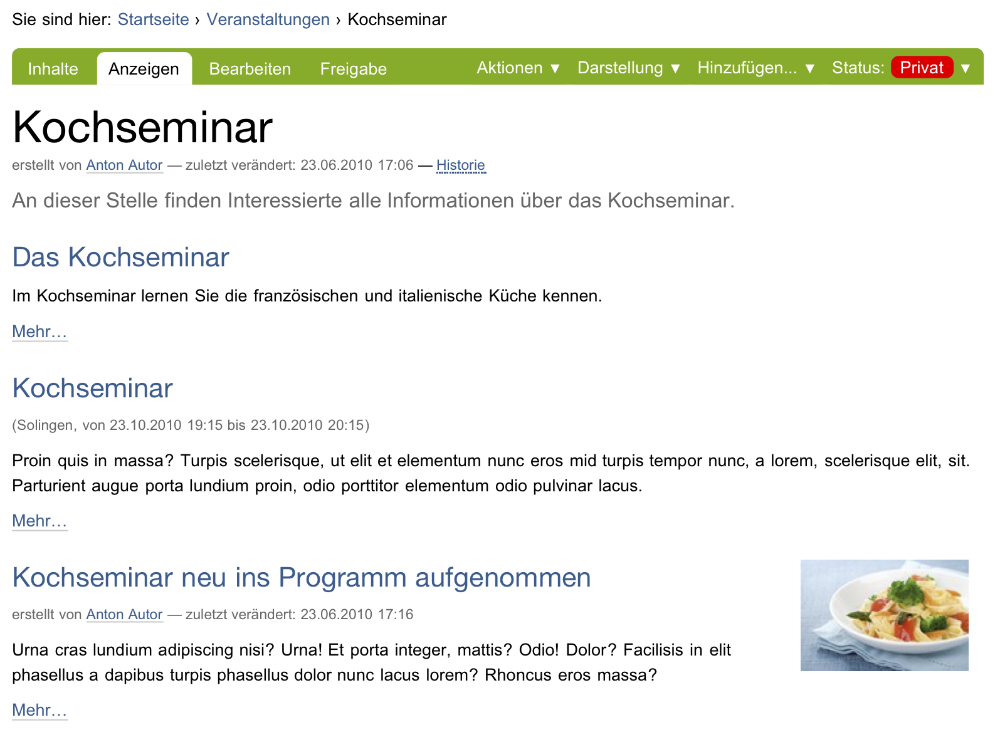
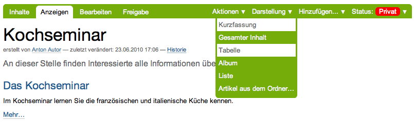

==================
Umgang mit Ordnern
==================

Dieses Tutorium beschäftigt sich mit den Besonderheiten von Ordnern
gegenüber anderen Artikeln.

Ordner anlegen
==============

Legen Sie einen Ordner an, indem Sie ähnlich vorgehen wie im vorigen Tutorium:

* Wechseln Sie in den Ordner »Veranstaltungen«.
* Wählen Sie aus dem Hinzufügemenü den Artikeltyp »Ordner« aus (siehe
  Abbildung :ref:`fig_add-menu-ordner`).

.. _fig_add-menu-ordner:

    Anlegen eines Ordners

Sie gelangen in das Bearbeitungsformular des neuen Ordners, das
zwei Felder enthält: Titel und Beschreibung.
Diese Felder haben bei Ordnern die gleiche Bedeutung wie bei Seiten.

* Bearbeiten Sie den neu angelegten Ordner. Im Rest dieses Tutoriums
  gehen wir davon aus, dass Sie ihm den Titel »Kochseminar« geben.

Nach dem Speichern gelangen Sie zur Anzeige des Ordners. Die Statusmeldung
informiert Sie darüber, dass die Änderungen gespeichert wurden. Die Anzeige
des Ordners informiert Sie darüber, dass der Ordner noch leer ist.

Inhalt eines Ordners
====================

Die Inhaltsansicht eines leeren Ordners unterscheidet sich nicht wesentlich
von seiner Anzeige (siehe Abbildung :ref:`fig_folder-empty`).

.. _fig_folder-empty:

    Inhaltsansicht eines neu angelegten Ordners

* Rufen Sie die Inhaltsansicht des Ordners »Kochseminar« auf.
* Legen Sie im Ordner »Kochseminar« eine Seite an, wie Sie es im vorigen
  Tutorium gelernt haben.
* Begeben Sie sich wieder zur Inhaltsansicht des Ordners »Kochseminar«.

Dort hat Plone jetzt eine Tabelle erzeugt, deren bisher einziger Eintrag die
gerade angelegte Seite ist (siehe Abbildung :ref:`fig_folder-with-object`).

.. _fig_folder-with-object:

.. figure::
    ../images/folder-with-object.png
    :width: 100%

    Inhaltsansicht eines Ordners mit einem Artikel

* Legen Sie weitere Artikel im Ordner »Kochseminar« an. Beobachten Sie
  dabei stets die Ansichten »Inhalte« und »Anzeigen« des Ordners.

Sowohl in der Inhaltsansicht als auch in der von Plone erzeugten Anzeige des
Ordners kommen neue Einträge am unteren Ende hinzu. Die bestehenden Einträge
behalten dabei ihre Reihenfolge bei (siehe
Abbildung :ref:`fig_folder-order`).

.. _fig_folder-order:

    Anzeige eines Ordners mit mehreren Artikeln

Ändern Sie nun die Reihenfolge der Einträge. Die Inhaltsansicht des Ordners
enthält dazu in der Tabellenspalte »Reihenfolge« für jeden Artikel ein Symbol,
das aus zwei Doppelpunkten besteht.

* Wechseln Sie in die Inhaltsansicht des Ordners »Kochseminar«.
* Gehen Sie mit dem Mauszeiger über die Doppelpunkte in der Tabelle. Je
  nach den Einstellungen Ihres Betriebssystems verwandelt sich der Mauspfeil
  dabei möglicherweise so, dass er Anfassen oder Bewegen symbolisiert.
* Greifen Sie nun mit einem Mausklick einen Artikel, und verschieben Sie
  ihn in der Liste bei gedrückter Maustaste nach oben oder unten. Wenn Sie die
  Maustaste loslassen, wird der Artikel an der entsprechenden Stelle
  einsortiert.
* Wechseln Sie zwischendurch in die Anzeige des Ordners, und vergewissern
  Sie sich, dass auch dort die Reihenfolge geändert wurde.

Falls Javascript an Ihrem Rechner nicht aktiviert ist, erscheinen statt der
Doppelpunkte in jeder Tabellenzeile Pfeile, mit denen Sie den jeweiligen
Artikel mit seinem Vorgänger oder Nachfolger vertauschen können.

Ordneranzeige
=============

Plone kennt verschiedene Vorlagen für die Anzeige eines Ordners.

* Begeben Sie sich zum Ordner »Kochseminar«.
* Öffnen Sie das Menü »Darstellung« und wählen Sie »Tabelle« aus (siehe
  Abbildung :ref:`fig_ansicht`).
  
.. _fig_ansicht:

    Darstellungen der Ordneranzeige

Die Anzeige des Ordners enthält jetzt anstelle der Liste eine Tabelle
mit Einträgen für jeden Artikel des Ordners.

* Probieren Sie nacheinander die anderen Ansichten aus. Die Albenansicht
  kommt nur dann zur Geltung, wenn Sie Bilder im Ordner erstellt haben.

Plone kann anstelle von Übersichtslisten oder -tabellen auch einen Artikel aus
dem Ordner als Anzeige verwenden. 

* Öffnen Sie das Darstellungsmenü und wählen Sie den Punkt »Artikel
  aus dem Ordner...«.
* Sie gelangen zu einem Formular, das alle im Ordner befindlichen Artikel
  mit Ausnahme der Unterordner auflistet (siehe
  Abbildung :ref:`fig_standardseite`).
  
.. _fig_standardseite:

    Auswahl eines Artikels als Ordneranzeige
  
* Kreuzen Sie den gewünschten Artikel an und speichern Sie das Formular.
* Plone leitet Sie nun zur Anzeige des Ordners »Kochseminar« weiter. Sie
  sehen dort anstelle einer Übersichtsliste oder -tabelle den gewählten
  Artikel.
* Wechseln Sie zur Inhaltsansicht. Sie sehen dort, dass der gewählte
  Artikel durch Fettschrift hervorgehoben ist.

Artikel kopieren und verschieben
================================

Plone erlaubt Ihnen nicht nur, Inhalte anzulegen und
zu löschen. Sie können Artikel und Ordner auch von einem Ort in der Website
an einen anderen verschieben oder kopieren.

Erzeugen Sie dazu im Ordner »Kochseminar« einen Unterordner und kopieren Sie
einen Artikel aus dem Ordner »Kochseminar« dort hinein.

* Legen Sie im Ordner »Kochseminar« einen Ordner an.
* Rufen Sie anschließend im Ordner »Kochseminar« den Artikel auf, den Sie
  kopieren möchten.
* Öffnen Sie das Menü »Aktionen« und wählen Sie den Eintrag »Kopieren«
aus.
* Wechseln Sie in den Unterordner.
* Fügen Sie eine Kopie des ausgewählten Artikels dort ein, indem Sie den
  Eintrag »Einfügen« im Aktionsmenü auswählen.

Die Anzeige des Unterordners enthält nun einen neuen Eintrag. Vergewissern
Sie sich, dass sich am Inhalt des Ordners »Kochseminar« nichts geändert hat.

Verschieben Sie als nächstes einen Artikel aus dem Ordner »Kochseminar« in den
Unterordner. Dabei gehen Sie ähnlich vor wie beim Kopieren.

* Wechseln Sie in den Ordner »Kochseminar« und rufen Sie den Artikel auf,
  den Sie verschieben möchten.
* Öffnen Sie das Menü »Aktionen« und wählen Sie den Eintrag
»Ausschneiden« aus.
* Wechseln Sie in den Unterordner.
* Fügen Sie den ausgewählten Artikel dort ein, indem Sie den Eintrag
  »Einfügen« im Aktionsmenü benutzen.

Sie werden bemerken, dass der Artikel nicht gleich beim Ausschneiden aus dem
Ordner »Kochseminar« verschwindet. Erst beim Einfügen wird er an seinem
Ursprungsort tatsächlich gelöscht. Kontrollieren Sie nach dem Verschieben den
Inhalt des Ordners »Kochseminar«.

Sie können Artikel nicht nur einzeln mit Hilfe der Einträge im Aktionsmenü
kopieren und verschieben. In der Inhaltsansicht eines Ordners können Sie
mehrere Artikel markieren, um sie gemeinsam zu kopieren oder zu
verschieben. 

* Wechseln Sie in die Inhaltsansicht des Ordners »Kochseminar«.
* Markieren Sie in der Spalte ganz links einige Artikel, die Sie kopieren
  möchten. 
* Betätigen Sie die Schaltfläche »Kopieren« unterhalb der
  Übersichtstabelle. Achten Sie auf die Statusmeldung.
* Wechseln Sie nun in den Unterordner.
* Betätigen Sie die Schaltfläche »Einfügen«. Lesen Sie die Statusmeldung
  und schauen Sie nach, wie sich die Übersichtsliste verändert hat.

Wenn Sie einen Ordner kopieren oder verschieben, werden alle Artikel, die sich
in dem Ordner befinden, mit dem Ordner verschoben oder kopiert.

* Legen Sie im Ordner »Kochseminar« einen weiteren Ordner an.
* Wechseln Sie in die Inhaltsansicht des Ordners »Kochseminar«.
* Markieren Sie den ersten Unterordner zum Kopieren.
* Wechseln Sie in den neuen Unterordner.
* Fügen Sie den markierten Ordner ein.

Der Unterordner mit seinem gesamten Inhalt befindet sich nun auch in dem
zweiten Unterordner.

* Vergewissern Sie sich, dass beide Ordner den gleichen Inhalt besitzen.

Ordner löschen
==============

Ordner werden wie alle anderen Artikel mit der Aktion »Löschen« im
Aktionsmenü gelöscht. Beachten Sie, dass beim Löschen eines Ordners auch die
darin enthaltenen Artikel gelöscht werden.

