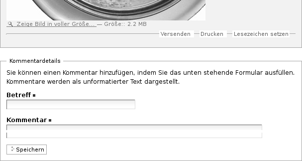
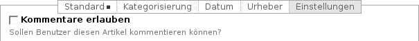

.. _sec_diskussionen:

============
 Kommentare
============

Plone verfügt über eine Kommentarfunktion, die es den Besuchern einer
Website erlaubt, sich mit den Autoren und anderen Besuchern über
einzelne Artikel auszutauschen.

Ist für einen Artikel die Kommentarfunktion eingeschaltet, so enthält seine
Anzeige am Seitenende die Schaltfläche »Kommentieren« sowie die bisherigen
Kommentare (siehe Abbildung :ref:`fig_diskussion`).

.. _fig_diskussion:

.. figure:: ../images/diskussion.png
   :width: 100%

   Kommentare

Antworten auf einen Kommentar werden direkt unterhalb des Kommentars
angezeigt und eingerückt. So kann sich eine verzweigte Diskussion
entwickeln.

An Diskussionen teilnehmen
==========================

Falls der Verfasser des Artikels Kommentare erlaubt hat, können Sie
den Artikel kommentieren. Um einen Kommentar hinzufügen zu können,
müssen Sie aber in der Regel an der Website angemeldet sein. Als nicht
angemeldeter Benutzer sehen Sie in diesem Fall eine Schaltfläche mit
der Aufschrift »Zum Kommentieren müssen Sie sich anmelden«.

Nach der Anmeldung sehen Sie unterhalb des Artikels die Schaltfläche
»Kommentieren« und am Ende jedes einzelnen Kommentars die Schaltfläche
»Antworten«. Die Schaltflächen führen Sie zu einem Formular, in dem Sie
einen Kommentar zum Artikel oder eine Antwort auf einen Diskussionsbeitrag
verfassen können (siehe Abbildung :ref:`fig:diskussion-kommentieren`).

.. _fig_diskussion-kommentieren:

   Eingabeformular für einen Kommentar

Oberhalb des Formulars wird der Artikel angezeigt. Antworten Sie auf einen
anderen Diskussionsbeitrag, so sehen Sie außerdem alle Kommentare, die Ihrer
Antwort in der Diskussion vorangingen. So haben Sie beim Schreiben all das im
Blick, worauf Sie sich beziehen möchten.

Im Kommentarformular geben Sie einen Betreff und Ihren Kommentar ein. Sie
müssen beide Formularfelder ausfüllen. Der Kommentar ist einfacher Text, den
Sie nicht formatieren können. Wenn Sie das Formular speichern, gelangen Sie
wieder zur Anzeige des Artikels. Dort ist Ihr Beitrag sofort sichtbar.

Falls die Website so konfiguriert ist, dass die Diskussion allen Besuchern
offensteht, können Sie im Kommentarformular neben Ihrem Beitrag auch Ihren
Benutzernamen und Ihr Passwort angeben, damit der Beitrag unter Ihrem Namen
gespeichert werden kann. Ohne diese Angaben wird der Beitrag anonym
veröffentlicht.

Konfiguration
=============

Als Besitzer eines Artikels können Sie bestimmen, ob eine öffentliche
Diskussion zu Ihrem Artikel möglich sein soll. Jeder Besucher, der den
Artikel einsehen darf, kann auch die Diskussion vollständig lesen. Ihr
Administrator kann für die gesamte Website einstellen, ob
unangemeldete Besucher Beiträge verfassen dürfen.

Um Kommentare zu erlauben, wechseln Sie in der Bearbeitungsansicht des
Artikels ins Teilformular »Einstellungen«. Dort können Sie die
Kommentarfunktion ein- und ausschalten, indem Sie das Häkchen bei der Option
»Kommentare erlauben« setzen oder entfernen (siehe
Abbildung :ref:`fig_allow-discussion`).

.. _fig_allow-discussion:

   Kommentare zu einem Artikel erlauben

Für jeden Artikeltyp ist voreingestellt, ob Kommentare erlaubt sind.

Beiträge löschen
================

Als Administrator eines Artikels können Sie einzelne Kommentare oder auch
ganze Diskussionsstränge löschen. Dafür besitzt jeder Kommentar neben der
Schaltfläche »Antworten« eine, die mit »Löschen« beschriftet ist. Löschen Sie
einen Diskussionsbeitrag, auf den bereits geantwortet wurde, so werden auch
alle Antworten auf ihn entfernt. Beachten Sie, dass beim Löschen von
Kommentaren keine weitere Nachfrage erfolgt.

