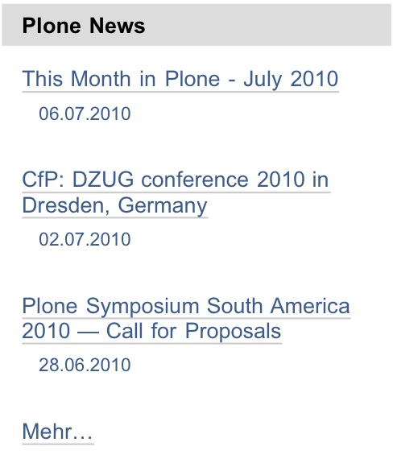

.. _sec_syndizierung:

==============
 Syndizierung
==============

Syndizierung oder Syndikation bedeutet, dass veränderliche
Informationen wie Schlagzeilen einer Nachrichtenagentur vielfach
weiterverwendet werden, etwa auf anderen Websites oder in einem
Nachrichtenticker auf Ihrem Rechner. So kann man aktuelle
Veröffentlichungen auf einer Website verfolgen, ohne die Website
selbst regelmäßig besuchen zu müssen.

.. _sec_rss:

RSS-Feeds und RSS-Portlet
=========================

Per Syndizierung zu verbreitende Informationen werden in
maschinenlesbarer Form als sogenannter RSS-Feed zur Verfügung
gestellt. RSS steht für »Rich Site Summary« oder »Really Simple
Syndication«. Ein RSS-Feed ist einfach eine Textdatei, die unter einer
bestimmten Internetadresse abrufbar ist. Diese Datei wird ständig
erneuert, etwa wenn eine neue Nachricht hinzukommt. Andere Websites
oder Programme auf Ihrem Rechner rufen sie in regelmäßigen Abständen
ab.

Der RSS-Feed enthält eine begrenzte Anzahl von Artikeln
in einem standardisierten Textformat. Das Programm, welches die Artikel
verarbeiten will, kann die Datei zerlegen und zu jedem Artikel
den Titel, die Zusammenfassung, eine Internetadresse und andere
Angaben entnehmen. Diese Informationen werden dann beispielsweise in einer
Artikelliste auf einer anderen Website angezeigt.

Außerdem enthält ein RSS-Feed Metadaten wie Titel, Beschreibung,
Internetadresse und vielleicht ein Logo. Man bezeichnet RSS-Feeds auch als
Nachrichtenkanäle; ein Nachrichtenticker kann beispielsweise Nachrichten aus
mehreren Kanälen gleichzeitig anzeigen und die Kanäle dabei dem Titel nach
unterscheiden.

In Plone gibt es ein Portlet, das die neuesten Artikel eines beliebigen
RSS-Feeds aus dem Web anzeigt (siehe Abbildung :ref:`fig_portlet-rss`).

.. _fig_portlet-rss:

   RSS-Portlet

Das Portlet enthält eine Liste von Titeln, die jeweils Verweise zum
Artikeltext sind. Der Titel des Portlets zeigt den Kanaltitel, und
gegebenenfalls enthält die Fußzeile des Portlets einen Verweis zu einer Liste
aller Artikel des Kanals. Die Internetadresse des RSS-Feeds, die Anzahl
der im Portlet aufgelisteten Artikel und das Abrufintervall für den
RSS-Feed können Sie in den Einstellungen des Portlets festlegen.

Von Plone veröffentlichte RSS-Feeds
===================================

Plone kann RSS-Feeds nicht nur abrufen und darstellen, sondern für Ordner,
Kollektionen und Suchen auch eigene RSS-Feeds oder Kanäle veröffentlichen.
Der RSS-Feed für einen Ordner listet die zuletzt geänderten Artikel im Ordner
auf, Feeds für Kollektionen und Suchen enthalten die jeweils zuerst
aufgeführten passenden Artikel oder Suchergebnisse. So könnten Sie
beispielsweise auf Ihrem Rechner in einem Nachrichtenticker einen RSS-Feed
Ihrer Website abonnieren, der Sie über Änderungen und neue Artikel auf der
Website informiert.

Ist auf Ihrer Website die Syndizierung eingeschaltet, können Sie für
jeden Ordner und jede Kollektion einzeln entscheiden, ob sie einen
RSS-Feed mit Meldungen anbieten sollen. Dazu besitzen diese
Artikeltypen eine Ansicht »Syndizierung« (siehe Abschnitt
:ref:`sec_syndizierung-ansicht`), auf der Sie jeweils den RSS-Feed
ein- und ausschalten und konfigurieren können.

Ordner und Kollektionen, die einen RSS-Feed anbieten, besitzen eine
Artikelaktion »RSS-Feed«, die ein Verweis zur Internetadresse des RSS-Feeds
ist. Unter dieser Adresse können die Besucher den Feed in einem beliebigen
RSS-Anzeigeprogramm abonnieren.

Wenn Sie eine Suche ausführen, so befindet sich am Anfang der Ergebnisliste
der Verweis »Abonnieren Sie einen stets aktuellen RSS-Feed aus diesen
Suchresultaten«. Dieser Verweis zeigt auf die Internetadresse eines
RSS-Feeds, der stets die aktuelle Ergebnisliste zu dieser Suchanfrage
enthält.

Für den RSS-Feed eines Ordners oder einer Kollektion werden als Titel und
Beschreibung die Metadaten des Ordners oder der Kollektion selbst verwendet.
Jeder Hinweis auf einen Artikel enthält neben Titel, Beschreibung und der
Internetadresse auch Angaben über den Herausgeber, den Autor, die
Nutzungsbedingungen und das Veröffentlichungsdatum. Diese Informationen werden
den Eigenschaften und Metadaten der Artikel entnommen.

In RSS-Feeds von Ordnern und Kollektionen ist der Inhalt von Unterordnern und
Unterkollektionen nicht enthalten: wenn für sie die Syndizierung aktiviert
ist, haben sie ihre eigenen RSS-Feeds.

.. todo:: Kontrollieren, ob Syndizierung so nocht funktioniert

.. _sec_syndizierung-ansicht:

Artikelansicht »Syndizierung«
=============================

Falls in Ihrer Website die Syndizierung aktiviert ist, tragen
Ordner und Kollektionen einen zusätzlichen Reiter mit der Aufschrift
»Syndizierung«. Er gehört zu einer Artikelansicht, in der Sie die
Syndizierungseigenschaften dieses Ordners bearbeiten können.

Damit ein Ordner oder eine Kollektion tatsächlich einen RSS-Feed
bereitstellt, müssen Sie die Syndizierung jeweils einzeln einschalten. Dazu
enthält die Syndizierungsansicht die Schaltfläche »Syndizierung erlauben«.

Nach dem Einschalten der Syndizierung enthält die Syndizierungsansicht eine
Reihe von Formularfeldern (siehe Abbildung :ref:`fig_syndizierung`).

.. _fig_syndizierung:

.. figure:: ../images/syndizierung.*
   :width: 100%
   :alt: Die Ansicht zur Konfiguration der Syndizierung

   Syndizierungsansicht

Zuoberst finden Sie eine Schaltfläche, mit der Sie die Syndizierung
für diesen Ordner jederzeit wieder ausschalten können. Beachten Sie,
dass alle Syndizierungseinstellungen für diesen Ordner danach verloren
sind.

Als nächstes folgen der Kanaltitel und die Kanalbeschreibung des RSS-Feeds.
Dabei handelt es sich um den Titel und die Beschreibung des Ordners oder der
Kollektion. Um diese Angaben zu ändern, müssen Sie den Titel und die
Beschreibung des Ordners oder der Kollektion selbst anpassen.

Mit den folgenden drei Angaben teilen Sie den Anzeigeprogrammen mit,
wann und wie oft sie den Feed abrufen sollten. Die ersten Felder bestimmen,
wie viele Zeiteinheiten vergehen sollen, bis der RSS-Feed erneut abgerufen
wird. Im dritten Feld geben Sie den Anfangszeitpunkt für
die regelmäßige Aktualisierung an. Wählen Sie
beispielsweise »wöchentlich«, »2« und das Datum eines beliebigen Dienstags
aus, so empfehlen Sie den Anzeigeprogrammen, jeden zweiten Dienstag
einen neuen RSS-Feed abzurufen.

Die RSS-Feeds von Ordnern und Kollektionen sind bei jedem Abruf auf
dem jeweils aktuellen Stand. Wird ein Feed zu oft abgerufen, dann
belastet das den Webserver unnötig; liest man einen Kanal jedoch zu
selten, so verpasst man Meldungen. Welche Häufigkeit der
Aktualisierung sinnvoll ist, hängt von Ihrem Anwendungsfall ab und
muss für jeden Ordner und jede Kollektion einzeln abgeschätzt werden.

Im letzten Formularfeld bestimmen Sie schließlich, wie viele Artikel
in einem RSS-Feed enthalten sein sollen. Üblicherweise sind das etwa
10 bis 20. Je mehr Artikel ein Feed enthält, desto seltener sollte er
abgerufen werden.

