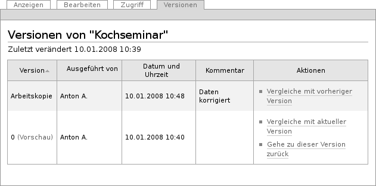
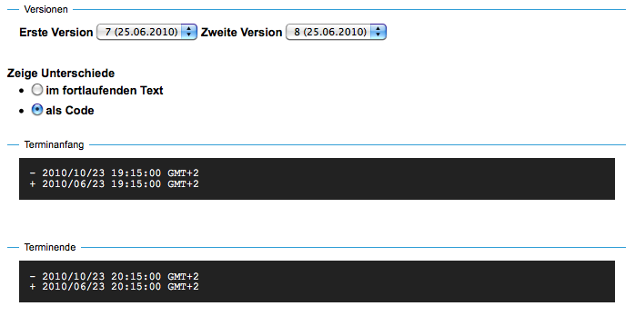
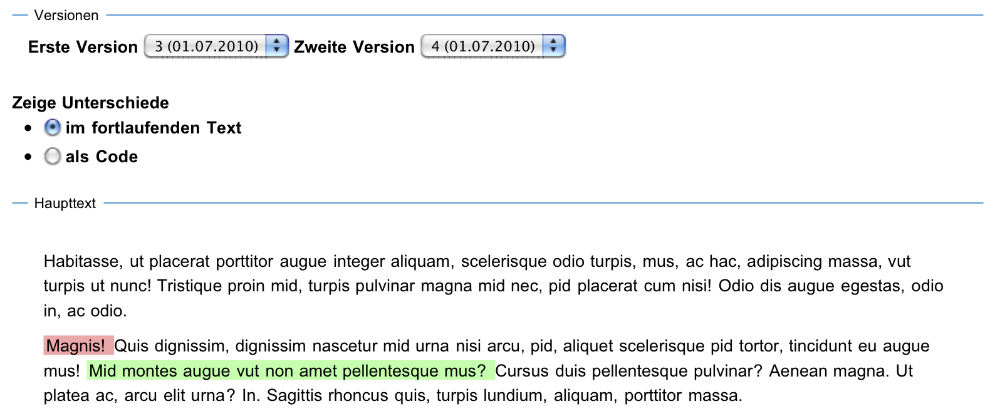

.. _sec_versionierung:

===============
 Versionierung
===============

Es wird bei Ihrer Arbeit an der Website gelegentlich vorkommen, dass Sie
Änderungen zurücknehmen und zu einer früheren Version eines Artikels
zurückkehren möchten. Das ist in Plone mit Hilfe der Versionsverwaltung
möglich. Das CMS erstellt jedes Mal, wenn Sie einen Artikel verändern und
speichern, eine neue Version des Inhalts. Die alten Versionen des Artikels
werden dabei nicht überschrieben, sondern stehen weiterhin zur Verfügung.

Sie erreichen die älteren Versionen eines Artikels über die Ansicht
»Versionen« (siehe Abbildung :ref:`fig_ansicht-versionen`).

.. _fig_ansicht-versionen:

   Die Ansicht »Versionen«

Dort finden Sie eine Tabelle vor, in der die aktuelle Arbeitskopie und die
vorherigen Versionen aufgelistet sind. Die Tabelle stellt Ihnen alle
Informationen zu den einzelnen Versionen übersichtlich in einzelnen Spalten
zur Verfügung.

Version
  In dieser Spalte erscheint die Versionsnummer beginnend bei
  Null. Die aktuelle Version wird als Arbeitskopie bezeichnet.

Ausgeführt von
  Diese Spalte führt den Benutzer auf, der die angegebene
  Version gespeichert hat. 

Datum und Uhrzeit
  Der Zeitpunkt, an dem die Version gespeichert wurde.

Kommentar
  Bemerkungen, die der Benutzer beim Speichern als
  Änderungsnotiz eingegeben hat.

Aktionen
  In dieser Spalte finden Sie Verweise zu allen Aktionen, die in
  Bezug auf die jeweilige Version des Artikels einen Sinn ergeben.

Folgende Aktionen können Sie mit einer Version eines Artikels ausführen:

Vergleiche mit aktueller Version
  Über diesen Verweis gelangen Sie zu
  einer Seite, auf der die ausgewählte Version mit der aktuellen verglichen
  wird (siehe Abbildung :ref:`fig_versionsvergleich-metadaten`).
 
Vergleiche mit vorheriger Version
  Sie gelangen zu einem Vergleich
  zwischen der ausgewählten Version und der Version davor.

Gehe zu dieser Version zurück
  Diese Aktion macht die ausgewählte
  Version zur neuen Arbeitskopie. Das bedeutet, dass die Besucher Ihrer
  Website nun eine frühere Version zu Gesicht bekommen. Die alte Arbeitskopie
  wird unter einer neuen Versionsnummer gespeichert. 

Versionsvergleich
=================

Beim Versionsvergleich werden nicht nur Änderungen am Inhalt des
Artikels aufgelistet, sondern auch Modifikationen an den Metadaten wie
den Kategorien oder dem Freigabe- oder Ablaufdatum und an den
sonstigen Einstellungen. Als einzige Ausnahme werden Verweise auf
andere Artikel von der Versionsverwaltung nicht erfasst.

.. Ist das ein Bug?

Bei den Metadaten bedeutet ein vorangestelltes Pluszeichen, dass der
folgende Eintrag oder Wert hinzugefügt wurde; ein Minuszeichen zeigt an,
welcher Eintrag oder Wert gelöscht wurde (siehe
Abbildung :ref:`fig_versionsvergleich-metadaten`).

.. _fig_versionsvergleich-metadaten:

   Versionsvergleich mit geänderten Metadaten

Bei Textfeldern, etwa der Beschreibung, werden die beiden Versionen
nebeneinander angezeigt. Hinzugefügter Text wird hellgrün hervorgehoben,
ersetzter und gelöschter Text hellrot.

Der Haupttext des Artikels wird zunächst nur einmal angezeigt, wobei
sichtbare Änderungen direkt im fließenden Text farbig markiert und
gegenübergestellt werden (siehe
Abbildung :ref:`fig_versionsvergleich-haupttext`).

.. _fig_versionsvergleich-haupttext:

   Versionsvergleich mit geändertem Haupttext

Sie können jedoch auch beide Versionen des Haupttexts einander
gegenüberstellen. Wechseln Sie mit den Verweisen »Zeige Änderungen im Code«
und »Zeige sichtbare Änderungen« zwischen den zwei Darstellungen.

