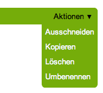

.. _sec_verwaltung:

========================
 Artikel in der Website
========================

Ein Artikel ist ein Teil einer Website. Er hat einen Platz in ihrer
Ordnerstruktur und einen Kurznamen, der ihn in seinem Ordner
kennzeichnet. Daraus ergeben sich verschiedene einfache Verwaltungsaufgaben:

* Artikel hinzufügen und umbenennen
* Artikel kopieren, verschieben und löschen
* mehrere Artikel gleichzeitig verwalten

.. _sec_artikel-erstellen:

Hinzufügen
==========

In der Anzeige und der Inhaltsansicht von Ordnern finden Sie das
Ausklappmenü »Hinzufügen« (siehe Abbildung :ref:`fig_hinzufuegen`),
mit dem Sie neue Artikel im betreffenden Ordner anlegen können.

.. _fig_hinzufuegen:

   Menü »Hinzufügen«

Wählen Sie aus dem Menü den Typ des anzulegenden Artikels aus. Daraufhin
leitet Plone Sie direkt zur Bearbeitungsansicht des neuen Artikels weiter.
Der Artikel wird jedoch erst dann tatsächlich in den Ordner gelegt,
wenn Sie das Bearbeitungsformular erfolgreich gespeichert haben.

Es ist möglich, dass das Hinzufügemenü nicht alle Artikeltypen Ihrer Website
auflistet. Dann hat Ihr Systemverwalter oder der Besitzer des Ordners die im
Menü angezeigten Artikeltypen eingeschränkt. Das Menü endet in diesem Fall mit
dem Eintrag »Mehr...«, der Sie zu einer Liste aller hinzufügbaren
Artikeltypen führt (siehe Abbildung :ref:`fig_hinzufuegen-form`).

.. _fig_hinzufuegen-form.png:

   Vollständige Auswahl hinzufügbarer Artikeltypen

Markieren Sie dort den gewünschten Typ und betätigen Sie die Schaltfläche
»Hinzufügen«.

Wenn Sie Javascript ausgeschaltet haben, ist kein Ausklappmenü vorhanden. Der
Verweis »Hinzufügen« bringt Sie dann direkt zu diesem Formular.

Hinzufügbare Artikeltypen einschränken
--------------------------------------

Falls Sie sich in einem Ordner befinden, für den Sie Verwalter sind oder den
Sie besitzen, enthält das Menü »Hinzufügen« den Eintrag
»Einschränkungen...«. Er führt zu einem
Formular, auf dem Sie zunächst drei Grundeinstellungen vornehmen können
(siehe Abbildung :ref:`fig_hinzufuegen-typen`).

.. _fig_hinzufuegen-typen:

   Grundeinstellungen für das Hinzufügen von Artikeln

Verwende die Eigenschaften des übergeordneten Ordners
  Es können dieselben Artikeltypen wie im übergeordneten Ordner hinzugefügt
  werden.

Erlaube das Hinzufügen der Standardartikeltypen
  Es können alle
  Standardartikeltypen hinzugefügt werden. Beachten Sie, dass auf Ihrer
  Website möglicherweise einige Artikeltypen überhaupt nicht zur Verfügung
  stehen.

Artikeltypen manuell festlegen 
  Die erlaubten Artikeltypen werden
  für diesen Ordner einzeln festgelegt.

Wenn Sie »Artikel manuell festlegen« auswählen, wird das Formular um zwei
Listen von Artikeltypen erweitert (siehe
Abbildung :ref:`fig_hinzufuegen-typen-lang`):

.. _fig_hinzufuegen-typen-lang:

   Einschränkung der hinzufügbaren Artikeltypen

Erlaubte Artikeltypen
  Nur diese Artikeltypen dürfen im Ordner überhaupt
  hinzugefügt werden.

Sekundäre Artikeltypen
  Diese Artikeltypen erscheinen nicht direkt im
  Auswahlmenü »Hinzufügen«, sondern sind nur über den Eintrag »Mehr...« im
  Hinzufügemenü erreichbar.

Wenn Sie Javascript ausgeschaltet haben, enthält das Hinzufügeformular
einen Verweis zu dem Formular, auf dem Sie die erlaubten Artikeltypen
einschränken können. Wenn Sie die Option »Artikeltypen manuell
festlegen« auswählen, müssen Sie das Formular erst speichern, bevor
die beiden Listen mit den erlaubten und den sekundären Artikeltypen
erscheinen.

.. _sec_hinzufugen-mit-wiki:

Hinzufügen mit Wiki-Verweisen
-----------------------------

Neue Artikel lassen sich auch ähnlich wie in einem Wiki
hinzufügen. Wenn Ihre Website entsprechend konfiguriert ist, können
Sie dazu Verweise auf noch nicht existierende Artikel erzeugen, über
die die jeweiligen Artikel später angelegt werden.

Bearbeiten Sie den Haupttext einer Seite, einer Nachricht oder eines Termins
und setzen ein einzelnes Wort oder eine Wortgruppe in runde oder eckige
Doppelklammern, so macht Plone beim Speichern aus dem geklammerten Text einen
Verweis auf einen Artikel, der im selben Ordner liegt und dessen Kurzname dem
Text entspricht (siehe Abschnitt :ref:`sec_wiki-verweise`).

Sollte ein solcher Artikel jedoch nicht vorhanden sein, erscheint dieser
Verweis in Rot und wird durch ein hochgestelltes, eingeklammertes Pluszeichen
markiert. (siehe Abbildung :ref:`fig_anzeige-wiki-links`). 

.. _fig_anzeige-wiki-links:

   Wiki-Verweise zu Artikeln, die noch nicht existieren

Wenn Sie dem Verweis folgen, wird im gleichen Ordner ein neuer Artikel
mit dem Namen des Verweises als Titel erstellt und in der
Bearbeitungsansicht angezeigt. Sie können den neuen Artikel dann
bearbeiten und speichern. Der Verweis erscheint daraufhin als
gewöhnlicher Verweis zum neuen Artikel.

Beim Hinzufügen von Artikeln über Wiki-Verweise ist Folgendes zu beachten:

* Die erzeugten Artikel befinden sich im gleichen Ordner wie der Artikel,
  in dem sich der Wiki-Verweis befand.

* Wiki-Verweise in einem Artikel erzeugen stets Artikel desselben Typs.
  Wiki-Verweise in einer Seite erzeugen eine neue Seite, in einer Nachricht
  eine neue Nachricht, und in einem Termin einen neuen Termin.

* Wiki-Verweise funktionieren nur bei den Artikeltypen »Seite«,
  »Nachricht« und »Termin«.

* Die Wiki-Methode funktioniert unabhängig davon, wie Sie den Text mit
  den Verweisen bearbeiten. Neben dem Texteditor Kupu können Sie auch in
  einfachem Text oder mit einer Auszeichnungssprache wie »Restructured Text«
  Wiki-Verweise erstellen.

.. _sec_kurzname:

Kurznamen und Umbenennen
========================

Jeder Artikel in einer Plone-Website besitzt einen Kurznamen, der ihn
innerhalb seines Ordners eindeutig kennzeichnet.

Artikel haben zwar auch einen Titel, aber dieser eignet sich nicht zu
ihrer eindeutigen Kennzeichnung. Einen Titel möchten Sie vielleicht
irgendwann ändern, oder Sie haben einen Grund, zwei Artikeln in einem
Ordner den gleichen Titel zu geben. Deshalb greift Plone auf Kurznamen
zurück.

Kurznamen zu bearbeiten muss für die Website und in Ihren persönlichen
Einstellungen erlaubt sein. Dann finden Sie in der Bearbeitungsansicht jedes
Artikels ein Feld für den Kurznamen. So können Sie den Kurznamen eines neu
hinzugefügten Artikels bestimmen, aber auch einen Artikel später umbenennen.

Wenn Sie Administrator sind, enthält das Menü »Aktionen« (siehe
Abbildung :ref:`fig_aktionen`) den Eintrag »Umbenennen«. Er führt Sie zu
einem Formular, in dem Sie den Kurznamen und den Titel des aktuellen Artikels
bearbeiten können (siehe Abbildung :ref:`fig_umbenennen`).

.. _fig_umbenennen:

Umbenennen eines Artikels
-------------------------

Damit Plone die von Ihnen vergebenen Kurznamen verwenden kann, müssen Sie
einige Regeln beachten:

* Kurznamen dürfen nur lateinische Buchstaben, Ziffern und die Zeichen
  ».« und »-« enthalten.

* Umlaute und das ß sind nicht erlaubt. Versuchen Sie zudem, Leerzeichen
  zu vermeiden.

* Groß- und Kleinbuchstaben gelten als unterschiedliche Zeichen. Sie
  sollten vermischte Groß- und Kleinschreibung vermeiden.

Die Internetadresse eines Artikels setzt sich zusammen aus dem Kurznamen des
Artikels selbst sowie den Kurznamen aller Ordner, in denen er sich befindet.
Die Adresse einer Seite in einem Ordner wäre beispielsweise
http://www.example.com/workshop/inhalt, wenn ›workshop‹ und ›inhalt‹
die Kurznamen des Ordners und der Seite sind.

Das bedeutet:

* Der Kurzname eines Artikels sollte einprägsam sein und sich direkt
  auf den Inhalt des Artikels beziehen. Treffende und einfache
  Kurznamen haben zwei Vorteile: die Adressen sind leicht zu notieren,
  und Suchmaschinen bewerten Ihre Internetseiten besser, wenn die
  Adressen mit dem Inhalt der Seiten in Verbindung stehen.

* Jeder Kurzname kann in jedem Ordner nur einmal vorkommen. Artikel in
  verschiedenen Ordnern dürfen indessen den gleichen Kurznamen tragen.

* Sie können den Kurznamen eines Artikels ändern, auch wenn von anderen
  Artikeln auf diesen Artikel verwiesen wird, da Plone interne Verweise
  automatisch auf die neue Adresse zeigen lässt.

Können oder wollen Sie für einen Artikel nicht selbst einen Kurznamen
festlegen, wählt Plone einen Namen, der sich vom Titel des Artikels ableitet.
Dabei ersetzt es nicht erlaubte Zeichen und vermeidet doppelt vergebene
Kurznamen im selben Ordner, indem es eine Zahl anhängt.

Kopieren, Verschieben und Löschen
=================================

Sie können Artikel nicht nur anlegen, sondern auch löschen oder in einen
anderen Ordner verschieben oder kopieren. Das Menü
»Aktionen« bietet folgende Tätigkeiten an (siehe
Abbildung :ref:`fig_aktionen`):

.. _fig_aktionen:

   Aktionen, um Artikel zu verwalten

* Ausschneiden
* Kopieren
* Einfügen (gegebenenfalls)
* Löschen
* Umbenennen (siehe Abschnitt :ref:`sec_kurzname`)

Um einen Artikel zu kopieren, markieren Sie ihn mit der Aktion
»Kopieren«.  Gehen Sie dann in den Zielordner und wählen Sie dort im
Aktionsmenü den Eintrag »Einfügen« aus. Der Menüeintrag »Einfügen«
erscheint erst, nachdem Sie einen Artikel kopiert oder ausgeschnitten
haben.

Wenn Sie einen Artikel in einen Ordner einfügen, in dem es bereits
einen anderen Artikel mit gleichem Kurznamen gibt, wird der neue
Artikel umbenannt. Dabei wird dem Kurznamen ein Hinweis darauf
angefügt, dass es sich um einen kopierten Artikel handelt. Ein solcher
Kurzname könnte »copy_of_seminar« lauten, wenn Sie einen Artikel mit
dem Kurznamen »seminar« in einen Ordner einfügen, wo dieser Kurzname
bereits vergeben st.

Um einen Artikel zu verschieben, gehen Sie ähnlich vor wie beim Kopieren.
Benutzen Sie zum Markieren des Artikels jedoch den Eintrag »Ausschneiden« im
Aktionsmenü. Der Artikel wird erst dann tatsächlich aus seinem bisherigen
Ordner entfernt, wenn er in den Zielordner eingefügt wurde.

Sobald ein Artikel zum Kopieren oder Ausschneiden markiert wurde,
besitzen nicht nur Ordner, sondern alle Artikel der Website den
Eintrag »Einfügen« im Aktionsmenü. Ist der aktuelle Artikel beim
Einfügen kein Ordner, so werden die markierten Artikel in den Ordner
eingefügt, in dem der aktuell angezeigte Artikel liegt.

Plone hält nur den Artikel zum Kopieren oder Verschieben bereit, den Sie
zuletzt ausgewählt haben. Markieren Sie einen neuen Artikel, wird beim
Einfügen nicht mehr der zuvor markierte, sondern der neue Artikel eingefügt.
Beim Einfügen bleibt die Markierung bestehen. Sie können also den gleichen
Artikel mehrmals an beliebigen Stellen der Website einfügen. Wurde der
markierte Artikel jedoch in der Zwischenzeit von Ihnen oder einem anderen
Benutzer verschoben, umbenannt oder gelöscht, so wird Ihnen Plone mitteilen,
dass es den Artikel nicht mehr finden kann.

Schließlich können Sie mit Hilfe der Aktion »Löschen« den aktuellen Artikel
löschen. Zur Sicherheit fragt Plone nach, ob Sie den Artikel wirklich löschen
möchten. 

Falls Sie einen Artikel löschen wollen, auf den von einem anderen Artikel aus
verwiesen wird, erhalten Sie von Plone eine Warnung mit einer Liste aller
Artikel, in denen ein Verweis auf den zu löschenden Artikel gesetzt wurde
(siehe Abbildung :ref:`fig_linkbruch-warnung`).

.. _fig_linkbruch-warnung:

   Warnung vor defekten Verweisen

Sie können in einem solchen Fall die einzelnen Artikel bearbeiten, um den
Verweis zu entfernen, sofern Sie dazu die Berechtigung haben. Anderenfalls
sollten Sie die Verfasser der betroffenen Artikel über die defekten Verweise
informieren oder den Löschvorgang abbrechen.

.. _sec_ordner-aktionen:

Ordneraktionen
==============

Sie können in einem Ordner mehrere Artikel gleichzeitig kopieren,
verschieben, umbenennen oder löschen und den Status mehrerer Artikel
in einem Arbeitsschritt verändern. Dazu befindet sich unterhalb der
Inhaltsübersicht eines Ordners eine Reihe von Schaltflächen für
Ordneraktionen. Kreuzen Sie diejenigen Artikel in der Inhaltsübersicht
an, auf die Sie eine Aktion anwenden wollen, und betätigen Sie die
entsprechende Schaltfläche. Es gibt folgende Ordneraktionen:

Kopieren 
  Markiert die angekreuzten Artikel zum Kopieren.

Ausschneiden
  Markiert die angekreuzten Artikel zum Verschieben.

Umbenennen
  Leitet Sie zu einem Formular weiter, das dem in
  Abbildung :ref:`fig_umbenennen` entspricht, allerdings Eingabefelder für
  alle markierten Artikel enthält. Beachten Sie die Regeln für Kurznamen in
  Abschnitt :ref:`sec_artikel-erstellen`.

Einfügen
  Fügt markierte Artikel in den Ordner ein, falls
  Sie in der laufenden Arbeitssitzung bereits einen oder mehrere Artikel zum
  Kopieren oder Verschieben markiert haben.

Löschen
  Löscht alle angekreuzten Artikel. Es gibt dabei keine
  Sicherheitsabfrage wie beim Löschen eines einzelnen Artikels über
  das Aktionsmenü.

Status ändern
  Leitet auf ein Formular weiter, wo Sie den Status der
  angekreuzten Artikel in einem Arbeitsgang verändern können (siehe
  Abschnitt :ref:`sec_workflow).

